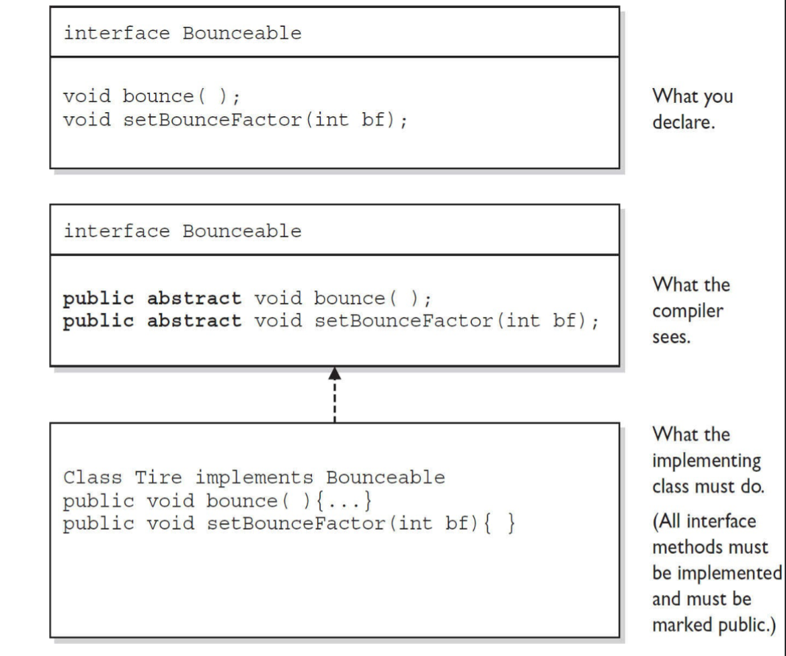

# Declarations and Access Control
## Identifiers and Keywords (OCA Objectives 1.2 and 2.1)
### Legal Identifiers
+ Identifiers must start with a letter, a currency character ($), or a connecting character such as
the underscore (_). Identifiers cannot start with a digit!
+ After the first character, identifiers can contain any combination of letters, currency
characters, connecting characters, or numbers.
+ In practice, there is no limit to the number of characters an identifier can contain.
+ You can’t use a Java keyword as an identifier.
    ```java
    // RIGHT V
    int $a=1;
    int _____a=1;
    int $=1;
    int _=1;
 
    // WRONG X
    int :1=1;
    int false=false;
    int true=false;
    int if=1;
    int -d=1;
    int .a=1;
    int 3a=1;
    ```
### Source File Declaration Rules
+ There can be only one public class per source code file
    ```java
    // WRONG X
    public class Car {}
    public class Car2 {}
    ```
+ Comments can appear at the beginning or end of any line in the source code file; they are
independent of any of the positioning rules discussed here.
 
    ```java
    // RIGHT V
    //public
    package demo;//aaa
    ```
+ If there is a public class in a file, the name of the file must match the name of the public class.
   
    ```java
    public class Car {}
    // RIGHT V
    // => Car.java
   
    // WRONG X
    // => CarDemo.java
    ```
+ If the class is part of a package, the package statement must be the first line in the source code file, before any import statements that may be present.
    ```java
    // RIGHT V
    package demo;
    import java.awt.Color;
 
    // WRONG X
     import java.awt.Color;
     package demo;
     
     // WRONG X
     package demo;
     public class Car {}
     import java.awt.Color;
    ```
+ If there are import statements, they must go between the package statement (if there is one) and the class declaration. If there isn’t a package statement, then the import statement(s) must be the first line(s) in the source code file. If there are no package or import statements, the class declaration must be the first line in the source code file
    ```java
    // WRONG X
 
     public class Car {}
     import java.awt.Color;
    ```
 
+ import and package statements apply to all classes within a source code file. In other words, there’s no way to declare multiple classes in a file and have them in different packages or use different imports.
 
+ A file can have more than one non-public class
    ```java
    // RIGHT V
     public class Car {}
     class NewCar {}
     class OldCar {}
    ```
+ Files with no public classes can have a name that does not match any of the classes in the file
    ```java
    // RIGHT V
     class Car {}
     class NewCar {}
     class OldCar {}
     // => AnyClass.java
    ```
 
### Using the javac and java Commands
#### Compiling with javac
+ The javac command is used to invoke Java’s compiler.
    ```cmd
    // RIGHT V
    javac [options] [source files]
    javac -help
    javac -version Foo.java Bar.java
    ```
#### Launching Applications with java
+ The java command is used to invoke the Java Virtual Machine (JVM).
+ The [options] and [args] parts of the java command are optional, and they can both have multiple values
    ```cmd
    // RIGHT V
    java [options] class [args]
    java -showversion MyClass x 1
    ```
 
#### Using public static void main(String[ ] args)
+ the only version of main() will be run
    ```java
    // RIGHT V
    public static void main(String[] args)
    static public void main(String[] args)
    static public void main(String... x)
    static public void main(String args[])
    ```
 
### Import Statements and the Java API
+ fully qualified name
    ```java
    // RIGHT V
    public static void main(String args[] ) {
        java.util.List<String> a=new java.util.ArrayList<String>();
    }
    ```
+ use import
 
    ```java
    import java.util.ArrayList;
    import java.util.List;
    // RIGHT V
    public static void main(String args[] ) {
        List<String> a=new ArrayList<String>();
    }
    ```
 
    ```java
    import java.util.*;
    // RIGHT V
    public static void main(String args[] ) {
        List<String> a=new ArrayList<String>();
    }
    ```
   
#### Static Import Statements
+ You must say import static; you can’t say static import.
    ```java
    // RIGHT V
    import static ClassName;
 
    // WRONG X
    static import ClassName;
   
    ```
 
+ Watch out for ambiguously named static members. For instance, if you do a static import for both the Integer class and the Long class, referring to MAX_VALUE will cause a compiler error because both Integer and Long have a MAX_VALUE constant and Java won’t know which MAX_VALUE you’re referring to
   
    ```java
        // WRONG X
        import static java.lang.Long.*;
        import static java.lang.Integer.*;
        public static void main(String[] args) {
            Integer a = MAX_VALUE;
       
        }
    ```
 
+ CANNOT use an import to search through the entire Java API
    ```java
    // Legal but Will not search across package
    import java.*
    ```
 
#### Class Declarations and Modifiers
##### Class Access
+ code from one class (class A) has access to another class (class B), it means class A can do one of three things
    + Create an instance of class B.
    ```java
    public class A {
    void test(){
        B b = new B();
    }
    }
    ```
    + Extend class B (in other words, become a subclass of class B).
    ```java
    public class A extends B {
 
    }
    ```
    + Access certain methods and variables within class B, depending on the access control of those methods and variables
    ```java
    public class A {
    void test(){
        B b = new B();
        b.test=10;
    }
    }
    ```
###### Default Access
+ no modifier preceding it in the declaration
+ default access is package-level access
    ```java
    package test;
    class B {
 
    int test;
    }
    /////////
    package nottest;
 
    // WRONG X
    public class C {
        void test(){
              B b = new B();
        }
    }
    ```
 
###### Public Access
+ A class declaration with the public keyword gives all classes from all packages access to the public class
    ```java
    package test;
    public class B {
 
    public int test;
    }
    /////////
    package nottest;
    // must import test.B
    import test.B;
    // RIGHT V
    public class C {
        void test(){
              B b = new B();
        }
    }
    ```
 
###### Other (Nonaccess) Class Modifiers
+ strictfp: Marking a class as strictfp means that any method code in the class will conform strictly to the IEEE 754 standard rules for floating points. Without that modifier,floating points used in the methods might behave in a platform-dependent way. If you don’t declare a class as strictfp, you can still get strictfp behavior on a method-by-method basis by declaring a method as strictfp
    ```java
    package nottest;
    // WRONG X
    public final abstract class Test {
        void test(){
            // WRONG X
            int strictfp =1;
        }
    }
    ```
+ never mark a class as both final and abstract
    ```java
    package nottest;
    // WRONG X
    public final abstract class Test {
       
    }
    ```
###### Final Classes
+ When used in a class declaration, the final keyword means the class can’t be subclassed
    ```java
    package nottest;
 
    public final class DemoFinal {
   
    }
 
    /////////
    package nottest;
    // WRONG X
    public class TestDemoFinal extends  DemoFinal{
    }
    ```
###### Abstract Classes
+ An abstract class can never be instantiated
    ```java
    package nottest;
 
    public abstract class DemoAbstract {
   
    }
 
    /////////
    package nottest;
    // WRONG X
    public class TestDemoAbstract{
         public static void main(String[] args) {
         DemoAbstract  demoAbstract =new DemoAbstract();
    }
    }
    ```
 
+ Cant mark a class both abstract and final
    ```java
    package test;
 
    public abstract  final class Demo {
    }
    ```
 
## Declaring an Interface
  <p align="center">
  
  </p>
 
+ Interface methods are implicitly public and abstract, unless declared as default or static. In other words, you do not need to actually type the public or abstract modifiers in the method declaration, but the method is still always public and abstract.
    ```java
    package demo;
 
    public interface Testable {
     void test();
    // public abstract void test();
    }
    ```
+  All variables defined in an interface must be public, static, and final—in other words, interfaces can declare only constants, not instance variables.
    ```java
    public interface Changable {
        int VARIABLE = 1;
        // public static final  int VARIABLE = 1;
        }
    ```
+ Interface methods cannot be marked final, strictfp, or native.
    ```java
    public interface Changable {
        // WRONG X
        final void change(int var);
        // WRONG X
        strictfp void change(int var);
        // WRONG X
        native void change(int var);
    }
    ```
+ An interface can extend one or more other interfaces
    ```java
    package demo;
    // RIGHT V
    public interface Liveable extends Changable,Testable{
    }
 
    ```
+ An interface cannot extend anything but another interface.
    ```java
    package demo;
    // WRONG (Test is a class)
    public interface Liveable extends Test{
    }
 
    ```
+ An interface cannot implement another interface or class
    ```java
    package demo;
    // WRONG (Changable is a interface)
    public interface Liveable implement Changable {
    }
 
    ```
+ An interface must be declared with the keyword interface
 
+  Interface types can be used polymorphically
 
+ All method in a interface are public abstract
    ```java
        package demo;
    public interface Liveable {
       public abstract void live();
        // WRONG
       protected abstract void live();
        // WRONG
       final abstract void live();
    }
    ```
##### Declaring Interface Constants
+ interface constants must alway be `public static final`
    ```java
    package demo;
    public interface Liveable {
        int healthPoint = 100; // public static final
       public abstract void live();
    }
 
    public Human implement Liveable {
          void live(){
            // WRONG
                healthPoint =10;
            }
    }
    ```
#### Declaring default Interface Methods
+ default methods are declared by using the default keyword. The default keyword can be used only with interface method signatures, not class method signatures
    ```java
    public class Demo{
        // WRONG
        default void test(){
 
        }
    }
    ```
+ default methods are public by definition, and the public modifier is optional
+ default methods cannot be marked as private, protected, static, final, or abstract.
+ default methods must have a concrete method body
    ```java
    package demo;
    public interface Liveable {
      // WRONG
      private default void live(){
        int a=1;
      }
     
      // WRONG
      final default void live(){
        int a=1;
      }
     
      // WRONG
      static default void live(){
        int a=1;
      }
     
      // WRONG
      abstract default void live(){
        int a=1;
      }
 
      // WRONG
      default void live();
    }
    ```
#### Declaring static Interface Methods
+ static interface methods are declared by using the static keyword.
+ static interface methods are public by default, and the public modifier is optional.
+ static interface methods cannot be marked as private, protected, final, or abstract
+ static interface methods must have a concrete method body
+ When invoking a static interface method, the method’s type (interface name) MUST be included in the invocation
    ```java
    package demo;
    public interface Liveable {
      static void live(){
        int a=1;
      }
    public Human implement Liveable {
       public static void main( String[] arg){
         // RIGHT
         Liveable.live();
         // WRONG
         new Human().live();
        // WRONG
         live();
         
       }
    }
    }
    ```
 
### Access Modifiers
+ two different access issues
    + Whether method code in one class can access a member of another class [R1]
    + Whether a subclass can inherit a member of its superclass [R2]
 
+ 4 Access Modifiers
    + public: [R1,R2] every where
    + protected: [R1] same package, [R2] every where
    + default: [R1] same package, [R2] same package
    + private: [R1] same class, [R2] same class
 
+ Don’t forget, though, that if class A itself can’t be accessed by class B, then no members within class A can be accessed by class B.
    ```java
    // only in this package =>
    class Demo{
        // not work
        public void test(){
 
        }
        // not work
        protected void test(){
 
        }
    }
    ```
+ Remember, if a subclass inherits a member, it’s exactly as if the subclass actually declared the member itself
 
    ```java
    // only in this package =>
    class Animal{
        public void eat(){
         // logic  
        }
    }
 
    class Dog extends Animal{
        public static void main(String[] arg){
            this.eat(); // a subclass can inherit a member of its superclass
            Animal a=new Animal();
            a.eat(); // Whether method code in one class can access a member of another class
        }
    }
    ```
 
#### Public Members
+ all other classes, regardless of the package they belong to, can access the member
+ For a subclass, if a member of its superclass is declared public, the subclass inherits that member regardless of whether both classes are in the same package
 
#### Private Members
+ Members marked private can’t be accessed by code in any class other than the class in which the private member was declared
+  A private member is invisible to any code outside the member’s own class.
    ```java
    // only in this package =>
    class Animal{
        private void eat(){
         // logic  
        }
    }
 
    class Dog extends Animal{
        public static void main(String[] arg){
            // WRONG
            this.eat(); // a subclass can inherit a member of its superclass
            Animal a=new Animal();
            // WRONG
            a.eat(); // Whether method code in one class can access a member of another class
        }
    }
    ```
+  You can, however, declare a matching method in the subclass. But regardless of how it looks, it is not an overriding method! It is simply a method that happens to have the same name as a private method (which you’re not supposed to know about) in the superclass.
    ```java
    // only in this package =>
    class Animal{
        private void eat(){
         // logic  
        }
    }
 
    class Dog extends Animal{
        public static void main(String[] arg){
            // RIGHT
            this.eat(); // a subclass can inherit a member of its superclass
            Animal a=new Animal();
            // WRONG
            a.eat(); // Whether method code in one class can access a member of another class
        }
 
        // RIGHT
        private void eat(){
         // logic  
        }
    }
    ```
 
#### Protected and Default Members
+  A default member may be accessed only if the class accessing the member belongs to the same package, whereas a protected member can be accessed (through inheritance) by a subclass even if the subclass is in a different package