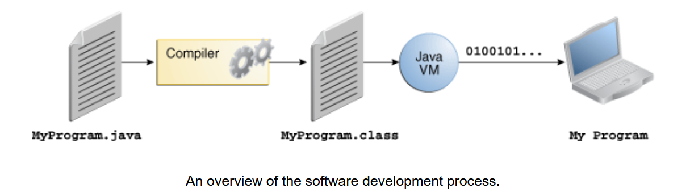
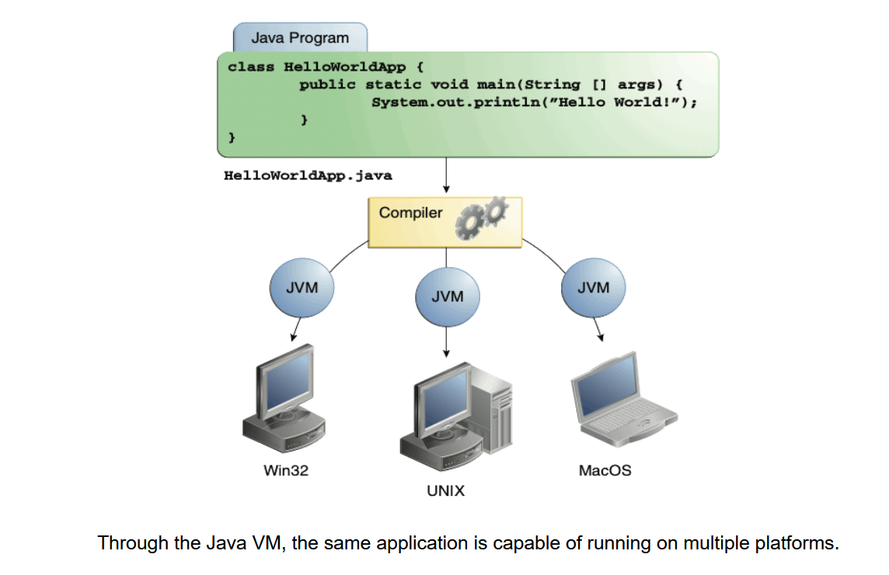

# Java Technology

`Java Technology` bao gồm ngôn ngữ lập trình bậc cao `Java` và nền tảng (`platform`) lập trình `Java`. 

## Ngôn Ngữ Lập Trình Java

Ngôn ngữ lập trình Java là một ngôn ngữ bậc cao được đặc trưng bởi các từ khóa sau:

- **Simple**: Đơn giản
- **Object oriented**: Hướng `object` 
- **Distributed**: Phân tán 
- **Multithreaded**: Đa luồng
- **Dynamic**: Động
- **Architecture neutral**: Kiến trúc trung lập 
- **Portable**: Di động 
- **High performance**: Hiệu năng cao 
- **Robust**: Bền bỉ 
- **Secure**: An toàn

Trong ngôn ngữ lập trình Java, tất cả mã nguồn `source code` trước tiên sẽ được viết trong các `file` văn bản thuần túy có đuôi `.java`. Sau đó, toàn bộ `source code` sẽ được đọc và dịch (biên dịch `compiled`) sang dạng `bytecode` - các file đuôi `.class` bằng trình biên dịch (`compiler`) `javac`. Một `file` `.class` không chứa `source code` mà `CPU` có thể hiểu được; thay vào đó, nó chứa `bytecode` – ngôn ngữ máy của `Java Virtual Machine` (`JVM`). Sau đó `JVM` sẽ thực hiện dịch từng dòng của `file` `.class` thành mã nhị phân `binary code` (thông dịch - `interpreter` ),`CPU` sẽ nhận những`binary code` này và thực thi chúng .

Bởi vì `JVM` có sẵn trên nhiều hệ điều hành `operating systems` khác nhau, các file `.class` giống nhau có thể chạy trên Microsoft Windows, Hệ điều hành Solaris™ (Solaris OS), Linux hoặc Mac OS... Bởi vậy java được coi là ngôn ngữ "viết 1 lần chạy mọi nơi"  `write once run anywhere`

Thông qua `JVM`, cùng một ứng dụng có khả năng chạy trên nhiều `platform` khác nhau.

##  `Java platform`

Một nền tảng `platform` là môi trường phần cứng hoặc phần mềm mà một chương trình chạy. Chúng ta đã đề cập đến một `platform` phổ biến nhất như Microsoft Windows, Linux, Solaris OS và Mac OS. Hầu hết các `platform` có thể được mô tả là sự kết hợp của `operating systems` và phần cứng. `Java platform` khác với hầu hết các `platform` khác ở chỗ đây là một `platform` chỉ dựa trên phần mềm `JVM`, chạy trên các `platform` phần cứng khác.

`Java platform` có hai thành phần:

- Java Virtual Machine (`JVM`)
- Java Application Programming Interface (API)

 `Java Virtual Machine` là `platform` cơ sở của Java và được port lên các `platform` phần cứng khác nhau.

`API` là một tập hợp lớn các thành phần phần mềm sẵn có cung cấp nhiều khả năng hữu ích. Nó được nhóm thành các thư viện các lớp và giao diện liên quan; các thư viện này được gọi là các `package`. Phần tiếp theo, *What Can Java Technology Do?*, nêu bật một số tính năng mà API cung cấp.

`API` và `Java Virtual Machine` cách ly chương trình khỏi phần cứng..

Là một `platform` độc lập không ảnh hưởng bởi môi trường, `Java platform` có thể chậm hơn so với mã native `native code`. Tuy nhiên, những tiến bộ trong công nghệ biên dịch `compiled` và máy ảo đang đưa hiệu suất gần đến mức của `native code` mà không ảnh hưởng đến tính di động.

# Java có thể làm được gì?

Ngôn ngữ lập trình `programming language` `Java`, một ngôn ngữ bậc cao `high-level language` đa dụng, là một nền tảng phần mềm `software platform` mạnh mẽ. 
Mỗi bản triển khai đầy đủ của `Java platform` đều cung cấp các tính năng sau:

- **Công cụ Phát triển `development tools`**: Các `development tools` cung cấp mọi thứ để biên dịch `complided`,
 chạy, giám sát, gỡ lỗi và tạo tài liệu cho các ứng dụng. Các công cụ chính là trình biên dịch `javac`,
  công cụ khởi động ứng dụng `java launcher`, và công cụ tài liệu `javadoc`.

- **Application Programming Interface (API)**: API cung cấp các chức năng cốt lõi của ngôn ngữ lập trình `Java`. 
Nó bao gồm một loạt các `class` hữu ích sẵn sàng để sử dụng trong các ứng dụng.
API bao gồm mọi thứ từ các `object` cơ bản đến mạng, bảo mật, tạo XML, truy cập cơ sở dữ liệu, và nhiều hơn nữa.
 API Java cung cấp rất nhiều; để có cái nhìn tổng quan về những gì nó bao gồm,
Tài liệu: https://docs.oracle.com/javase/8/docs/
 
- **Công nghệ Triển khai**: Phần mềm JDK cung cấp các cơ chế tiêu chuẩn như phần mềm `Java Web Start` và phần mềm `Java Plug-In` để triển khai các ứng dụng tới người dùng cuối.

- **Bộ Công cụ Giao diện Người dùng**: Các bộ công cụ `JavaFX`, `Swing`, và `Java 2D` cho phép bạn tạo ra các giao diện người dùng đồ họa (GUI) phức tạp.

- **Thư viện Tích hợp**: Các thư viện tích hợp như `Java IDL API`, `JDBC API`, `Java Naming and Directory Interface (JNDI) API`, `Java RMI`, và `Java Remote Method Invocation over Internet Inter-ORB Protocol Technology (Java RMI-IIOP Technology)` cho phép truy cập cơ sở dữ liệu và thao tác các `object` từ xa.
