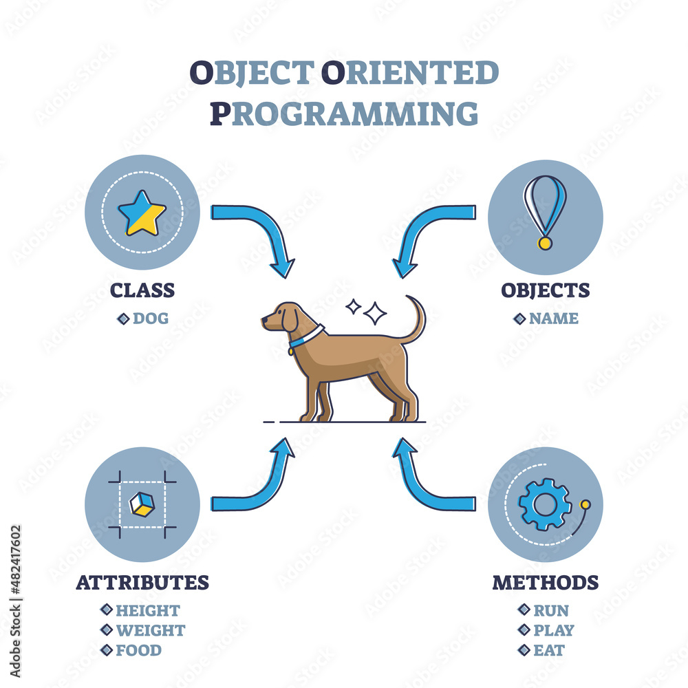
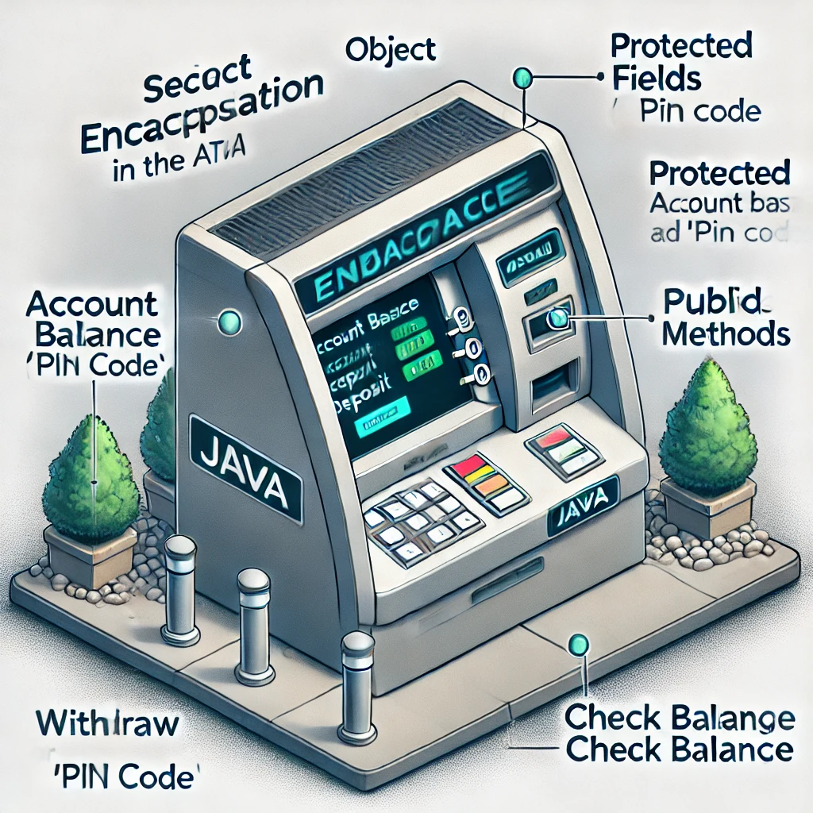
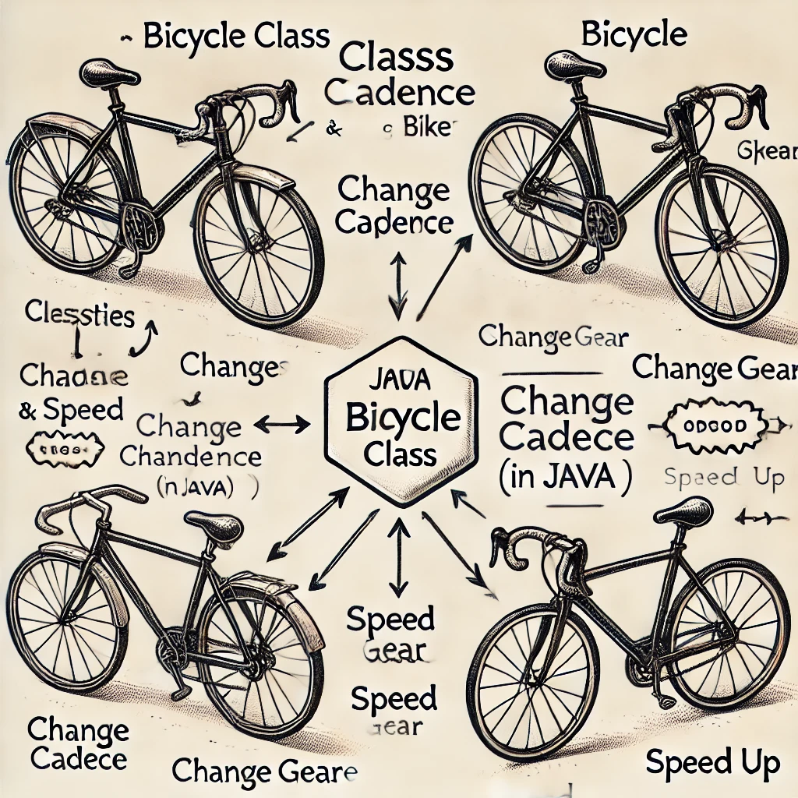
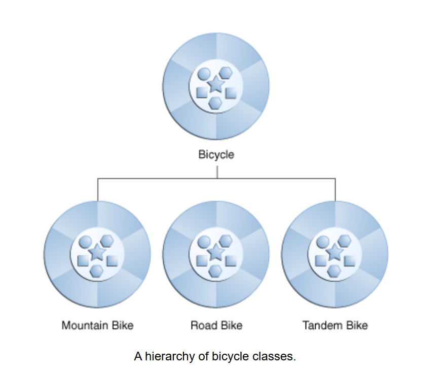

# Các Khái Niệm Lập Trình Hướng `object`

## `Object` Là Gì?

+ **`Object`** là yếu tố then chốt để hiểu công nghệ lập trình hướng `object`.
 Hãy nhìn xung quanh ngay bây giờ sẽ tìm thấy nhiều ví dụ về các `object` trong thế giới thực:
  + con chó
  + bàn làm việc
  + tivi
  + chiếc xe đạp.

+ Các `Object` trong thế giới thực có hai đặc điểm chung: chúng đều có trạng thái (state) và hành vi (behavior).
  + Chó có trạng thái (tên, màu sắc, giống, có đói không) và hành vi (sủa, chạy lấy đồ, vẫy đuôi). 
  + Xe đạp cũng có trạng thái (số hiện tại, tốc độ quay pedal hiện tại, tốc độ hiện tại) và hành vi (đổi số, thay đổi tốc độ quay pedal, phanh lại).
  
+ Xác định trạng thái và hành vi cho các `object` trong thế giới thực là một cách tuyệt vời để bắt đầu suy nghĩ theo hướng lập trình hướng `object` `object`.
+ `Task`: Dành một chút thời gian ngay bây giờ để quan sát các `object` trong thế giới thực xung quanh.
Với mỗi `object` mà bạn thấy, hãy tự hỏi hai câu hỏi:
  + Những trạng thái nào mà `object` này có thể có? 
  + Những hành vi nào mà `object` này có thể thực hiện?

+ Hãy chắc chắn ghi lại các quan sát của bạn. Khi làm như vậy, bạn sẽ nhận ra rằng các `object` trong thế giới thực khác nhau về độ phức tạp;
 đèn bàn của bạn có thể chỉ có hai trạng thái (bật và tắt) và hai hành vi (bật đèn, tắt đèn),
 nhưng đài phát thanh trên bàn làm việc của bạn có thể có nhiều trạng thái khác (bật, tắt, âm lượng hiện tại, kênh hiện tại) và hành vi (bật, tắt, tăng âm lượng, giảm âm lượng, tìm kiếm, quét, và điều chỉnh). 
 Bạn cũng có thể nhận ra rằng một số `object` có thể chứa các `object` khác
+ Những quan sát thực tế này đều có thể chuyển hóa vào thế giới lập trình hướng `object`.

<p align="center">
  
</p>

+ **Các `object` trong phần mềm** về mặt khái niệm tương tự như các `object` trong thế giới thực: chúng cũng bao gồm trạng thái (state) và hành vi (behavior) liên quan. Một **`object`** lưu trữ trạng thái của nó trong **`object`** (các biến `variable` trong một số ngôn ngữ lập trình) và thể hiện hành vi của nó thông qua **`methods`** (các hàm trong một số ngôn ngữ lập trình).Các `method` có thể tương tác thay đổi `state` của `object` và đóng vai trò là cơ chế chính để **giao tiếp giữa các `object`**.



+ Việc ẩn giấu `state` nội bộ và yêu cầu tất cả tương tác phải được thực hiện thông qua các `method` của `object` được gọi là **data encapsulation** — một nguyên tắc cơ bản của lập trình hướng `object`.

<p align="center">
  
</p>


## `Class` Là Gì?

Trong thế giới thực, chúng ta sẽ thường thấy nhiều **`object`** riêng lẻ cùng loại. Có thể có hàng ngàn chiếc xe đạp khác nhau cùng loại và mẫu mã. Mỗi chiếc xe đạp được xây dựng từ cùng một bộ **blueprint** (bản thiết kế) và do đó chứa các thành phần giống nhau. Trong thuật ngữ **object-oriented**, chúng ta nói rằng xe đạp của bạn là một **instance** của 1 **class** xe đạp. Một **class** là bản thiết kế từ đó các `object` riêng lẻ được tạo ra.

Dưới đây là một ví dụ về **class Bicycle** có thể là một cách triển khai (`implementation`) của một chiếc xe đạp:

```java
class Bicycle {

    int cadence = 0;
    int speed = 0;
    int gear = 1;

    void changeCadence(int newValue) {
         cadence = newValue;
    }

    void changeGear(int newValue) {
         gear = newValue;
    }

    void speedUp(int increment) {
         speed = speed + increment;   
    }

    void applyBrakes(int decrement) {
         speed = speed - decrement;
    }

    void printStates() {
         System.out.println("cadence:" +
             cadence + " speed:" + 
             speed + " gear:" + gear);
    }
}
```
<p align="center">
  
</p>

## `Inheritance` (kế thừa) Là Gì?

+ Các loại **object** khác nhau thường có một số đặc điểm chung với nhau. Ví dụ, xe đạp leo núi (mountain bike), xe đạp đường trường (road bike), và xe đạp đôi (tandem bike) đều chia sẻ các đặc điểm của xe đạp (tốc độ hiện tại, nhịp đạp hiện tại, số hiện tại). Tuy nhiên, mỗi loại cũng có các tính năng bổ sung làm cho chúng khác biệt: xe đạp đôi có hai yên xe và hai bộ tay lái; xe đạp đường trường có tay lái gập; một số xe đạp leo núi có thêm vòng xích, giúp có tỷ lệ số thấp hơn.

+ **Object-oriented programming** cho phép các **class** kế thừa trạng thái (`state`) và hành vi (`behavier`) được sử dụng chung từ các **class** khác. Trong ví dụ này, **class Bicycle** giờ đây trở thành **superclass** của **MountainBike**, **RoadBike**, và **TandemBike**. Trong ngôn ngữ lập trình **Java**, mỗi **class** được phép có một **direct superclass**, và mỗi **superclass** có thể có có số lượng **subclass** không giới hạn:

Một sơ đồ về các **class** trong một hệ thống phân cấp.
Một hệ thống phân cấp các **class** xe đạp.

Cú pháp để tạo một **subclass** rất đơn giản. Ở đầu phần khai báo **class**, sử dụng từ khóa **extends**, sau đó là tên của **class** mà bạn muốn kế thừa:

```java
class MountainBike extends Bicycle {

    // Các field và method mới
    // định nghĩa xe đạp leo núi sẽ nằm ở đây

}
```
<p align="center">
  
</p>

## Interface Là Gì?

# What Is an Interface?

+ Như chúng ta đã học, các **object** định nghĩa cách chúng tương tác với thế giới bên ngoài thông qua các **method** mà chúng cung cấp. Các **method** tạo thành **interface** của object với thế giới bên ngoài; ví dụ, các nút bấm trên mặt trước của chiếc TV của bạn là giao diện giữa bạn và hệ thống dây điện bên trong. Bạn nhấn nút "power" để bật và tắt TV.

+ **interface** là một nhóm các **method** liên quan với phần thân rỗng. Hành vi của một chiếc xe đạp, nếu được chỉ định dưới dạng **interface**, có thể trông như sau:

```java
interface Bicycle {

    // Số vòng quay của bánh xe trên mỗi phút
    void changeCadence(int newValue);

    void changeGear(int newValue);

    void speedUp(int increment);

    void applyBrakes(int decrement);
}
```
+ Để triển khai `interface` này, tên của class của bạn sẽ thay đổi (ví dụ, thành một thương hiệu xe đạp cụ thể, như ACMEBicycle), và bạn sẽ sử dụng từ khóa `implements` trong khai báo class:

```java
class ACMEBicycle implements Bicycle {

    int cadence = 0;
    int speed = 0;
    int gear = 1;

   // Trình biên dịch sẽ yêu cầu rằng các method
   // changeCadence, changeGear, speedUp, và applyBrakes
   // đều phải được triển khai. Việc biên dịch sẽ thất bại nếu
   // các method này thiếu trong class này.

    void changeCadence(int newValue) {
         cadence = newValue;
    }

    void changeGear(int newValue) {
         gear = newValue;
    }

    void speedUp(int increment) {
         speed = speed + increment;   
    }

    void applyBrakes(int decrement) {
         speed = speed - decrement;
    }

    void printStates() {
         System.out.println("cadence:" +
             cadence + " speed:" + 
             speed + " gear:" + gear);
    }
}

```
+ Triển khai một `interface` cho phép một `class` trở nên rõ ràng hơn về hành vi mà nó cam kết cung cấp. `Interface` tạo thành một hợp đồng `contract` giữa `class` hiện tại với các `class` khác, và `contract` này được thực thi tại thời điểm `biên dịch` bởi `compiler`. Nếu `class` của bạn tuyên bố triển khai một `interface`, tất cả các `method` được định nghĩa bởi `interface` đó phải xuất hiện trong `source code` của nó trước khi `class` có thể biên dịch thành công.

## Package Là Gì?
+ `Namespace` là một không gian tên trong lập trình, dùng để tổ chức và phân biệt các thành phần (hàm, lớp, biến) nhằm tránh xung đột tên. Nó giúp sắp xếp mã nguồn gọn gàng và rõ ràng hơn, đặc biệt trong các dự án lớn hoặc khi dùng nhiều thư viện.

+ **`Package`** là một không gian tên (*`namespace`*) giúp tổ chức một tập hợp các **`class`** và **`interface`** liên quan. Về mặt khái niệm, bạn có thể nghĩ các **`package`** giống như những thư mục khác nhau trên máy tính của mình. Bạn có thể lưu các trang HTML trong một thư mục, hình ảnh trong thư mục khác, và các tập lệnh hoặc ứng dụng ở một thư mục khác nữa. Vì phần mềm viết bằng ngôn ngữ Java có thể bao gồm hàng trăm hoặc hàng ngàn **`class`** riêng lẻ, nên rất hợp lý để giữ mọi thứ có tổ chức bằng cách đặt các **`class`** và **`interface`** liên quan vào trong các **`package`**.

+ Nền tảng Java cung cấp một thư viện **`class`** khổng lồ (một tập hợp các **`package`**) có thể sử dụng trong các ứng dụng của bạn. Thư viện này được gọi là "`Application Programming Interface`", hay viết tắt là "`API`". Các **`package`** trong `API` thể hiện các tác vụ thường gặp nhất trong lập trình. Ví dụ, một `object` **`String`** chứa trạng thái và hành vi cho chuỗi ký tự; một `object` **`File`** cho phép lập trình viên dễ dàng tạo, xóa, kiểm tra, so sánh hoặc chỉnh sửa tệp trên hệ thống tệp; một `object` **`Socket`** cho phép tạo và sử dụng các `socket` mạng; các `object` `GUI` khác nhau điều khiển các nút và hộp kiểm và bất cứ thứ gì liên quan đến giao diện đồ họa người dùng. Có hàng nghìn **`class`** để bạn lựa chọn. Điều này cho phép bạn, với tư cách là lập trình viên, tập trung vào việc thiết kế ứng dụng cụ thể của mình thay vì phải lo đến cơ sở hạ tầng cần thiết để làm cho nó hoạt động.

+ **`Java Platform API Specification`** chứa danh sách đầy đủ cho tất cả các **`package`**, **`interface`**, **`class`**, **`field`**, và **`method`** được cung cấp bởi nền tảng Java SE.

## `Syntax`
+ `Syntax` (cú pháp) trong lập trình là tập hợp các quy tắc xác định cách viết và cấu trúc của `source code` để chương trình có thể hiểu và thực thi chính xác. Mỗi ngôn ngữ lập trình có cú pháp riêng biệt để định nghĩa cách sử dụng các thành phần như biến, hàm, vòng lặp, điều kiện, v.v.

# Java Keywords and Descriptions (Bảng tổng hợp syntax)

| Keywords   | Description |
|------------|-------------|
| abstract   | Được sử dụng cho lớp và phương thức. Một lớp trừu tượng không thể sử dụng để tạo đối tượng mà phải thông qua một lớp kế thừa nó. Một phương thức trừu tượng chỉ có thể được sử dụng trong một lớp trừu tượng và nó không có phần thân. Phần thân được cung cấp bởi lớp con. |
| assert     | Kiểm tra điều kiện là đúng hay sai (Thường sử dụng trong Unit Test) |
| boolean    | Kiểu dữ liệu logic, chỉ nhận một trong hai giá trị true hoặc false |
| break      | Sử dụng để thoát khỏi vòng lặp hoặc sử dụng trong switch case |
| byte       | Kiểu dữ liệu có thể lưu trữ các số nguyên từ -128 đến 127 |
| case       | Sử dụng với câu lệnh switch, đánh dấu một khối lệnh |
| catch      | Dùng để bắt ngoại lệ được tạo bởi khối try, sử dụng kèm với try để xử lý các ngoại lệ trong chương trình |
| char       | Kiểu ký tự dùng để biểu diễn các ký tự trong bộ mã Unicode |
| class      | Dùng để định nghĩa một class |
| continue   | Sử dụng để tiếp tục một vòng lặp tại điều kiện đã được xác định |
| const      | Sử dụng để xác định một hằng số. Tuy nhiên trong Java không sử dụng từ này mà sử dụng final |
| default     | Mặc định được thực thi nếu không có case nào trả về true. Được sử dụng trong switch case |
| do         | Sử dụng cùng với while để tạo vòng lặp do while |
| double     | Là kiểu dữ liệu lưu trữ các số thực |
| else       | Sử dụng trong câu điều kiện. Rẽ nhánh điều kiện ngược với if |
| enum       | Kiểu dữ liệu đặc biệt, đại diện cho hằng số cố định |
| exports     | Exports một package với một module |
| extends    | Kế thừa một lớp (Chỉ ra rằng một lớp được kế thừa từ một lớp khác) |
| final      | Dùng để chỉ ra các biến, phương thức không thay đổi sau khi đã được định nghĩa. Những phương thức final không được kế thừa và override. |
| finally    | Được sử dụng với các ngoại lệ, khối finally luôn được thực thi dù có ngoại lệ xảy ra hay không |
| float      | Là kiểu dữ liệu lưu trữ các số thực |
| for        | Dùng để tạo vòng lặp for |
| if         | Sử dụng để tạo câu điều kiện |
| implements | Implements một interface |
| import     | Sử dụng để import package, class hoặc interface |
| instanceof  | Kiểm tra một đối tượng là một thể hiện của một lớp cụ thể hay một interface |
| int        | Kiểu dữ liệu dùng để lưu trữ các số nguyên từ -2147483648 đến 2147483647 |
| interface  | Sử dụng để định nghĩa interface |
| long       | Kiểu dữ liệu dùng để lưu trữ các số nguyên từ -263 đến 263-1 |
| module     | Khai báo một module |
| native     | Sử dụng để chỉ định một hàm được triển khai bởi các ngôn ngữ khác |
| new        | Tạo một đối tượng mới |
| package    | Khai báo một package |
| private    | Phạm vi truy cập sử dụng cho các biến, phương thức và constructor, làm cho chúng chỉ có thể được truy cập trong lớp đã khai báo |
| protected  | Phạm vi truy cập sử dụng cho các biến, phương thức và constructor, làm cho chúng chỉ có thể được truy cập nếu trong cùng package hoặc thông qua tính kế thừa |
| public     | Phạm vi truy cập có thể sử dụng cho lớp, biến, phương thức và constructor, làm cho chúng có thể được truy cập ở khắp mọi nơi trong chương trình |
| requires   | Chỉ định các thư viện bắt buộc bên trong một module |
| return     | Sử dụng để trả về một giá trị từ một phương thức |
| short      | Kiểu dữ liệu dùng để lưu trữ các số nguyên từ -32768 đến 32767 |
| static     | Định nghĩa biến, phương thức của một lớp có thể được truy cập trực tiếp từ lớp mà không thông qua khởi tạo đối tượng của lớp |
| strictfp   | Hạn chế độ chính xác và làm tròn của các phép tính số thực |
| super      | Đề cập tới các đối tượng lớp cha |
| switch     | Sử dụng trong mệnh đề switch case |
| synchronized| Chỉ ra là ở mỗi thời điểm chỉ có 1 đối tượng hay 1 lớp có thể truy nhập đến biến dữ liệu hoặc phương thức loại đó – Thường được sử dụng trong lập trình đa luồng (multithreading) |
| this       | Tham chiếu đến đối tượng hiện tại trong một phương thức hoặc hàm tạo |
| throw      | Ném ra ngoại lệ |
| throws     | Khai báo một ngoại lệ |
| transient  | Chỉ định rằng nếu một đối tượng được Serialized, giá trị của biến sẽ không cần được lưu trữ |
| try        | Dùng để tạo mệnh đề try catch |
| var        | Khai báo biến |
| void       | Cho biết một phương thức không có giá trị trả về |
| volatile   | Báo cho chương trình dịch biết là biến khai báo volatile có thể thay đổi tùy ý trong các luồng (thread) |
| while      | Tạo vòng lặp while |
