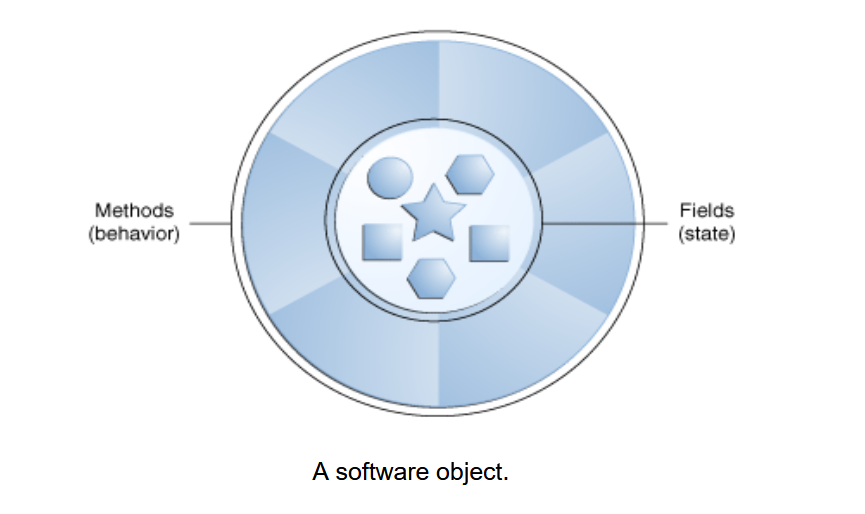

# Các Khái Niệm Lập Trình Hướng `object`

## `Object` Là Gì?

+ **`Object`** là yếu tố then chốt để hiểu công nghệ lập trình hướng `object`.
 Hãy nhìn xung quanh ngay bây giờ sẽ tìm thấy nhiều ví dụ về các `object` trong thế giới thực:
  + con chó
  + bàn làm việc
  + tivi
  + chiếc xe đạp.

+ Các `Object` trong thế giới thực có hai đặc điểm chung: chúng đều có trạng thái (state) và hành vi (behavior).
  + Chó có trạng thái (tên, màu sắc, giống, có đói không) và hành vi (sủa, chạy lấy đồ, vẫy đuôi). 
  + Xe đạp cũng có trạng thái (số hiện tại, tốc độ quay pedal hiện tại, tốc độ hiện tại) và hành vi (đổi số, thay đổi tốc độ quay pedal, phanh lại).
  
+ Xác định trạng thái và hành vi cho các `object` trong thế giới thực là một cách tuyệt vời để bắt đầu suy nghĩ theo hướng lập trình hướng đối tượng `object`.
+ `Task`: Dành một chút thời gian ngay bây giờ để quan sát các `object` trong thế giới thực xung quanh.
Với mỗi `object` mà bạn thấy, hãy tự hỏi hai câu hỏi:
  + Những trạng thái nào mà `object` này có thể có? 
  + Những hành vi nào mà `object` này có thể thực hiện?

+ Hãy chắc chắn ghi lại các quan sát của bạn. Khi làm như vậy, bạn sẽ nhận ra rằng các `object` trong thế giới thực khác nhau về độ phức tạp;
 đèn bàn của bạn có thể chỉ có hai trạng thái (bật và tắt) và hai hành vi (bật đèn, tắt đèn),
 nhưng đài phát thanh trên bàn làm việc của bạn có thể có nhiều trạng thái khác (bật, tắt, âm lượng hiện tại, kênh hiện tại) và hành vi (bật, tắt, tăng âm lượng, giảm âm lượng, tìm kiếm, quét, và điều chỉnh). 
 Bạn cũng có thể nhận ra rằng một số `object` có thể chứa các `object` khác
+ Những quan sát thực tế này đều có thể chuyển hóa vào thế giới lập trình hướng `object`.

+ **Các `object` trong phần mềm** về mặt khái niệm tương tự như các `object` trong thế giới thực: chúng cũng bao gồm trạng thái (state) và hành vi (behavior) liên quan. Một **`object`** lưu trữ trạng thái của nó trong **`object`** (các biến `variable` trong một số ngôn ngữ lập trình) và thể hiện hành vi của nó thông qua **`methods`** (các hàm trong một số ngôn ngữ lập trình).
 Các `method` có thể tương tác thay đổi `state` của `object` và đóng vai trò là cơ chế chính để **giao tiếp giữa các `object`**.

+ Việc ẩn giấu `state` nội bộ và yêu cầu tất cả tương tác phải được thực hiện thông qua các `method` của `object` được gọi là **data encapsulation** — một nguyên tắc cơ bản của lập trình hướng đối tượng.

## Class Là Gì?

**Class** là một bản mẫu hoặc mẫu thiết kế từ đó các `object` được tạo ra. Phần này định nghĩa một lớp mô hình hóa trạng thái và hành vi của một `object` trong thế giới thực. Nó tập trung vào những điều cơ bản, cho thấy cách mà ngay cả một lớp đơn giản cũng có thể mô hình hóa trạng thái và hành vi một cách rõ ràng.

## Inheritance Là Gì?

**Inheritance** cung cấp một cơ chế mạnh mẽ và tự nhiên để tổ chức và cấu trúc phần mềm của bạn. Phần này giải thích cách mà các lớp có thể kế thừa trạng thái và hành vi từ các **superclass**, và giải thích cách tạo ra một lớp từ một lớp khác bằng cú pháp đơn giản được cung cấp bởi ngôn ngữ Java.

## Interface Là Gì?

**Interface** là một hợp đồng giữa một lớp và thế giới bên ngoài. Khi một lớp **implements** (thực thi) một interface, nó cam kết cung cấp các hành vi mà interface đã công bố. Phần này định nghĩa một interface đơn giản và giải thích các thay đổi cần thiết cho bất kỳ lớp nào thực thi nó.

## Package Là Gì?

**Package** là một không gian tên dùng để tổ chức các lớp và interface một cách hợp lý. Đặt mã của bạn vào các package làm cho các dự án phần mềm lớn dễ quản lý hơn. Phần này giải thích tại sao điều này hữu ích và giới thiệu cho bạn về **Application Programming Interface (API)** được cung cấp bởi nền tảng Java.
