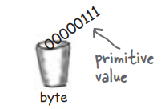
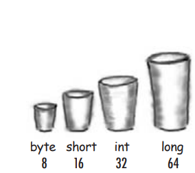
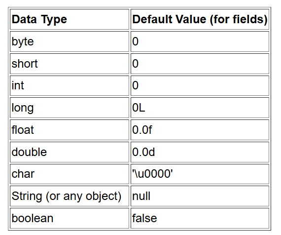

# Các thông tin cơ bản về Java

## Biến `Variable`

- `Variable`: là thành phần lưu trữ giá trị trong lập trình, `Variable` có thể lưu trữ nhiều kiểu dữ liệu khác nhau, giá trị của 1 `Variable` có thể thay đổi.

- Ngôn ngữ lập trình Java định nghĩa các loại `variables` sau:

  - `Instance Variables` (`Non-Static Fields`): Các `objects` lưu trữ `state` của chúng trong các `non-static fields`, nghĩa là các `fields` được khai báo mà không có từ khóa `static`.` Non-static fields` còn được gọi là `instance variables` vì giá trị `value` của chúng là duy nhất cho mỗi `instance` của một `class`.

    ```java
    public class MyClass {
    // instance variable declaration
    private int instanceVariable;

    public void setInstanceVariable(int value) {
        instanceVariable = value;
    }

    public int getInstanceVariable() {
        return instanceVariable;
    }

    public static void main(String[] args) {
        MyClass obj1 = new MyClass();
        obj1.setInstanceVariable(10);

        MyClass obj2 = new MyClass();
        obj2.setInstanceVariable(20);

        System.out.println("Value of obj1's variable: " + obj1.getInstanceVariable());
        System.out.println("Value of obj2's variable: " + obj2.getInstanceVariable());
    }
     }
    ```

  - `Class Variables` (`Static Fields`): Một `class variable` là bất kỳ `field` nào được khai báo `declare` với từ khóa `static`; điều này cho phép trình biên dịch `compiler` biết rằng chỉ có một bản sao duy nhất của `variable` này tồn tại, bất kể `class` đã được khởi tạo `initialize` bao nhiêu lần. Một `field` xác định số bánh răng của một loại xe đạp có thể được đánh dấu là `static` vì về mặt ý niệm, số bánh răng sẽ giống nhau cho tất cả các `instances`. Ví dụ: static int numGears = 6; tạo ra một `static field`. Ngoài ra, từ khóa `final` có thể được thêm vào để chỉ ra rằng số bánh răng sẽ không bao giờ thay đổi.

    ```java
     class Car {
     // Sử dụng static để biến này có thể dùng chung cho mọi đối tượng Car
       static int numberOfCars = 0;

    // Constructor (hàm tạo) được gọi mỗi lần tạo một đối tượng Car mới
       Car() {
       // Tăng số lượng xe khi tạo một xe mới
           numberOfCars++;
       }

    // Phương thức static để lấy số lượng xe hiện có
       static int getNumberOfCars() {
           return numberOfCars;
       }
     }

     public class Main {
       public static void main(String[] args) {
            // Tạo các đối tượng Car
            Car car1 = new Car();
            Car car2 = new Car();
            Car car3 = new Car();

       // In ra số lượng xe ô tô đã được tạo
        System.out.println("Số lượng xe đã tạo: " + Car.getNumberOfCars()); // Kết quả: 3
       }
     }
    ```

  - `Local Variables`(Biến cục bộ): Tương tự như cách một `object` lưu trữ `state` của nó trong các `fields`, một `method` sẽ thường lưu trữ `state` tạm thời trong các `local variables`. Cú pháp `declare` một `local variable` tương tự như `declare` một `field` (ví dụ: int count = 0;). Không có từ khóa đặc biệt nào để chỉ định một `variable` là "`local`"; việc xác định hoàn toàn phụ thuộc vào vị trí mà `variable` được `declare` — nghĩa là giữa dấu ngoặc nhọn mở và đóng của method "{ }". Do đó, `local variables` chỉ hiển thị cho các `methods` mà chúng được `declare`; chúng không thể truy cập `access` từ phần còn lại của `class`.
    ```java
    public class LocalVariable {
      public void show() {
        int num = 100; // local variable
        System.out.println("The number is : " + num);
     }
      public static void main(String args[]) {
        LocalVariableTest test = new LocalVariableTest();
        test.show();
     }
      }
    ```
 - Tham số (`Parameters`): là 1 `Variable` được truyền vào 1 `method` để `method` có thể hoạt động trên `Parameters` đó 
    ```java
    public class LocalVariable {
      public void show(String parameter ) {
        System.out.println("The parameter is : " + parameter);      
     }

      }
    ```
+ `Naming` quy tắc đặt tên `variable`:
  + Phân biệt chữ hoa và chữ thường: tên "AGE" và và "age" là 2 tên khác nhau
  + Định danh hợp lệ: Tên `variable` bắt buộc phải là chữ cái, $, hoặc _, theo quy ước thì bắt đầu tên `variable` nên là chữ cái.
  + Không dùng khoảng trắng: tên `variable` không dùng khoảng trắng
  + Các ký tự sau kí tự đầu có thể là chữ cái, số, hoặc _ $
  + Dùng từ đầy đủ: Tên `variable` nên được đặt đầy đủ, dễ hiểu và giàu thông tin
  + Tránh từ khóa: không dùng từ khóa để làm tên `variable`
  + Quy ước viết hoa: 
    + Từ đầu tiên viết thường chữ cái đầu, từ từ thứ 2 chở đi viết hoa chữ cái đầu (vd: isRunnning, myEmail)
    + Đối với `final` `variable` viết hoa tất cả các chữ cái và các từ cách nhau bởi dấu _ (vd: IS_RUNNING, MY_EMAIL)

### `Primitive Data Types` (kiểu dữ liệu nguyên thủy)
<p align="center">
  
</p>

+ Java là ngôn ngữ lập trình `statically-typed` nghĩa là kiểu (`type`) và tên của `variable` phải được khai báo trước khi chúng được sử dụng

```java
int gear = 1;
```

+ Kiểu dữ liệu `data type` của 1 `variable` xác định giá trị mà nó có thể chứa cũng như các phép toán có thể thực hiện trên nó
+ `Primitive Data Types`: kiểu dữ liệu cơ bản nhất, được định nghĩa sẵn bởi ngôn ngữ.
+ Trong Java `Primitive Data Types` được phân ra là 8 loại: 
  - `byte`: Kiểu dữ liệu `byte` là một số nguyên bù hai 8-bit có dấu. Nó có giá trị tối thiểu là `-128` và giá trị tối đa là `127` (bao gồm). Kiểu dữ liệu `byte` có thể hữu ích để tiết kiệm bộ nhớ trong các mảng lớn, khi việc tiết kiệm bộ nhớ thực sự có ý nghĩa. Nó cũng có thể được sử dụng thay cho `int` khi giới hạn của nó giúp làm rõ ý nghĩa mã của bạn.
  - `short`: Kiểu dữ liệu `short` là một số nguyên bù hai 16-bit có dấu. Nó có giá trị tối thiểu là `-32,768` và giá trị tối đa là `32,767` (bao gồm). Tương tự như `byte`, bạn có thể sử dụng `short` để tiết kiệm bộ nhớ trong các mảng lớn, trong các tình huống mà việc tiết kiệm bộ nhớ thực sự quan trọng.
  - `int`: Theo mặc định, kiểu dữ liệu `int` là một số nguyên bù hai 32-bit có dấu, có giá trị tối thiểu là `-2^31` và giá trị tối đa là `2^31-1`. Trong Java SE 8 trở lên, bạn có thể sử dụng kiểu dữ liệu `int` để biểu diễn số nguyên 32-bit không dấu, có giá trị tối thiểu là `0` và giá trị tối đa là `2^32-1`. Sử dụng lớp `Integer` để sử dụng kiểu `int` dưới dạng số nguyên không dấu. Các phương thức tĩnh như `compareUnsigned`, `divideUnsigned`,... đã được thêm vào lớp `Integer` để hỗ trợ các phép toán số học cho số nguyên không dấu.
  - `long`: Kiểu dữ liệu `long` là một số nguyên bù hai 64-bit. `long` có dấu có giá trị tối thiểu là `-2^63` và giá trị tối đa là `2^63-1`. Trong Java SE 8 trở lên, bạn có thể sử dụng kiểu `long` để biểu diễn một số nguyên 64-bit không dấu, có giá trị tối thiểu là `0` và giá trị tối đa là `2^64-1`. Sử dụng kiểu dữ liệu này khi bạn cần một phạm vi giá trị rộng hơn những gì `int` cung cấp. Lớp `Long` cũng chứa các phương thức như `compareUnsigned`, `divideUnsigned`,... để hỗ trợ các phép toán số học cho số nguyên không dấu.
  - `float`: Kiểu dữ liệu `float` là một số thực có độ chính xác đơn 32-bit chuẩn IEEE 754. Phạm vi giá trị của nó nằm ngoài phạm vi của cuộc thảo luận này, nhưng được quy định trong phần “Floating-Point Types, Formats, and Values” của “Java Language Specification”. Giống như các khuyến nghị cho `byte` và `short`, sử dụng `float` (thay vì `double`) nếu bạn cần tiết kiệm bộ nhớ trong các mảng lớn của các số thực. Kiểu dữ liệu này không nên được sử dụng cho các giá trị chính xác, chẳng hạn như tiền tệ. Đối với điều này, bạn sẽ cần sử dụng lớp `java.math.BigDecimal`.
  - `double`: Kiểu dữ liệu `double` là một số thực có độ chính xác kép 64-bit chuẩn IEEE 754. Phạm vi giá trị của nó nằm ngoài phạm vi của cuộc thảo luận này, nhưng được quy định trong phần “Floating-Point Types, Formats, and Values” của “Java Language Specification”. Đối với các giá trị thập phân, kiểu dữ liệu này thường là lựa chọn mặc định. Giống như đã đề cập ở trên, kiểu dữ liệu này không nên được sử dụng cho các giá trị chính xác, chẳng hạn như tiền tệ.
  - `boolean`: Kiểu dữ liệu `boolean` chỉ có hai giá trị khả thi: `true` và `false`. Sử dụng kiểu dữ liệu này cho các cờ đơn giản để theo dõi các điều kiện `true/false`.
  - `char`: Kiểu dữ liệu `char` là một ký tự Unicode 16-bit duy nhất. Nó có giá trị tối thiểu là ` ` (hoặc `0`) và giá trị tối đa là ` ` (hoặc `65,535` bao gồm).

<p align="center">
  
</p>

+ `Default Values`: 
  + Các `Fields` sẽ luôn có giá trị `default` được cung cấp bởi `compiler` khi chúng được khai báo `declare` 
    <p align="center">
       
     </p>

  + `Local variables`: các `Local variables` không được cung cấp giá trị `default` khi khai báo. Nếu không thể khởi tạo `Local variables` tại nơi khai báo, hãy đảm bảo gán giá trị cho nó trước khi sử dụng. Truy cập vào một `Local variables` chưa được khởi tạo sẽ dẫn đến lỗi biên dịch (`compile-time error`).

```java
    public class DefaultValuesExample {
    // `Field` declarations
    int defaultInt;       // Giá trị mặc định là 0
    boolean defaultBool;  // Giá trị mặc định là false
    double defaultDouble; // Giá trị mặc định là 0.0
    String defaultString; // Giá trị mặc định là null

    public void displayValues() {
        // In ra các giá trị mặc định của các `Fields`
        System.out.println("Default int: " + defaultInt);
        System.out.println("Default boolean: " + defaultBool);
        System.out.println("Default double: " + defaultDouble);
        System.out.println("Default String: " + defaultString);

        // Ví dụ về `Local variable`
        int localInt;
        // System.out.println("Local int: " + localInt); // Lỗi biên dịch: `Local variables` chưa được khởi tạo
    }

    public static void main(String[] args) {
        DefaultValuesExample example = new DefaultValuesExample();
        example.displayValues();
    }
    }
``` 

## Toán tử

Phần này mô tả các `operators` của ngôn ngữ lập trình `Java`. Nó giới thiệu các toán tử thường dùng nhất trước, và các toán tử ít được dùng hơn sau. Mỗi phần thảo luận đều bao gồm các mẫu mã mà bạn có thể biên dịch và chạy.

## Biểu thức, Câu lệnh và Khối lệnh

Các `operators` có thể được sử dụng trong việc xây dựng `expressions`, để tính toán giá trị; các `expressions` là thành phần cốt lõi của các `statements`; các `statements` có thể được nhóm thành các `blocks`. Phần này thảo luận về các `expressions`, `statements`, và `blocks` bằng cách sử dụng mã ví dụ mà bạn đã thấy.

## Câu lệnh Điều khiển Luồng

Phần này mô tả các `control flow statements` được hỗ trợ bởi ngôn ngữ lập trình `Java`. Nó bao gồm các câu lệnh quyết định, vòng lặp, và câu lệnh phân nhánh cho phép chương trình của bạn thực thi có điều kiện các khối mã cụ thể.
