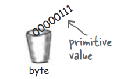
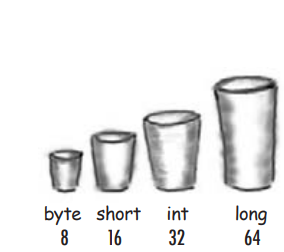

# Các thông tin cơ bản về Java
 
## Biến `Variable`
 
- `Variable`: là thành phần lưu trữ giá trị trong lập trình, `Variable` có thể lưu trữ nhiều kiểu dữ liệu khác nhau, giá trị của 1 `Variable` có thể thay đổi.
 
- Ngôn ngữ lập trình Java định nghĩa các loại `variables` sau:
 
  - `Instance Variables` (`Non-Static Fields`): Các `objects` lưu trữ `state` của chúng trong các `non-static fields`, nghĩa là các `fields` được khai báo mà không có từ khóa `static`.` Non-static fields` còn được gọi là `instance variables` vì giá trị `value` của chúng là duy nhất cho mỗi `instance` của một `class`.
 
    ```java
    public class MyClass {
    // instance variable declaration
    private int instanceVariable;
 
    public void setInstanceVariable(int value) {
        instanceVariable = value;
    }
 
    public int getInstanceVariable() {
        return instanceVariable;
    }
 
    public static void main(String[] args) {
        MyClass obj1 = new MyClass();
        obj1.setInstanceVariable(10);
 
        MyClass obj2 = new MyClass();
        obj2.setInstanceVariable(20);
 
        System.out.println("Value of obj1's variable: " + obj1.getInstanceVariable());
        System.out.println("Value of obj2's variable: " + obj2.getInstanceVariable());
    }
     }
    ```
 
  - `Class Variables` (`Static Fields`): Một `class variable` là bất kỳ `field` nào được khai báo `declare` với từ khóa `static`; điều này cho phép trình biên dịch `compiler` biết rằng chỉ có một bản sao duy nhất của `variable` này tồn tại, bất kể `class` đã được khởi tạo `initialize` bao nhiêu lần. Một `field` xác định số bánh răng của một loại xe đạp có thể được đánh dấu là `static` vì về mặt ý niệm, số bánh răng sẽ giống nhau cho tất cả các `instances`. Ví dụ: static int numGears = 6; tạo ra một `static field`. Ngoài ra, từ khóa `final` có thể được thêm vào để chỉ ra rằng số bánh răng sẽ không bao giờ thay đổi.
 
    ```java
     class Car {
     // Sử dụng static để biến này có thể dùng chung cho mọi đối tượng Car
       static int numberOfCars = 0;
 
    // Constructor (hàm tạo) được gọi mỗi lần tạo một đối tượng Car mới
       Car() {
       // Tăng số lượng xe khi tạo một xe mới
           numberOfCars++;
       }
 
    // Phương thức static để lấy số lượng xe hiện có
       static int getNumberOfCars() {
           return numberOfCars;
       }
     }
 
     public class Main {
       public static void main(String[] args) {
            // Tạo các đối tượng Car
            Car car1 = new Car();
            Car car2 = new Car();
            Car car3 = new Car();
 
       // In ra số lượng xe ô tô đã được tạo
        System.out.println("Số lượng xe đã tạo: " + Car.getNumberOfCars()); // Kết quả: 3
       }
     }
    ```
 
  - `Local Variables`(Biến cục bộ): Tương tự như cách một `object` lưu trữ `state` của nó trong các `fields`, một `method` sẽ thường lưu trữ `state` tạm thời trong các `local variables`. Cú pháp `declare` một `local variable` tương tự như `declare` một `field` (ví dụ: int count = 0;). Không có từ khóa đặc biệt nào để chỉ định một `variable` là "`local`"; việc xác định hoàn toàn phụ thuộc vào vị trí mà `variable` được `declare` — nghĩa là giữa dấu ngoặc nhọn mở và đóng của method "{ }". Do đó, `local variables` chỉ hiển thị cho các `methods` mà chúng được `declare`; chúng không thể truy cập `access` từ phần còn lại của `class`.
    ```java
    public class LocalVariable {
      public void show() {
        int num = 100; // local variable
        System.out.println("The number is : " + num);
     }
      public static void main(String args[]) {
        LocalVariableTest test = new LocalVariableTest();
        test.show();
     }
      }
    ```
 - Tham số (`Parameters`): là 1 `Variable` được truyền vào 1 `method` để `method` có thể hoạt động trên `Parameters` đó
    ```java
    public class LocalVariable {
      public void show(String parameter ) {
        System.out.println("The parameter is : " + parameter);      
     }
 
      }
    ```
+ `Naming` quy tắc đặt tên `variable`:
  + Phân biệt chữ hoa và chữ thường: tên "AGE" và và "age" là 2 tên khác nhau
  + Định danh hợp lệ: Tên `variable` bắt buộc phải là chữ cái, $, hoặc _, theo quy ước thì bắt đầu tên `variable` nên là chữ cái.
  + Không dùng khoảng trắng: tên `variable` không dùng khoảng trắng
  + Các ký tự sau kí tự đầu có thể là chữ cái, số, hoặc _ $
  + Dùng từ đầy đủ: Tên `variable` nên được đặt đầy đủ, dễ hiểu và giàu thông tin
  + Tránh từ khóa: không dùng từ khóa để làm tên `variable`
  + Quy ước viết hoa:
    + Từ đầu tiên viết thường chữ cái đầu, từ từ thứ 2 chở đi viết hoa chữ cái đầu (vd: isRunnning, myEmail)
    + Đối với `final` `variable` viết hoa tất cả các chữ cái và các từ cách nhau bởi dấu _ (vd: IS_RUNNING, MY_EMAIL)
 
### `Primitive Data Types` (kiểu dữ liệu nguyên thủy)
<p align="center">
  
</p>
 
+ Java là ngôn ngữ lập trình `statically-typed` nghĩa là kiểu (`type`) và tên của `variable` phải được khai báo trước khi chúng được sử dụng
 
```java
int gear = 1;
```
 
+ Kiểu dữ liệu `data type` của 1 `variable` xác định giá trị mà nó có thể chứa cũng như các phép toán có thể thực hiện trên nó
+ `Primitive Data Types`: kiểu dữ liệu cơ bản nhất, được định nghĩa sẵn bởi ngôn ngữ.
+ Trong Java `Primitive Data Types` được phân ra là 8 loại:
  - `byte`: Kiểu dữ liệu `byte` là một số nguyên bù hai 8-bit có dấu. Nó có giá trị tối thiểu là `-128` và giá trị tối đa là `127` (bao gồm). Kiểu dữ liệu `byte` có thể hữu ích để tiết kiệm bộ nhớ trong các mảng lớn, khi việc tiết kiệm bộ nhớ thực sự có ý nghĩa. Nó cũng có thể được sử dụng thay cho `int` khi giới hạn của nó giúp làm rõ ý nghĩa mã của bạn.
  - `short`: Kiểu dữ liệu `short` là một số nguyên bù hai 16-bit có dấu. Nó có giá trị tối thiểu là `-32,768` và giá trị tối đa là `32,767` (bao gồm). Tương tự như `byte`, bạn có thể sử dụng `short` để tiết kiệm bộ nhớ trong các mảng lớn, trong các tình huống mà việc tiết kiệm bộ nhớ thực sự quan trọng.
  - `int`: Theo mặc định, kiểu dữ liệu `int` là một số nguyên bù hai 32-bit có dấu, có giá trị tối thiểu là `-2^31` và giá trị tối đa là `2^31-1`. Trong Java SE 8 trở lên, bạn có thể sử dụng kiểu dữ liệu `int` để biểu diễn số nguyên 32-bit không dấu, có giá trị tối thiểu là `0` và giá trị tối đa là `2^32-1`. Sử dụng lớp `Integer` để sử dụng kiểu `int` dưới dạng số nguyên không dấu. Các phương thức tĩnh như `compareUnsigned`, `divideUnsigned`,... đã được thêm vào lớp `Integer` để hỗ trợ các phép toán số học cho số nguyên không dấu.
  - `long`: Kiểu dữ liệu `long` là một số nguyên bù hai 64-bit. `long` có dấu có giá trị tối thiểu là `-2^63` và giá trị tối đa là `2^63-1`. Trong Java SE 8 trở lên, bạn có thể sử dụng kiểu `long` để biểu diễn một số nguyên 64-bit không dấu, có giá trị tối thiểu là `0` và giá trị tối đa là `2^64-1`. Sử dụng kiểu dữ liệu này khi bạn cần một phạm vi giá trị rộng hơn những gì `int` cung cấp. Lớp `Long` cũng chứa các phương thức như `compareUnsigned`, `divideUnsigned`,... để hỗ trợ các phép toán số học cho số nguyên không dấu.
  - `float`: Kiểu dữ liệu `float` là một số thực có độ chính xác đơn 32-bit chuẩn IEEE 754. Phạm vi giá trị của nó nằm ngoài phạm vi của cuộc thảo luận này, nhưng được quy định trong phần “Floating-Point Types, Formats, and Values” của “Java Language Specification”. Giống như các khuyến nghị cho `byte` và `short`, sử dụng `float` (thay vì `double`) nếu bạn cần tiết kiệm bộ nhớ trong các mảng lớn của các số thực. Kiểu dữ liệu này không nên được sử dụng cho các giá trị chính xác, chẳng hạn như tiền tệ. Đối với điều này, bạn sẽ cần sử dụng lớp `java.math.BigDecimal`.
  - `double`: Kiểu dữ liệu `double` là một số thực có độ chính xác kép 64-bit chuẩn IEEE 754. Phạm vi giá trị của nó nằm ngoài phạm vi của cuộc thảo luận này, nhưng được quy định trong phần “Floating-Point Types, Formats, and Values” của “Java Language Specification”. Đối với các giá trị thập phân, kiểu dữ liệu này thường là lựa chọn mặc định. Giống như đã đề cập ở trên, kiểu dữ liệu này không nên được sử dụng cho các giá trị chính xác, chẳng hạn như tiền tệ.
  - `boolean`: Kiểu dữ liệu `boolean` chỉ có hai giá trị khả thi: `true` và `false`. Sử dụng kiểu dữ liệu này cho các cờ đơn giản để theo dõi các điều kiện `true/false`.
  - `char`: Kiểu dữ liệu `char` là một ký tự Unicode 16-bit duy nhất. Nó có giá trị tối thiểu là ` ` (hoặc `0`) và giá trị tối đa là ` ` (hoặc `65,535` bao gồm).
 
#### `Primitive Data Types`
+ Ngoài 8 loại `Primitive Data Types` kể trên, Java còn cung cấp 1 `Class` đặc biệt để làm việc với 1 chuỗi `char` là `String`. Về bản chất `String` ko phải là `Primitive Data Types` nhưng được thiết kế để hoạt động như 1 kiểu nguyên thủy (`immutable`,`auto create using "" `)
  + `immutable`: một khi được tạo ra giá trị không thể thay đổi  (sẽ nói sâu hơn ở phần bài `Object` và `Class`)
  + `auto create using ""`: có thể tự động khởi tạo ko cần từ khóa `new` (sẽ nói sâu hơn ở phần bài `Object` và `Class`)
 
<p align="center">
  
</p>
 
#### `Default Values`:
  + Các `Fields` sẽ luôn có giá trị `default` được cung cấp bởi `compiler` khi chúng được khai báo `declare`
 
    | Data Type               | Default Value (for fields) |
    |-------------------------|----------------------------|
    | byte                    | 0                          |
    | short                   | 0                          |
    | int                     | 0                          |
    | long                    | 0L                         |
    | float                   | 0.0f                       |
    | double                  | 0.0d                       |
    | char                    | '\u0000'                   |
    | String (or any object)  | null                       |
    | boolean                 | false                      |
 
  + `Local variables`: các `Local variables` không được cung cấp giá trị `default` khi khai báo. Nếu không thể khởi tạo `Local variables` tại nơi khai báo, hãy đảm bảo gán giá trị cho nó trước khi sử dụng. Truy cập vào một `Local variables` chưa được khởi tạo sẽ dẫn đến lỗi biên dịch (`compile-time error`).
 
```java
    public class DefaultValuesExample {
    // `Field` declarations
    int defaultInt;       // Giá trị mặc định là 0
    boolean defaultBool;  // Giá trị mặc định là false
    double defaultDouble; // Giá trị mặc định là 0.0
    String defaultString; // Giá trị mặc định là null
 
    public void displayValues() {
        // In ra các giá trị mặc định của các `Fields`
        System.out.println("Default int: " + defaultInt);
        System.out.println("Default boolean: " + defaultBool);
        System.out.println("Default double: " + defaultDouble);
        System.out.println("Default String: " + defaultString);
 
        // Ví dụ về `Local variable`
        int localInt;
        // System.out.println("Local int: " + localInt); // Lỗi biên dịch: `Local variables` chưa được khởi tạo
    }
 
    public static void main(String[] args) {
        DefaultValuesExample example = new DefaultValuesExample();
        example.displayValues();
    }
    }
```
 
#### `Literals`
+ `Literals` là các `variable` diễn trực tiếp của giá trị cố định trong `source code`, không cần tính toán.
+ Các `variable` `primitive` không cần từ khóa `new` để khởi tạo, vì chúng không phải `object` từ một `class`.
```java
boolean result = true;
char capitalC = 'C';
byte b = 100;
short s = 10000;
int i = 100000;
```
 
  + `Integer Literals`
    + `Integer literal` là kiểu `long` nếu kết thúc bằng L hoặc l; nếu không thì là `int`. Nên dùng chữ L in hoa để tránh nhầm với số 1.
    + `Integer literals` có thể biểu diễn qua các hệ số:
    + `Decimal` (cơ số 10): chỉ các chữ số 0-9.
    + `Hexadecimal` (cơ số 16): gồm các số 0-9 và chữ cái A-F, bắt đầu bằng 0x.
    + `Binary` (cơ số 2): gồm 0 và 1, bắt đầu bằng 0b.
 
      ```java
      int decVal = 26;    // Decimal
      int hexVal = 0x1a;  // Hexadecimal
      int binVal = 0b11010; // Binary
      ```
 
  + `Floating-Point Literals`
    + `Floating-point literals` là kiểu `float` nếu kết thúc bằng `F` hoặc `f`, nếu không là kiểu `double`. Có thể dùng ký hiệu `E` hoặc `e` cho dạng khoa học.\
    + `float` 32-bit và `double` 64-bit.
 
 
      ```java
      double d1 = 123.4;
      double d2 = 1.234e2;  // Khoa học
      float f1  = 123.4f;
      ```
 
##### `Character`
+ `char` và `String` có thể chứa ký tự `Unicode`, hoặc dùng mã  `Unicode` (ví dụ: '\u0108').
+ Dùng dấu nháy đơn ' cho `char` và nháy kép " cho `String`.
+ Một số mã đặc biệt cho `char`: \b, \t, \n, \f, \r, \", \', \\.
+ Có một `literal` đặc biệt khác là `null`, có thể được sử dụng như một giá trị cho bất kì `reference type` nào. `null` có thể được gán cho bất kỳ `variable` nào, ngoại trừ  `variable` của các `Primitive Data Types`.
+ `null` để chỉ trạng thái của 1 `variable` là `unavailable` (không khả dụng || không có giá trị)  (sẽ nói sâu hơn ở phần bài `Object` và `Class`)
```java
char letter = 'C';
```
 
+ ##### Sử dụng Dấu Gạch Dưới trong `Literals` Số
  + Kể từ Java SE 7, có thể sử dụng dấu gạch dưới _ giữa các chữ số trong `literals` để tăng khả năng đọc.
  + Không được phép đặt _ ở:
    + Đầu hoặc cuối số.
    + Cạnh dấu chấm thập phân.
    + Trước hậu tố F hoặc L.
    + Trong các vị trí bắt buộc phải có dãy số.
 
      ```java
      long creditCardNumber = 1234_5678_9012_3456L;  // Hợp lệ
      float pi1 = 3_.1415F;                         // Không hợp lệ
      int x2 = 52_;                                 // Không hợp lệ
      ```
#### Mảng `Arrays`
+ `Arrays` là một `object` chứa một số lượng cố định các giá trị của một `data type` duy nhất. Độ dài của `Arrays` được xác định khi mảng được tạo và sau khi tạo, độ dài của nó sẽ cố định.
+ Mỗi `phần tử` trong một mảng được gọi là một `element`, và mỗi `element` được truy cập qua chỉ số (`index`) của nó.

+ Khai báo một biến `reference` `variable` đến một `Arrays`:
```java
byte[] anArrayOfBytes;
short[] anArrayOfShorts;
long[] anArrayOfLongs;
float[] anArrayOfFloats;
double[] anArrayOfDoubles;
boolean[] anArrayOfBooleans;
char[] anArrayOfChars;
String[] anArrayOfStrings;
```
 
+ Tạo, khởi tạo, và truy cập một `Arrays`
```java
// tạo một mảng số nguyên
anArray = new int[10];
int[] anArray = { 100, 200, 300, 400, 500, 600, 700, 800, 900, 1000 };
```
+ Sao chép `Arrays`
```java
public static void arraycopy(Object src, int srcPos, Object dest, int destPos, int length)
```
 
```java
class ArrayCopyDemo {
    public static void main(String[] args) {
        String[] copyFrom = {
            "Affogato", "Americano", "Cappuccino", "Corretto", "Cortado",  
            "Doppio", "Espresso", "Frappucino", "Freddo", "Lungo", "Macchiato",      
            "Marocchino", "Ristretto" };
       
        String[] copyTo = new String[7];
        System.arraycopy(copyFrom, 2, copyTo, 0, 7);
        for (String coffee : copyTo) {
            System.out.print(coffee + " ");          
        }
    }
}
```
 
```
Cappuccino Corretto Cortado Doppio Espresso Frappucino Freddo
```
##### `java.util.Arrays`
+ `class` `java.util.Arrays` cung cấp nhiều `method` để thao tác với `Arrays`:
  + `binarySearch`: Dùng để tìm kiếm vị trí của một `element` trong `Arrays` đã sắp xếp
    ```java
    int[] numbers = {1, 3, 5, 7, 9};
    int index = java.util.Arrays.binarySearch(numbers, 5);
    System.out.println("Vị trí của 5: " + index);
    ```
  + `equals`: Kiểm tra xem hai `Arrays` có bằng nhau không.
     ```java
    int[] array1 = {1, 2, 3};
    int[] array2 = {1, 2, 3};
    boolean isEqual = java.util.Arrays.equals(array1, array2);
    System.out.println("Hai mảng bằng nhau: " + isEqual);
    ```  
  + `fill`: Điền một giá trị cụ thể vào mọi `element` của `Arrays`.
     ```java
    int[] array = new int[5];
    java.util.Arrays.fill(array, 7);
    System.out.println(java.util.Arrays.toString(array));
    ```  
  + `sort` và `parallelSort`: `sort` sắp xếp tuần tự; `parallelSort` sắp xếp song song để tăng tốc độ trên hệ thống đa bộ xử lý.
    ```java
     int[] numbers = {5, 3, 8, 1};
     java.util.Arrays.sort(numbers);
     System.out.println("Mảng đã sắp xếp: " + java.util.Arrays.toString(numbers));
    ```  
  + `toString`: Chuyển đổi `Arrays` thành `String` có định dạng.
      ```java
      String[] names = {"Alice", "Bob", "Charlie"};
      System.out.println(java.util.Arrays.toString(names));
      ```
  + `stream`: dùng để thực hiện các thao tác trên `Arrays` theo kiểu lập trình hàm `functional programming`.    
      ```java
      String[] words = {"Java", "Python", "C++"};
      java.util.Arrays.stream(words).forEach(System.out::println);
      ```    
 
## Toán tử `Operators`
+ `Operators` là các ký hiệu đặc biệt dùng để thực hiện các phép toán cụ thể trên một, hai hoặc ba `operands` và sau đó trả về kết quả.
+ Khi học về các `Operators` trong `Java`, cần nắm rõ `precedence` (độ ưu tiên) của các `Operators`. `Operators` có độ ưu tiên cao sẽ được đánh giá trước những `Operators` có độ ưu tiên thấp hơn. Các `Operators` trên cùng một hàng có độ ưu tiên bằng nhau. Nếu trong một biểu thức xuất hiện các `Operators` có cùng độ ưu tiên, sẽ có quy tắc để quyết định thứ tự đánh giá:
  + Tất cả `binary operators` trừ `assignment operators` được đánh giá từ trái sang phải.
  + `Assignment operators` được đánh giá từ phải sang trái.
 
### Bảng độ ưu tiên của các Operators
 
| Operators                  | Precedence                          | Quy tắc đánh giá               |
|----------------------------|-------------------------------------|--------------------------------|
| postfix                    | `expr++ expr--`                     | từ trái sang phải              |
| unary                      | `++expr --expr +expr -expr ~ !`     | từ trái sang phải              |
| multiplicative             | `* / %`                             | từ trái sang phải              |
| additive                   | `+ -`                               | từ trái sang phải              |
| shift                      | `<< >> >>>`                         | từ trái sang phải              |
| relational                 | `< > <= >= instanceof`              | từ trái sang phải              |
| equality                   | `== !=`                             | từ trái sang phải              |
| bitwise AND                | `&`                                 | từ trái sang phải              |
| bitwise exclusive OR       | `^`                                 | từ trái sang phải              |
| bitwise inclusive OR       | `\|`                                 | từ trái sang phải              |
| logical AND                | `&&`                                | từ trái sang phải              |
| logical OR                 | `\|\|`                                | từ trái sang phải              |
| ternary                    | `? :`                               | từ trái sang phải              |
| assignment                 | `=` `+=` `-=` `*=` `/=` `%=` `&=` `^=` `\|=` `<<=` `>>=` `>>>=` | từ phải sang trái          |
 
 
#### Toán tử Gán, Toán tử Số học và Toán tử Unary
 
##### Toán tử Gán `Assignment`
+ Một trong những toán tử phổ biến nhất là toán tử gán đơn giản `=`; nó gán giá trị ở bên phải cho toán hạng ở bên trái:
 
```java
int cadence = 0;
int speed = 0;
int gear = 1;
```
 
##### Toán tử Số học `Arithmetic`
+ Ngôn ngữ lập trình Java cung cấp các toán tử thực hiện phép cộng, phép trừ, phép nhân và phép chia.
 
| Toán tử | Mô tả |
|---------|-------|
| `+`     | Toán tử cộng |
| `-`     | Toán tử trừ |
| `*`     | Toán tử nhân |
| `/`     | Toán tử chia |
| `%`     | Toán tử chia lấy dư |
 
```java
class ArithmeticDemo {
    public static void main (String[] args) {
        int result = 1 + 2;
        System.out.println("1 + 2 = " + result);
        int original_result = result;
 
        result = result - 1;
        System.out.println(original_result + " - 1 = " + result);
        original_result = result;
 
        result = result * 2;
        System.out.println(original_result + " * 2 = " + result);
        original_result = result;
 
        result = result / 2;
        System.out.println(original_result + " / 2 = " + result);
        original_result = result;
 
        result = result + 8;
        System.out.println(original_result + " + 8 = " + result);
        original_result = result;
 
        result = result % 7;
        System.out.println(original_result + " % 7 = " + result);
    }
}
```
 
Kết quả đầu ra của chương trình:
 
```
1 + 2 = 3
3 - 1 = 2
2 * 2 = 4
4 / 2 = 2
2 + 8 = 10
10 % 7 = 3
```
 
##### Toán tử Unary `Unary Operators`
Các toán tử `unary` chỉ yêu cầu một toán hạng; chúng thực hiện các thao tác như tăng/giảm một giá trị, phủ định một biểu thức, hoặc đảo giá trị của một `boolean`.
 
| Toán tử | Mô tả |
|---------|-------|
| `+`     | Toán tử cộng đơn; biểu thị giá trị dương |
| `-`     | Toán tử trừ đơn; phủ định một biểu thức |
| `++`    | Toán tử tăng; tăng giá trị lên 1 |
| `--`    | Toán tử giảm; giảm giá trị xuống 1 |
| `!`     | Toán tử phủ định logic; đảo giá trị của một `boolean` |
 
Chương trình sau, `UnaryDemo`, kiểm tra các toán tử `unary`:
 
```java
class UnaryDemo {
    public static void main(String[] args) {
        int result = +1;
        System.out.println(result);
 
        result--;
        System.out.println(result);
 
        result++;
        System.out.println(result);
 
        result = -result;
        System.out.println(result);
 
        boolean success = false;
        System.out.println(success);
        System.out.println(!success);
    }
}
```
 
+ Các toán tử tăng/giảm có thể được áp dụng trước (`prefix`) hoặc sau (`postfix`) toán hạng. Cả `result++;` và `++result;` đều kết thúc với `result` tăng thêm 1. Sự khác biệt duy nhất là prefix (`++result`) trả về giá trị đã được tăng, trong khi postfix (`result++`) trả về giá trị ban đầu. Nếu chỉ thực hiện tăng/giảm đơn giản, chọn phiên bản nào cũng không quan trọng. Nhưng nếu sử dụng trong biểu thức lớn, lựa chọn này có thể tạo sự khác biệt.
 
```java
class PrePostDemo {
    public static void main(String[] args){
        int i = 3;
        i++;
        System.out.println(i);
        ++i;        
        System.out.println(i);
        System.out.println(++i);
        System.out.println(i++);
        System.out.println(i);
    }
}
```
#### Toán tử Equality, Relational, và Conditional
##### Toán tử Equality và Relational
+ Toán tử `equality` và `relational` xác định nếu một toán hạng lớn hơn, nhỏ hơn, bằng hoặc không bằng một toán hạng khác. Phần lớn các toán tử này có thể đã quen thuộc với bạn. Lưu ý rằng bạn phải sử dụng `==`, không phải `=`, khi kiểm tra xem hai giá trị `primitive` có bằng nhau không.
 
  | Toán tử | Ý nghĩa                  |
  |---------|---------------------------|
  | `==`    | bằng                     |
  | `!=`    | không bằng               |
  | `>`     | lớn hơn                  |
  | `>=`    | lớn hơn hoặc bằng        |
  | `<`     | nhỏ hơn                  |
  | `<=`    | nhỏ hơn hoặc bằng        |
 
```java
class ComparisonDemo {
 
    public static void main(String[] args){
        int value1 = 1;
        int value2 = 2;
        if(value1 == value2)
            System.out.println("value1 == value2");
        if(value1 != value2)
            System.out.println("value1 != value2");
        if(value1 > value2)
            System.out.println("value1 > value2");
        if(value1 < value2)
            System.out.println("value1 < value2");
        if(value1 <= value2)
            System.out.println("value1 <= value2");
    } }
```
##### Toán tử Conditional
+ Toán tử `&&` và `||` thực hiện các phép toán `Conditional-AND` và `Conditional-OR` trên hai biểu thức `boolean`. Các toán tử này có tính chất "short-circuiting", nghĩa là toán hạng thứ hai chỉ được đánh giá nếu cần thiết.
 
  | Toán tử | Ý nghĩa                  |
  |---------|---------------------------|
  | `&&`    | và                    |
  | `\|\|`  | hoặc               |
 
```java
class ConditionalDemo1 {
 
    public static void main(String[] args){
        int value1 = 1;
        int value2 = 2;
        if((value1 == 1) && (value2 == 2))
            System.out.println("value1 is 1 AND value2 is 2");
        if((value1 == 1) || (value2 == 1))
            System.out.println("value1 is 1 OR value2 is 1");
    }
}
```
+ Một toán tử điều kiện khác là ?:, có thể được xem như là cách viết ngắn gọn cho câu lệnh `if-then-else`. Toán tử này còn được gọi là toán tử `ternary` vì nó sử dụng ba toán hạng.
```java
class ConditionalDemo2 {
 
    public static void main(String[] args){
        int value1 = 1;
        int value2 = 2;
        int result;
        boolean someCondition = true;
        result = someCondition ? value1 : value2;
 
        System.out.println(result);
    }
}
```
 
##### Toán tử So sánh Kiểu instanceof
+ Toán tử `instanceof` so sánh một `object` với một kiểu cụ thể. Bạn có thể sử dụng nó để kiểm tra xem một đối tượng có phải là `instance` của một `class`, `instance` của một `subclass`, hoặc `instance` của một `class implement` một `interface` cụ thể.
```java
class InstanceofDemo {
    public static void main(String[] args) {
 
        Parent obj1 = new Parent();
        Parent obj2 = new Child();
 
        System.out.println("obj1 instanceof Parent: " + (obj1 instanceof Parent));
        System.out.println("obj1 instanceof Child: " + (obj1 instanceof Child));
        System.out.println("obj1 instanceof MyInterface: " + (obj1 instanceof MyInterface));
        System.out.println("obj2 instanceof Parent: " + (obj2 instanceof Parent));
        System.out.println("obj2 instanceof Child: " + (obj2 instanceof Child));
        System.out.println("obj2 instanceof MyInterface: " + (obj2 instanceof MyInterface));
    }
}
 
class Parent {}
class Child extends Parent implements MyInterface {}
interface MyInterface {}
 
```
```
obj1 instanceof Parent: true
obj1 instanceof Child: false
obj1 instanceof MyInterface: false
obj2 instanceof Parent: true
obj2 instanceof Child: true
obj2 instanceof MyInterface: true
```
+ Khi sử dụng toán tử `instanceof`, lưu ý rằng `null` không phải là `instance` của bất kỳ thứ gì.
 
#### Toán tử Bitwise và Bit Shift
 
+ Ngôn ngữ lập trình Java cũng cung cấp các toán tử thực hiện các phép toán `bitwise` và `bit shift` trên các kiểu số nguyên. Các toán tử này ít được sử dụng, nên nội dung giới thiệu sẽ ngắn gọn để biết về sự tồn tại của chúng.
 
- **Toán tử bitwise complement `~`** là toán tử đơn nguyên, đảo ngược một mẫu bit; nó có thể áp dụng cho bất kỳ kiểu số nguyên nào, biến mỗi `0` thành `1` và mỗi `1` thành `0`. Ví dụ, một byte có 8 bit; khi áp dụng toán tử này cho một giá trị có mẫu bit là `"00000000"`, mẫu bit sẽ đổi thành `"11111111"`.
 
- **Toán tử dịch trái có dấu `<<`** sẽ dịch một mẫu bit sang trái, và **toán tử dịch phải có dấu `>>`** sẽ dịch một mẫu bit sang phải. Mẫu bit được cho bởi toán hạng bên trái, và số vị trí cần dịch được xác định bởi toán hạng bên phải. Toán tử dịch phải không dấu `>>>` sẽ chèn `0` vào vị trí ngoài cùng bên trái, trong khi vị trí ngoài cùng bên trái sau `>>` phụ thuộc vào sự mở rộng dấu.
 
- **Toán tử `&` bitwise** thực hiện phép toán `AND` bitwise.
 
- **Toán tử `^` bitwise** thực hiện phép toán `XOR` bitwise (exclusive OR).
 
- **Toán tử `|` bitwise** thực hiện phép toán `OR` bitwise (inclusive OR).
 
 
```java
class BitDemo {
    public static void main(String[] args) {
        int bitmask = 0x000F;
        int val = 0x2222;
        // in ra "2"
        System.out.println(val & bitmask);
    }
}
```
 
## Biểu thức `Expressions`, Câu lệnh `Statements` và Khối lệnh `Blocks`
+ Bây giờ chúng ta đã hiểu về `variable` và `Operator`, đến lúc học về `Expressions`, `Statements`, và `Blocks`.
Toán tử `Operator` có thể được sử dụng để xây dựng các biểu thức `Expressions`, `Expressions` tính toán ra giá trị; `Expressions` là thành phần chính của `Statements`; `Statements` có thể được nhóm thành các `Blocks`
 
### `Expressions`
+ `Expressions` là một cấu trúc được tạo thành từ `variable`, `Operator`, và các lời gọi phương thức `method call`, được xây dựng theo cú pháp `syntax` của ngôn ngữ, và trả về một giá trị đơn.
```java
int cadence = 0;
anArray[0] = 100;
System.out.println("Element 1 at index 0: " + anArray[0]);
 
int result = 1 + 2; // result is now 3
if (value1 == value2)
    System.out.println("value1 == value2");
```
+ Kiểu dữ liệu của giá trị mà một `expression` trả về phụ thuộc vào các thành phần được sử dụng trong `expression`. 
`Expression` `cadence = 0` trả về `int` vì `assignment operator` trả về một giá trị có cùng kiểu dữ liệu với toán hạng bên trái của nó;
 trong trường hợp này, `cadence` là `int`. Có thể thấy từ các `expressions` khác,
 một `expression` có thể trả về các kiểu giá trị khác nhau như `boolean` hoặc `String`.
+ Ngôn ngữ lập trình `Java` cho phép xây dựng các `compound expressions` từ các `expressions` nhỏ hơn miễn là kiểu dữ liệu yêu cầu bởi
 một phần của `expression` khớp với kiểu dữ liệu của phần còn lại. Dưới đây là một ví dụ về `compound expression`:

```java
1 * 2 * 3
```
+ Trong ví dụ cụ thể này, thứ tự đánh giá `expression` không quan trọng vì kết quả của phép nhân không phụ thuộc vào thứ tự; kết quả luôn như nhau, không phụ thuộc vào thứ tự thực hiện các phép nhân. 
 Tuy nhiên, điều này không đúng với tất cả các `expressions`. Ví dụ, `expression` sau cho ra các kết quả khác nhau,
 tùy thuộc vào việc thực hiện phép cộng hay phép chia trước:

```java
x + y / 100    // mơ hồ
```

+ Có thể xác định chính xác cách `expression` được đánh giá bằng cách sử dụng dấu ngoặc tròn `(` và `)`. Ví dụ, để làm cho `expression` trên rõ ràng, có thể viết như sau:

```java
(x + y) / 100  // rõ ràng, khuyến nghị
```

+ Nếu bạn không chỉ rõ thứ tự các phép toán được thực hiện, thứ tự sẽ được xác định bởi mức độ ưu tiên gán cho các `operators` trong `expression`. Các `operators` có mức độ ưu tiên cao hơn sẽ được đánh giá trước. Ví dụ, `division operator` có mức độ ưu tiên cao hơn `addition operator`. Vì vậy, hai câu lệnh sau là tương đương:

```java
x + y / 100 
x + (y / 100) // rõ ràng, khuyến nghị
```

+ Khi viết các `compound expressions`, hãy rõ ràng và chỉ định bằng dấu ngoặc các `operators` cần được đánh giá trước.

### `Statements` 

+ `Statements` tương đương với các câu trong ngôn ngữ tự nhiên. Một `statement` tạo thành một đơn vị thực thi hoàn chỉnh. Các loại `expressions` sau có thể được biến thành `statement` bằng cách kết thúc `expression` với dấu chấm phẩy (`;`).
  + `Assignment expressions`
  + Bất kỳ sử dụng nào của `++` hoặc `--`
  + `Method invocations`
  + `Object creation expressions`

+ Các `statements` này được gọi là `expression statements`. Dưới đây là một số ví dụ về `expression statements`.

```java
// assignment statement
aValue = 8933.234;
// increment statement
aValue++;
// method invocation statement
System.out.println("Hello World!");
// object creation statement
Bicycle myBike = new Bicycle();
```

+ Ngoài `expression statements`, còn có hai loại `statements` khác: `declaration statements` và `control flow statements`.
 `Declaration statement` khai báo một `variable`.

```java
// declaration statement
double aValue = 8933.234;
```

+ Cuối cùng, `control flow statements` điều chỉnh thứ tự thực hiện các `statements`.

### Khối `Block`
+ `Block` là một nhóm chứa không hoặc nhiều `statements` nằm giữa các dấu ngoặc nhọn và có thể được sử dụng ở bất cứ đâu mà một `statement` đơn lẻ được phép. Ví dụ sau, `BlockDemo`, minh họa việc sử dụng `blocks`:

```java
class BlockDemo {
     public static void main(String[] args) {
          boolean condition = true;
          if (condition) { // bắt đầu khối 1
               System.out.println("Condition is true.");
          } // kết thúc khối 1
          else { // bắt đầu khối 2
               System.out.println("Condition is false.");
          } // kết thúc khối 2
     }
}
```

## `Control flow statements`
+ Các `statements` trong `source code` thường được thực thi từ trên xuống dưới, theo thứ tự xuất hiện. Tuy nhiên, các `Control flow statements`
 sẽ phá vỡ luồng thực thi bằng cách áp dụng các quyết định (`decision making`), vòng lặp (`looping`), và rẽ nhánh (`branching`), 
 cho phép chương trình thực thi có điều kiện các khối mã cụ thể. Phần này mô tả các câu lệnh ra quyết định 
(if-then, if-then-else, switch), các câu lệnh lặp (for, while, do-while), và các câu lệnh rẽ nhánh (break, continue, return) được hỗ trợ trong ngôn ngữ lập trình Java.

### Câu lệnh `if-then` và `if-then-else`
#### Câu lệnh `if-then`
+ Câu lệnh `if-then` là câu lệnh điều khiển luồng đơn giản nhất.
 Nó cho phép chương trình của bạn thực thi một phần nhất định của mã chỉ khi một điều kiện cụ thể được đánh giá là đúng. 
Ví dụ, lớp `Bicycle` có thể cho phép phanh giảm tốc độ của xe đạp chỉ khi xe đang di chuyển. Một cách triển khai phương thức `applyBrakes` có thể như sau:

```java
void applyBrakes() {
    // phần "if": xe đạp phải đang di chuyển
    if (isMoving){ 
        // phần "then": giảm tốc độ hiện tại
        currentSpeed--;
    }
}
```

+ Nếu điều kiện này đánh giá là sai (nghĩa là xe đạp không đang di chuyển), luồng điều khiển sẽ nhảy đến cuối câu lệnh if-then.
+ Ngoài ra, dấu ngoặc {} mở và đóng là tùy chọn, miễn là phần "then" chỉ chứa một câu lệnh
```java
void applyBrakes() {
    // giống như trên, nhưng không có dấu ngoặc
    if (isMoving)
        currentSpeed--;
}
```
#### Câu lệnh `if-then-else`
+ Câu lệnh if-then-else cung cấp một hướng thực thi phụ khi phần "if" được đánh giá là sai.
 Có thể sử dụng câu lệnh if-then-else trong phương thức applyBrakes để thực hiện một hành động nào đó nếu phanh được áp dụng khi xe đạp không di chuyển. 
Trong trường hợp này, hành động là chỉ cần in ra thông báo lỗi rằng xe đạp đã dừng.
```java
void applyBrakes() {
    if (isMoving) {
        currentSpeed--;
    } else {
        System.err.println("The bicycle has already stopped!");
    } 
}

```
### Câu Lệnh `switch`
+ Câu lệnh `switch` trong Java, khác với các câu lệnh `if-then` và `if-then-else`, có thể có nhiều đường dẫn thực thi khác nhau.
Một `switch` hoạt động với các kiểu dữ liệu nguyên thủy như `byte`, `short`, `char`, và `int`. 
Nó cũng hỗ trợ các loại kiểu `enum`, `class` `String`, và một số `class` đặc biệt đóng gói các kiểu dữ liệu nguyên thủy như `Character`, `Byte`, `Short`, và `Integer`.

+ Ví dụ dưới đây, `SwitchDemo`, khai báo một biến `int` có tên là `month` biểu thị một tháng. Mã sẽ hiển thị tên tháng dựa trên giá trị của `month` sử dụng câu lệnh `switch`.
```java
public class SwitchDemo {
    public static void main(String[] args) {

        int month = 8;
        String monthString;
        switch (month) {
            case 1:  monthString = "January";
                     break;
            case 2:  monthString = "February";
                     break;
            case 3:  monthString = "March";
                     break;
            case 4:  monthString = "April";
                     break;
            case 5:  monthString = "May";
                     break;
            case 6:  monthString = "June";
                     break;
            case 7:  monthString = "July";
                     break;
            case 8:  monthString = "August";
                     break;
            case 9:  monthString = "September";
                     break;
            case 10: monthString = "October";
                     break;
            case 11: monthString = "November";
                     break;
            case 12: monthString = "December";
                     break;
            default: monthString = "Invalid month";
                     break;
        }
        System.out.println(monthString);
    }
}
```
### Câu Lệnh `while` và `do-while`

+ Câu lệnh `while` liên tục thực hiện một khối câu lệnh trong khi một điều kiện nhất định là đúng. Cú pháp của nó có thể được diễn đạt như sau:

```java
while (expression) {
     statement(s)
}
```

+ Câu lệnh `while` đánh giá `expression`, điều này phải trả về giá trị boolean. Nếu `expression` đánh giá là đúng, câu lệnh `while` sẽ thực hiện `statement(s)` trong khối `while`. Câu lệnh `while` tiếp tục kiểm tra `expression` và thực hiện khối của nó cho đến khi `expression` đánh giá là sai. Sử dụng câu lệnh `while` để in các giá trị từ 1 đến 10 có thể được thực hiện như trong chương trình sau:

```java
class WhileDemo {
    public static void main(String[] args){
        int count = 1;
        while (count < 11) {
            System.out.println("Count is: " + count);
            count++;
        }
    }
}
```

+ Có thể triển khai một vòng lặp vô hạn bằng cách sử dụng câu lệnh `while` như sau:

```java
while (true){
    // your code goes here
}
```

+ Ngôn ngữ lập trình Java cũng cung cấp một câu lệnh `do-while`, có thể được diễn đạt như sau:

```java
do {
     statement(s)
} while (expression);
```

+ Sự khác biệt giữa `do-while` và `while` là `do-while` đánh giá `expression` ở dưới cùng của vòng lặp thay vì ở trên cùng. Do đó, các câu lệnh trong khối `do` luôn được thực hiện ít nhất một lần, như được trình bày trong chương trình sau:

```java
class DoWhileDemo {
    public static void main(String[] args){
        int count = 1;
        do {
            System.out.println("Count is: " + count);
            count++;
        } while (count < 11);
    }
}
```

### Câu lệnh `for`
+ Câu lệnh for cung cấp một cách ngắn gọn để lặp qua một dải giá trị. Dạng tổng quát của câu lệnh for có thể được diễn đạt như sau:
  + Biểu thức `initialization` khởi tạo vòng lặp; nó được thực thi một lần khi vòng lặp bắt đầu.
  + Khi biểu thức `termination` đánh giá thành `false`, vòng lặp sẽ kết thúc.
  + Biểu thức `increment` được gọi sau mỗi lần lặp qua vòng lặp; nó hoàn toàn chấp nhận việc tăng hoặc giảm một giá trị.
```java
for (initialization; termination; increment) {
    statement(s)
}
```

```java
class ForDemo {
    public static void main(String[] args) {
         for(int i = 1; i < 11; i++) {
              System.out.println("Count is: " + i);
         }
    }
}
```

```
Count is: 1
Count is: 2
Count is: 3
Count is: 4
Count is: 5
Count is: 6
Count is: 7
Count is: 8
Count is: 9
Count is: 10
```

+ Câu lệnh for cũng có một dạng khác được thiết kế để lặp qua Collections và mảng. Dạng này đôi khi được gọi là câu lệnh for nâng cao,
 và có thể được sử dụng để làm cho các vòng lặp của bạn ngắn gọn và dễ đọc hơn

 ```java
class EnhancedForDemo {
    public static void main(String[] args) {
         int[] numbers = {1, 2, 3, 4, 5, 6, 7, 8, 9, 10};
         for (int item : numbers) {
             System.out.println("Count is: " + item);
         }
    }
}

```
```
Count is: 1
Count is: 2
Count is: 3
Count is: 4
Count is: 5
Count is: 6
Count is: 7
Count is: 8
Count is: 9
Count is: 10
```

### Câu lệnh nhánh `Branching Statements`
+ Câu lệnh `break`: Câu lệnh break được sử dụng để thoát khỏi vòng lặp hoặc câu lệnh `switch`.
```java
for (int i = 0; i < 10; i++) {
    if (i == 5) {
        break; // thoát khỏi vòng lặp khi i = 5
    }
}
```
+ Câu lệnh `continue`: Câu lệnh continue được sử dụng để bỏ qua phần còn lại của vòng lặp hiện tại và tiếp tục với lần lặp tiếp theo.
```java
for (int i = 0; i < 10; i++) {
    if (i % 2 == 0) {
        continue; // bỏ qua các số chẵn
    }
    System.out.println(i); // chỉ in ra các số lẻ
}

```
+ Câu lệnh `return`: Câu lệnh `return` trong Java được sử dụng để kết thúc một phương thức `method` và có thể trả về một `value` cho `method` đó.
```java
return value;
```
+ `value` là giá trị trả về. Nếu phương thức không trả về giá trị nào, chỉ cần sử dụng return; mà không có giá trị.
