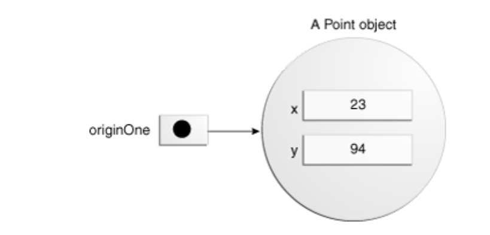
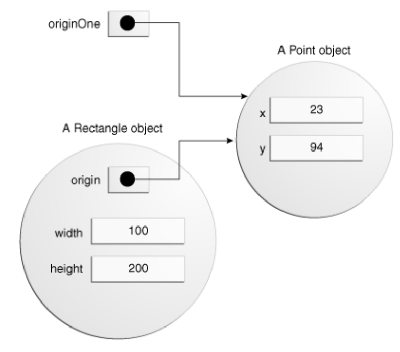
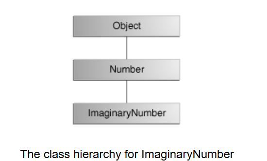

# `Classes` and `Objects`
## `Classes`
+ `Class` là một bản thiết kế hoặc nguyên mẫu để tạo ra các `object`.
### Declaring Classes
+ để khai báo `declare` 1 `class`:
  + Các `modifier` như `public`, `private`, và một số `modifier` khác. (Lưu ý rằng modifier private chỉ có thể được áp dụng cho Nested Classes.)
  + Tên `class`, theo quy ước, viết hoa chữ cái đầu.
  + Tên `superclass` của `class`, nếu có, đứng sau từ khóa `extends`. Một `class` chỉ có thể kế thừa (`extend`) từ một `parent class`.
  + Danh sách các `interface` mà `class` triển khai, nếu có, cách nhau bởi dấu phẩy và đứng sau từ khóa `implements`. Một `class` có thể `triển khai` nhiều hơn một `interface`.
  + Phần thân của `class`, bao quanh bởi 1 cặp ngoặc nhọn `{}`.
    ```java
    public class MyClass extends MySuperClass implements YourInterface {
    // field, constructor, and
    // method declarations
    private class MyNestedClass{
 
 
    }
    }
    ```
+ Phần thân của `class` hay `class body` là nơi sẽ bao gồm toàn bộ `code` thiết kế cho vòng đời của `object` được tạo ra bới `class` bao gồm:
  + `constructors`: dùng để khởi tạo 1 `object` mới từ `class` hiện tại.
  + `fields`: các trạng thái của `class` hoặc `object`.
  + `methods`: các hành vi của `class` hoặc `object`
 
### Declaring Member Variables
+ có 3 loại `Variables` khác nhau:
  + `Variables` trong 1 `class` được gọi là `fields`.
  + `Variables` trong 1 `method` hoặc `code block` được gọi là `local variables`.
  + `Variables` trong khai báo của `method` được gọi là `parameters`.
 
    ```java
    // access modifier  type  name
    public              int   cadence;
    public int gear;
    public int speed;
    ```
 
+ Khai báo 1 `fields` gồm 3 thành phần bao gồm:
  + `access modifier`: phạm vi truy cập bao gồm  `public`, `private`, `protected`, `default`
  + `data type`: kiểu dữ liệu
  + `name`: tên `fields`
 
## Access Modifiers
+ Kiểm soát quyền truy cập của `class` khác đối với `fields`, bao gồm 4 loại:
  + `public`: `field` có thể được truy cập từ tất cả các `class`.
  + `protected`: Chỉ trong cùng package hoặc `class` con
  + `default`: Chỉ trong cùng `package`
  + `private`: `field` chỉ có thể truy cập trong chính `class` của nó.
 
+ Để đạt được tính đóng gói `encapsulation` các `field` của 1 `class` nên được để `private`, và truy cập thông qua các `public` `method`
    ```java
    public class Bicycle {
   
    private int cadence;
    private int gear;
    private int speed;
   
    public Bicycle(int startCadence, int startSpeed, int startGear) {
        gear = startGear;
        cadence = startCadence;
        speed = startSpeed;
    }
   
    public int getCadence() {
        return cadence;
    }
   
    public void setCadence(int newValue) {
        cadence = newValue;
    }
   
    public int getGear() {
        return gear;
    }
   
    public void setGear(int newValue) {
        gear = newValue;
    }
   
    public int getSpeed() {
        return speed;
    }
   
    public void applyBrake(int decrement) {
        speed -= decrement;
    }
   
    public void speedUp(int increment) {
        speed += increment;
    }
    }
 
    ```
## `Types`
+ Tất cả các biến đều phải có một `type`.  
  + `primitive types` như int, float, boolean, v.v.
  + `reference types` `Strings`, `Arrays`, hoặc `Objects`
 
## Variable Names
+ Tất cả các biến đều phải tuân thủ quy tắc đặt tên trong bài trước
+ `Naming` quy tắc đặt tên `variable`:
  + Phân biệt chữ hoa và chữ thường: tên "AGE" và và "age" là 2 tên khác nhau
  + Định danh hợp lệ: Tên `variable` bắt buộc phải là chữ cái, $, hoặc _, theo quy ước thì bắt đầu tên `variable` nên là chữ cái.
  + Không dùng khoảng trắng: tên `variable` không dùng khoảng trắng
  + Các ký tự sau kí tự đầu có thể là chữ cái, số, hoặc _ $
  + Dùng từ đầy đủ: Tên `variable` nên được đặt đầy đủ, dễ hiểu và giàu thông tin
  + Tránh từ khóa: không dùng từ khóa để làm tên `variable`
  + Quy ước viết hoa:
    + Từ đầu tiên viết thường chữ cái đầu, từ từ thứ 2 chở đi viết hoa chữ cái đầu (vd: isRunnning, myEmail)
    + Đối với `final` `variable` viết hoa tất cả các chữ cái và các từ cách nhau bởi dấu _ (vd: IS_RUNNING, MY_EMAIL)
+ Quy tắc đặt tên cho `class` và `method` phương thức áp dụng tương tự chỉ khác ở 2 điểm:
  + Chữ cái đầu tiên của tên `class` phải viết hoa vd: `Car`,` Person`, `Student`, `OrderProcessor`
  + Tên `method` phải chứa động từ và nên là từ đầu tiên: `calculateTotal()`, `getSpeed()`, `setGear()`, `applyBrake()`, `speedUp()`
 
 
### Defining Methods
+ khai báo `method` có sáu thành phần theo thứ tự:
   + `Modifiers`: `public`, `private`,`protected`,`default`
   + `Return type`:  kiểu dữ liệu của giá trị trả về từ `method`, hoặc `void` nếu `method` không trả về giá trị.
   + `Method name`: các quy tắc đặt tên cho `fields` cũng áp dụng cho tên `method`
   + `Parameter list`: danh sách các tham số đầu vào được phân cách bằng dấu phẩy, với kiểu dữ liệu đi trước tên tham số và được đặt trong dấu ngoặc đơn ()
   + `Exception list`: danh sách các lỗi mà `method` có thể tạo ra trong quá trình chạy (học ở phần sau)
   + `Method body`: được đặt giữa cặp ngoặc nhọn – là triển khai của `method`, bao gồm cả khai báo của các `local variables`, sẽ nằm ở đây.
   ```java
    //Modifier  Return type  Method name
    public     double        calculateAnswer(// Parameter list
                                  double wingSpan, int numberOfEngines,
                                  double length, double grossTons) {
    // thực hiện tính toán ở đây
    }
    ```
+ `Method name` và `Parameter type` của `method` tạo thành `method signature`, trong 1 `class` không thể có 2  `method signature` giống nhau
  ```java
  calculateAnswer(double, int, double, double)
  ```
#### Naming a Method
+ Theo quy ước, tên method nên là một động từ viết thường hoặc là một tên nhiều từ bắt đầu bằng động từ viết thường, theo sau bởi tính từ, danh từ, v.v.
    ```java
    run()
    runFast()
    getBackground()
    getFinalData()
    compareTo()
    setX()
    isEmpty()
    ```
+ Trong 1 `class` có thể có nhiều `Method` có tên giống nhau nhờ cơ chế `method overloading`
#### Overloading Methods
+ Java có thể phân biệt giữa các `methods` với các `method signatures` khác nhau. Điều này có nghĩa là các methods trong cùng một lớp có thể có cùng tên nếu chúng có danh sách tham số khác nhau.
   
    ```java
    public class DataArtist {
        public void draw(String s) {
        }
   
        public void draw(int i) {
        }
   
        public void draw(double f) {
        }
 
        public void draw(int i, double f) {
        }
    }
    ```
 
+ Các `overloaded methods` được phân biệt bởi số lượng và kiểu của các `arguments` được truyền vào `method`.Trong ví dụ mã, draw(String s) và draw(int i) là các `methods` khác nhau và độc lập vì chúng yêu cầu các loại `arguments` khác nhau.
+ Không thể khai báo nhiều `method` với cùng tên và cùng số lượng và kiểu `arguments` vì trình biên dịch `compiler` không thể phân biệt chúng.
+ `Compiler` không xét đến kiểu trả về khi phân biệt `methods`, do đó không thể khai báo hai `methods` với cùng `signature` ngay cả khi chúng có `Return type` khác nhau.
+ Nên dùng `Overloaded methods` một cách phù hợp vì sẽ làm `code` khó đọc hơn
 
### Providing Constructors for Classes
+ `Constructors`: là 1 `method` đặc biệt dùng để tạo ra `object` từ `class`
+ Khai báo `Constructors` giống như khai báo `method` trừ 1 số điểm đặc biệt sau
  +  tên của `Constructors` là tên `class`
  + `Constructors` không có `return type`
   
   ```java
   public Bicycle(int startCadence, int startSpeed, int startGear) {
    gear = startGear;
    cadence = startCadence;
    speed = startSpeed;
    }
   ```
 
+ Để tạo một `object` từ một `constructor` sử dụng từ khóa `new`.Từ khóa `new` sẽ tạo ra không gian trong bộ nhớ cho `object` và khởi tạo các `fields` (`default value`) của nó.
   
    ```java
    Bicycle myBike = new Bicycle(30, 0, 8);
    ```
 
+ 1 `class` có thể có nhiều `constructor` khác nhau miễn là chúng có `method signature` khác nhau
+ `constructor` không có tham số đầu vào gọi là `no-argument constructor`
   
   ```java
    Bicycle(){
        ///
    }
    ```
 
+ `compiler` sẽ tự động gọi đến `no-argument constructor` của `class` cha nếu `class` con không có `constructor`, nếu `class` cha (`superclass`) không có `no-argument constructor` thì `compiler` sẽ báo lỗi. Khi `class` có `constructor` rồi thì `compiler` sẽ mặc định gọi vào `constructor` duy nhất đó mà ko gọi lên `class` cha nữa
   
   ```java
   public class Bicycle {
    int gear ;
    int cadence ;
    int speed ;
    // chỉ có 1 constructor duy nhất ko gọi lên `no-argument constructor` của `class` cha
    public Bicycle(int startCadence, int startSpeed, int startGear) {
    gear = startGear;
    cadence = startCadence;
    speed = startSpeed;
     }
 
    }
    ```
 
+ Nếu ko khai báo `superclass` qua từ khóa `extend`, `compiler` sẽ mặc định hiểu `class` cha là `Object`
+ Có thể sử dụng `access modifiers` trong khai báo `constructor` để kiểm soát `constructor` có thể được gọi bởi các `classes` khác nào.
 
   ```java
   public class Bicycle {
    int gear ;
    int cadence ;
    int speed ;
    // không cho các class khác gọi vào
    private Bicycle(int startCadence, int startSpeed, int startGear) {
    gear = startGear;
    cadence = startCadence;
    speed = startSpeed;
     }
 
    }
    ```
 
### Truyền Thông Tin Vào `Method` hoặc `Constructor`
+ Khai báo của một `method` hoặc `constructor` sẽ xác định số lượng và loại của các tham số cho `method` hoặc `constructor` đó.
    ```java
    public double computePayment(
                  double loanAmt,
                  double rate,
                  double futureValue,
                  int numPeriods) {
    double interest = rate / 100.0;
    double partial1 = Math.pow((1 + interest),
                    - numPeriods);
    double denominator = (1 - partial1) / interest;
    double answer = (-loanAmt / denominator)
                    - ((futureValue * partial1) / denominator);
    return answer;
    }  
    ```
+ `Parameters` là danh sách các `variable` trong khai báo `method`. `Arguments` là các giá trị thực tế được truyền vào khi `method` được gọi. Khi bạn một `method`, các `arguments` phải khớp với các `parameters` về loại và thứ tự.
#### Các Kiểu `Parameter`
+ Có thể sử dụng bất kỳ loại dữ liệu nào cho `parameter` của một `method` hoặc `constructor`. Bao gồm các loại dữ liệu nguyên thủy `primative`  như double, float, và int, và các kiểu tham chiếu  `reference` như `object` và `arrays`.
    ```java
    public Polygon polygonFrom(Point[] corners) {
    // thân method ở đây
    }
 
    ```
+ Lưu ý: Có thể truyền một `method` vào một `method` khác, bằng cách sử dụng một `lambda expression` hoặc `method reference`.
 
#### Số lượng `Argument` động
+ Có thể sử dụng một cấu trúc gọi là `varargs` để truyền một số lượng giá trị tùy ý vào `method`
    ```java
    public Polygon polygonFrom(Point... corners) {
    int numberOfSides = corners.length;
    double squareOfSide1, lengthOfSide1;
    squareOfSide1 = (corners[1].x - corners[0].x)
                     * (corners[1].x - corners[0].x)
                     + (corners[1].y - corners[0].y)
                     * (corners[1].y - corners[0].y);
    lengthOfSide1 = Math.sqrt(squareOfSide1);
 
    // thêm mã thân method để tạo và trả về một
    // `polygon` kết nối các `Point`
    }
 
    public PrintStream printf(String format, Object... args)
    ```
+ Gọi `method`:
    ```java
     System.out.printf("%s: %d, %s%n", name, idnum, address);
    ```
 
#### Tên `Parameter`
+ Khi khai báo một `parameter` cho một `method` hoặc `constructor`, cần phải cung cấp một tên cho `parameter` đó. Tên này được sử dụng trong thân `method` để tham chiếu đến `argument` được truyền vào.
+ Tên của một `parameter` phải là duy nhất trong phạm vi của nó. Nó không thể trùng với tên của một `parameter` khác cho cùng một `method` hoặc `constructor`, và không thể là tên của một `local variable` trong `method` hoặc `constructor`.
+ Một `parameter` có thể có cùng tên với một trong các trường (`field`) của `class`. Nếu trường hợp này xảy ra, `parameter` sẽ che khuất (`shadow`) `field`.
    ```java
    public class Circle {
        // `field` của `class`
    private int x, y, radius;
                          // paramter
    public void setOrigin(int x, int y) {
        int a = x+y;// xy là paramter ko phải là `field`
    }
    }
    ```
+ để sử dụng `field` của `class` sử dụng từ khóa `this`
    ```java
    public class Circle {
        // `field` của `class`
    private int x, y, radius;
                          // paramters
    public void setOrigin(int x, int y) {
        int a = this.x + this.y; // x y là `field` của `class`
    }
    }
    ```
#### Truyền `Argument` `primative type`
+ Các `primative type` `argument`, như `int` hoặc `double`, được truyền vào các `method` theo giá trị (`by value`). Điều này có nghĩa là bất kỳ thay đổi nào đối với các giá trị của `parameter` chỉ tồn tại trong phạm vi của `method`. Khi `method` kết thúc, các `parameter` sẽ biến mất và mọi thay đổi của chúng sẽ bị mất.
    ```java
    public class PassPrimitiveByValue {
 
        public static void main(String[] args) {
           
        int x = 3;
           
        // gọi passMethod() với
        // x làm argument
        passMethod(x);
           
        // in x để xem giá trị của nó
        // có thay đổi không
        System.out.println("After invoking passMethod, x = " + x);
        // KẾT QUẢ:
        // After invoking passMethod, x =  3
        }
       
    // thay đổi parameter trong passMethod()
        public static void passMethod(int p) {
            p = 10;
        }
    }
 
    ```
#### Truyền `reference type` `Argument`
+ Các `reference type` `parameter`, như `object`, cũng được truyền vào các `method` theo giá trị (`by value`). Điều này có nghĩa là khi `method` kết thúc, tham chiếu đã truyền vào vẫn tham chiếu đến cùng một `object` như trước. Tuy nhiên, các giá trị của các `field` của `object` có thể được thay đổi trong `method`, nếu chúng có cấp độ truy cập phù hợp.
    ```java
    public void moveCircle(Circle circle, int deltaX, int deltaY) {
    // mã để di chuyển gốc của circle đến x+deltaX, y+deltaY
    circle.setX(circle.getX() + deltaX);
    circle.setY(circle.getY() + deltaY);
       
    // mã để gán một tham chiếu mới cho circle
    circle = new Circle(0, 0);
    }
 
    ```
+ call method:
    ```java
    moveCircle(myCircle, 23, 56)
    ```
 
## Objects
+ Một chương trình Java điển hình sẽ tạo ra nhiều đối tượng (`objects`), các `objects` tương tác với nhau qua `method`, qua những sự tương tác này trương trình có thể thực hiện nhiều tác vụ phức tạp khác nhau
+ Khi một `objects` đã hoàn thành nhiệm vụ mà nó được tạo ra, các tài nguyên của nó sẽ được tái sử dụng cho các `objects` khác.
    ```java
    public class CreateObjectDemo {
 
    public static void main(String[] args) {
       
        // Khai báo và tạo một đối tượng point và hai đối tượng rectangle.
        Point originOne = new Point(23, 94);
        Rectangle rectOne = new Rectangle(originOne, 100, 200);
        Rectangle rectTwo = new Rectangle(50, 100);
       
        // Hiển thị chiều rộng, chiều cao và diện tích của rectOne
        System.out.println("Width of rectOne: " + rectOne.width);
        System.out.println("Height of rectOne: " + rectOne.height);
        System.out.println("Area of rectOne: " + rectOne.getArea());
       
        // Đặt vị trí cho rectTwo
        rectTwo.origin = originOne;
       
        // Hiển thị vị trí của rectTwo
        System.out.println("X Position of rectTwo: " + rectTwo.origin.x);
        System.out.println("Y Position of rectTwo: " + rectTwo.origin.y);
       
        // Di chuyển rectTwo và hiển thị vị trí mới của nó
        rectTwo.move(40, 72);
        System.out.println("X Position of rectTwo: " + rectTwo.origin.x);
        System.out.println("Y Position of rectTwo: " + rectTwo.origin.y);
    }
    }
    ```
    ```cmd
    Width of rectOne: 100
    Height of rectOne: 200
    Area of rectOne: 20000
    X Position of rectTwo: 23
    Y Position of rectTwo: 94
    X Position of rectTwo: 40
    Y Position of rectTwo: 72
    ```
### Creating Objects
+ Như đã biết, một `class` cung cấp bản thiết kế (`blueprint`) để tạo ra các `object`. 
    
    ```java
    // Declaration   Initialization     // Instantiation
    Point originOne  =                   new Point(23, 94);
    Rectangle rectOne = new Rectangle(originOne, 100, 200);
    Rectangle rectTwo = new Rectangle(50, 100);
    ```
+ Khai báo (`Declaration`): Các đoạn mã được in đậm là các khai báo biến (variable declarations) kết nối một tên biến với một kiểu object.
+ `Instantiation`: Từ khóa `new` là một toán tử trong Java dùng để tạo `object`.
+ `Initialization`: Toán tử `new` đi kèm với một lời gọi hàm tạo (`constructor`), dùng để khởi tạo 1 `object` mới.
#### Declaring a Variable to Refer to an Object
+ để khai báo một `variable`:
    ```java
     Type name;
     Point originOne;
    ```
+ Câu lệnh trên sẽ được `compiler` hiểu rằng `variable` tên name sẽ được tham chiếu đến các `object` được tạo bởi `class` `Type`
+ khi khai báo như trên, giá trị của name sẽ không được xác định cho đến khi 1 `object` được gán cho nó, khi này nếu sử dụng `variable` name
sẽ gặp lỗi `compile`

<p align="center">
  
</p>

#### Khởi tạo một object
+ Toán tử `new` khởi tạo một `class` bằng cách cấp phát bộ nhớ cho một `object` mới, gọi `construtor` và trả về một tham chiếu đến vùng nhớ của `object` vừa tạo.
+ Toán tử `new` bắt buộc phải được theo sau bởi 1 `constructor`
    ```java
     Point originOne = new Point(23, 94);
    ```
+ Tham chiếu được trả về bởi toán tử `new` không nhất thiết phải được gán cho một `variable`. Nó cũng có thể được sử dụng trực tiếp trong một biểu thức
    ```java
    int height = new Rectangle().height;
    ```

    ```java
    public class Point {
    public int x = 0;
    public int y = 0;
    // constructor
    public Point(int a, int b) {
        x = a;
        y = b;
    }
    }
    ```

    ```java
    Point originOne = new Point(23, 94);
    ```

    <p align="center">
  
    </p>

    ```java
    public class Rectangle {
    public int width = 0;
    public int height = 0;
    public Point origin;

    // four constructors
    public Rectangle() {
        origin = new Point(0, 0);
    }
    public Rectangle(Point p) {
        origin = p;
    }
    public Rectangle(int w, int h) {
        origin = new Point(0, 0);
        width = w;
        height = h;
    }

    public Rectangle(Point p, int w, int h) {
        origin = p;
        width = w;
        height = h;
    }

    // a method for moving the rectangle
    public void move(int x, int y) {
        origin.x = x;
        origin.y = y;
    }

    // a method for computing the area of the rectangle
    public int getArea() {
        return width * height;
    }
    }

    ```

    ```java
    Rectangle rectOne = new Rectangle(originOne, 100, 200);
    ```

     <p align="center">
  
    </p>

### Using Objects
#### Tham chiếu đến `Field` và `method` của `Object`
+ Các `field` của `object` được truy cập qua tên của biến tham chiếu đến chúng
    ```java
     System.out.println("Width of rectOne: "  + rectOne.width);
     System.out.println("Height of rectOne: " + rectOne.height);
    ```

+  Các `method` của `object` được truy cập qua tên biến tham chiếu đến chúng
    ```java
     System.out.println("Area of rectOne: " + rectOne.getArea());
    rectTwo.move(40, 72);
    ```

+ Hoặc cũng có thể truy cập qua tham chiếu vừa được tạo bởi từ khóa `new` 
    ```java
    new Rectangle(100, 50).getArea();
    int height = new Rectangle().height;
    ```
+ Khi 1 `object` không được tham chiếu nó sẽ bị thu hồi với `JVM`

#### Bộ Thu Gom Rác (Garbage Collector) 
+ Trong Java, lập trình viên không cần quản lý thủ công bộ nhớ hay hủy các `object` không còn cần thiết. Java có một `garbage collector` tự động xóa các `object` khi chúng không còn tham chiếu nào, giúp giải phóng bộ nhớ.

## More on Classes
### Returning a Value from a Method
+ Một `method` sẽ trả lại giá trị cho đoạn code đã gọi nó khi
  + Hoàn thành tất cả các `statement` trong `method`.
  + Gặp keyword `return`
  + Ném ra throw một `Exception`
+ Một `method` có thể trả về `reference type`, `primary type` hoặc ko trả về gì `void`
    
    ```java
    public Bicycle seeWhosFastest(Bicycle myBike, Bicycle yourBike,
                              Environment env) {
    Bicycle fastest;
    // mã để tính toán xe đạp nào 
    // nhanh hơn, dựa vào mỗi xe 
    // đạp và tốc độ vòng quay, cũng 
    // như môi trường (địa hình và gió)
    return fastest;
    }
    ```

+ `Return type` của `method` và giá trị trả ra của `return` phải cùng `type`
    ```java
    public int getArea() {
    return width * height; // => int 
    }
    ```

+ Bất kỳ `method` nào được khai báo `Return type` là `void` sẽ không trả về giá trị. Nó không cần chứa lệnh `return`, nhưng cũng có thể chứa lệnh này.
    ```java
    public void showArea() {
    // some code 
    // ...
    return;
    }
    ```

#### Trả Về một Class hoặc Interface
+ Khi một `method` sử dụng tên `class` làm kiểu trả về của nó, `class` của kiểu của đối tượng được trả về phải là một `subclass` của hoặc chính xác là `class` của kiểu trả về.
     <p align="center">
  
    </p>

    ```java
    public Number returnANumber() {
    return new Object(); // không thể trả ra do 1 Number thì là 1 Object, nhưng 1 Object chưa chắc đã là Number 
    return new Number(); // có thể trả ra do cùng type 
    return new ImaginaryNumber();// có thể trả ra do là subclass của Number
    }
    ```
### Using the this Keyword
+ Bên trong một `instance` `method` hoặc `constructor`, `this` là tham chiếu đến `object` hiện tại — `object` có `method` hoặc `constructor` đang được gọi.
#### Sử dụng this với một Field
+ Sử dụng từ khóa `this` khi một `field` bị che khuất `shadow` bởi một tham số của `method` hoặc `constructor`.
    ```java
    public class Point {
    public int x = 0;
    public int y = 0;
        
    //constructor
    public Point(int a, int b) {
        // không bị shadow
        x = a;
        y = b;
    }
    }

    public class Point {
    public int x = 0;
    public int y = 0;
        
    //constructor
    public Point(int x, int y) {
        // bị shadow do constructor nhận tham số đầu vào trùng tên
        this.x = x;
        this.y = y;
    }
    }
    ```

#### Sử dụng this với một Constructor (hoặc Method)
+ Từ bên trong một `constructor`, có thể sử dụng từ khóa `this` để gọi một `constructor` khác trong cùng `class`. Làm như vậy được gọi là `explicit constructor invocation`.
    ```java
    public class Rectangle {
    private int x, y;
    private int width, height;
        
    public Rectangle() {
        this(0, 0, 1, 1);
    }

    public Rectangle(int width, int height) {
        this(0, 0, width, height);
    }

    public Rectangle(int x, int y, int width, int height) {
        this.x = x;
        this.y = y;
        this.width = width;
        this.height = height;
    }
    ...
    }
    main(){
        Rectangle a = new Rectangle();
    }
    ```
### Controlling Access to Members of a Class
+ Các `access level modifier` xác định liệu các `class` khác có thể sử dụng một `field` cụ thể hoặc gọi một `method` cụ thể hay không. Có hai cấp độ kiểm soát truy cập:
    - Ở cấp độ `class` (`top level`) — `public` hoặc `package-private` (ko có `modifier`).
    - Ở cấp độ `field` (`member level`) — `public`, `private`, `protected`, hoặc `package-private` (không có `modifier`).

+ ở `class` có thể được khai báo với 2 loại `modifier` 
   + `public`: `class` này sẽ được truy cập cho tất cả các `class` ở mọi nơi.
   + `default`|| `package-private` (ko có `modifier`): chỉ truy cập trong `package` của chính nó.
+ ở `field` có thể được khai báo với 4 loại `modifier` 
   + `public`: `class` này sẽ được truy cập cho tất cả các `class` ở mọi nơi.
   + `protected`: chỉ có thể truy cập được trong `package` hoặc `subclass` của `class` hiện tại.
   + `default` || `package-private` (ko có `modifier`): chỉ truy cập trong `package` của chính nó.
   + `private`: chỉ có thể truy cập được trong `class` hiện tại

| Modifier      | Class | Package | Subclass | World |
|---------------|-------|---------|----------|-------|
| `public`      | Y     | Y       | Y        | Y     |
| `protected`   | Y     | Y       | Y        | N     |
| no modifier   | Y     | Y       | N        | N     |
| `private`     | Y     | N       | N        | N     |

### Các Lớp và Packages trong Ví Dụ Minh Họa Các Mức Độ Truy Cập

Bảng sau đây cho thấy nơi các thành viên của `Alpha class` có thể nhìn thấy đối với từng `access modifier` có thể áp dụng cho chúng.

| Modifier      | Alpha | Beta | Alphasub | Gamma |
|---------------|-------|------|----------|-------|
| `public`      | Y     | Y    | Y        | Y     |
| `protected`   | Y     | Y    | Y        | N     |
| no modifier   | Y     | Y    | N        | N     |
| `private`     | Y     | N    | N        | N     |

### Understanding Class Members
+ `static`: chỉ các trường (`fields`) và phương thức (`methods`) thuộc về `class`, thay vì thuộc về một thể hiện (`instance`) của `class`.

### Class variable
+ `class variable`: các `field` được đánh dấu `static` liên kết với `class`, thay vì với bất kỳ `object` nào. Mỗi 1 `static variable` sẽ  được lưu trữ ở một vị trí cố định trong bộ nhớ.
+ Bất kỳ `object` nào cũng có thể thay đổi giá trị của một `class variable`, tuy nhiên `class variable` cũng có thể thay đổi qua `class`.

    ```java
    public class Bicycle {
        
    private int cadence;
    private int gear;
    private int speed;
        
    // add an instance variable for the object ID
    private int id;
    
    // add a class variable for the
    // number of Bicycle objects instantiated
    private static int numberOfBicycles = 0;
        
    }
    ```
    ```java
    // truy cập qua class (khuyên dùng)
    Bicycle.numberOfBicycles=0;
    // truy cập qua instance (không khuyên dùng )
     Bicycle  bicycle = new  Bicycle();
     bicycle.numberOfBicycles=0;
    ```
+ ví dụ dùng `class variable` để tạo và quản lý ID cho `object` Bicycle
    ```java
    public class Bicycle {
        
    private int cadence;
    private int gear;
    private int speed;
        
    // add an instance variable for the object ID
    private int id;
    
    // add a class variable for the
    // number of Bicycle objects instantiated
    private static int numberOfBicycles = 0;
        
    }
    ```
    ```java
    // truy cập qua class (khuyên dùng)
    Bicycle.numberOfBicycles=0;
    // truy cập qua instance (không khuyên dùng)
     Bicycle  bicycle = new  Bicycle();
     bicycle.numberOfBicycles=0;
    ```

### Class method
+ `class method`: các `method` được đánh dấu `static` liên kết với `class`, thay vì với bất kỳ `object` nào.
+ Bất kỳ `object` nào của `class` cũng có thể gọi `class method` , tuy nhiên `class method` cũng có thể gọi qua `class`.
    ```java
    ClassName.methodName(args)// gọi qua class (khuyên dùng)
    instanceName.methodName(args)//gọi qua instance (không khuyên dùng)
    ```
+ quy tắc giữa `static` và `non-static`:
  + `Instance methods` có thể truy cập các `Instance variable` và `Instance methods` trực tiếp.
  + `Instance methods` có thể truy cập `Class variable` và `Class methods` trưc tiếp.
  + `Class method` có thể truy cập `Class method` và `Class variable` trưc tiếp.
  + `Class method` không thể `Instance variable` và `Instance methods` trực tiếp, mà phải truy cập qua tham chiếu.
    ```java
   public class ExampleClass {

    // Instance variable
    private int instanceVar = 10;

    // Class variable
    private static int classVar = 20;

    // Instance method
    public void instanceMethod() {
        // Có thể truy cập instance variable và instance method
        System.out.println("Instance variable: " + instanceVar);
        this.otherInstanceMethod();

        // Có thể truy cập class variable và class method
        System.out.println("Class variable: " + classVar);
        staticMethod();
    }

    // Another instance method
    public void otherInstanceMethod() {
        System.out.println("Another instance method.");
    }

    // Class method
    public static void staticMethod() {
        // Có thể truy cập class variable và class method
        System.out.println("Class variable: " + classVar);

        // Không thể truy cập trực tiếp instance variable và instance method
        // System.out.println("Instance variable: " + instanceVar); // Compile error
        // otherInstanceMethod(); // Compile error

        // Để truy cập instance variable hoặc instance method, cần sử dụng tham chiếu đối tượng
        ExampleClass obj = new ExampleClass();
        System.out.println("Instance variable via object: " + obj.instanceVar);
        obj.otherInstanceMethod();
    }

    public static void main(String[] args) {
        ExampleClass obj = new ExampleClass();

        // Gọi instance method
        obj.instanceMethod();

        // Gọi class method
        ExampleClass.staticMethod();
    }
    }
    ```

### Constants `final`
+ `Keyword` `static`, kết hợp với `keyword` `final`, cũng được sử dụng để định nghĩa các hằng số. Từ khóa `final` chỉ ra rằng giá trị của `variable` này không thể thay đổi.
    ```java
    static final double PI = 3.141592653589793;
    ```
+  Theo quy ước, tên của các giá trị hằng số được viết hoa. Nếu tên bao gồm hơn một từ, các từ được phân cách bởi dấu gạch dưới (_).

### Khởi tạo Field 
+ Có thể gán giá trị khởi tạo cho field khi khai báo, thích hợp cho các giá trị đơn giản có thể đặt trên một dòng.
    ```java
    public class BedAndBreakfast {

    // initialize to 10
    public static int capacity = 10;

    // initialize to false
    private boolean full = false;
    }
    ```
+  Sử dụng `static initialization block` cho `class variables` khi cần logic phức tạp hoặc xử lý lỗi. Các `static block` sẽ chạy theo thứ tự xuất hiện trong `code`.
    ```java
    public class DatabaseConnection {
    
    // Khai báo class variable cho kết nối database
    private static Connection connection;

    // Static initialization block để khởi tạo kết nối database với xử lý lỗi
    static {
        try {
            // Giả định tải driver cho database
            Class.forName("com.mysql.jdbc.Driver");

            // Khởi tạo kết nối đến database với URL, tên đăng nhập, và mật khẩu
            connection = DriverManager.getConnection(
                "jdbc:mysql://localhost:3306/mydatabase", "username", "password");
            
            System.out.println("Kết nối database thành công!");

        } catch (ClassNotFoundException e) {
            System.err.println("Không tìm thấy driver database.");
        } catch (SQLException e) {
            System.err.println("Không thể kết nối đến database.");
            e.printStackTrace();
        }
    }

    // Phương thức để truy cập kết nối database
    public static Connection getConnection() {
        return connection;
    }
    
    // Static initialization block khác có thể chạy tiếp nếu cần
    static {
        System.out.println("Chạy static block thứ hai.");
    }
    }

    public class Main {
    public static void main(String[] args) {
        // Truy cập kết nối database từ class variable đã khởi tạo
        Connection conn = DatabaseConnection.getConnection();
        if (conn != null) {
            System.out.println("Sẵn sàng sử dụng kết nối.");
        }
    }
    }

    ```
+ Thay thế `static block` bằng phương thức `private static` để dễ dàng tái sử dụng khi cần khởi tạo lại `class variable`.
    ```java
    public class DatabaseConnection {

    // Khai báo class variable cho kết nối database
    private static Connection connection;

    // Khai báo class variable cho trạng thái kết nối
    private static boolean isInitialized = false;

    // Phương thức private static để khởi tạo kết nối database
    private static void initializeConnection() {
        try {
            // Giả định tải driver cho database
            Class.forName("com.mysql.jdbc.Driver");

            // Khởi tạo kết nối đến database với URL, tên đăng nhập, và mật khẩu
            connection = DriverManager.getConnection(
                "jdbc:mysql://localhost:3306/mydatabase", "username", "password");

            System.out.println("Kết nối database thành công!");
            isInitialized = true;

        } catch (ClassNotFoundException e) {
            System.err.println("Không tìm thấy driver database.");
        } catch (SQLException e) {
            System.err.println("Không thể kết nối đến database.");
            e.printStackTrace();
        }
    }

    // Phương thức để truy cập kết nối database, sẽ khởi tạo nếu chưa được khởi tạo
    public static Connection getConnection() {
        // Kiểm tra nếu connection chưa được khởi tạo, gọi phương thức khởi tạo lại
        if (!isInitialized) {
            initializeConnection();
        }
        return connection;
    }

    // Phương thức để tái khởi tạo kết nối (ví dụ như sau khi kết nối bị mất)
    public static void reinitializeConnection() {
        // Đặt lại trạng thái isInitialized và khởi tạo lại kết nối
        isInitialized = false;
        initializeConnection();
    }

    public static void main(String[] args) {
        // Truy cập kết nối database từ class variable
        Connection conn = DatabaseConnection.getConnection();
        if (conn != null) {
            System.out.println("Sẵn sàng sử dụng kết nối.");
        }

        // Tái khởi tạo kết nối khi cần thiết
        DatabaseConnection.reinitializeConnection();
    }
    }

    ```
+ Khởi tạo `instance variables`:
   - `Initializer block`: `code block` không có từ khóa `static`, sao chép vào tất cả `constructor`, hữu ích khi chia sẻ khởi tạo giữa nhiều `constructor`.
    ```java
    public class Employee {

    private String name;
    private int age;

    // Initializer block để khởi tạo instance variables
    {
        // Khối mã này sẽ được sao chép vào tất cả các constructor
        name = "Unknown";
        age = 0;
    }

    // Constructor không tham số
    public Employee() {
        //{
        // Khối mã này sẽ được sao chép vào tất cả các constructor
        // name = "Unknown";
        // age = 0;
        //}
        System.out.println("Constructor không tham số.");
    }

    // Constructor với tham số
    public Employee(String name, int age) {
        //{
        // Khối mã này sẽ được sao chép vào tất cả các constructor
        // name = "Unknown";
        // age = 0;
        //}
        this.name = name;
        this.age = age;
        System.out.println("Constructor với tham số.");
    }

    public void display() {
        System.out.println("Tên: " + name);
        System.out.println("Tuổi: " + age);
    }

    public static void main(String[] args) {
        // Tạo đối tượng sử dụng constructor không tham số
        Employee emp1 = new Employee();
        emp1.display();

        // Tạo đối tượng sử dụng constructor có tham số
        Employee emp2 = new Employee("John", 30);
        emp2.display();
    }
    }

    ```
   - `Final method`: `Final method` để khởi tạo `instance variable`, tránh ghi đè và hỗ trợ tái sử dụng trong `subclass`.
     ```java
    public class Person {

    private String name;

    // Phương thức final để khởi tạo instance variable
    protected final String initializeName() {
        return "Unknown Name";
    }

    // Constructor sử dụng phương thức final để khởi tạo
    public Person() {
        this.name = initializeName(); // Gọi phương thức final để khởi tạo biến thể hiện
    }

    public void display() {
        System.out.println("Tên: " + name);
    }

    public static void main(String[] args) {
        // Tạo đối tượng Person
        Person person = new Person();
        person.display();
    }
    }

    ```

### Summary of Creating and Using Classes and Objects
## Khai báo `class`
- `class` được khai báo bằng tên `class` và nội dung `class` được đóng trong dấu ngoặc nhọn.
- `class` bao gồm các `fields`, `methods`, và `constructors`.
- `Fields` chứa thông tin trạng thái, `methods` triển khai hành vi, và `constructors` khởi tạo `object`.

## Điều khiển quyền truy cập
- Quyền truy cập vào `class` và các thành viên của `class` được điều khiển thông qua `access modifiers` như `public`,`protected`,`default`,`private`.

## Class Variables và Class Methods
- `Class variables` và `class methods` được khai báo bằng từ khóa `static`.
- `Class variables` được chia sẻ giữa các `instace`, và có thể truy cập thông qua tên `class` hoặc tham chiếu `object`.
- Các `instance variables` được sao chép riêng cho mỗi `object` và phải truy cập qua tham chiếu `object`.

## Tạo đối tượng từ `class`
- Để tạo `object`, sử dụng toán tử `new` và một `constructor`.
- `new` trả về tham chiếu đến `object`, có thể gán vào `variable` hoặc sử dụng trực tiếp.

## Truy cập vào `instance variables` và `method` ngoài `class`
- Truy cập `instance variables` và `methods` từ ngoài `class` qua `qualified name`.
    - `instance variables`: `objectReference.variableName`
    - `instance method`: `objectReference.methodName(argumentList)` hoặc `objectReference.methodName()`.

## Garbage Collector
- `Garbage collector` tự động dọn dẹp các `object` không còn tham chiếu.
- Bạn có thể `explicitly` gán giá trị `null` cho `object` để bỏ tham chiếu.

## Nested Classes
### Inner Class Example
### Local Classes
### Anonymous Classes
### Lambda Expressions
#### Method References
### When to Use Nested Classes, Local Classes, Anonymous Classes, and Lambda Expressions
## Enum Types