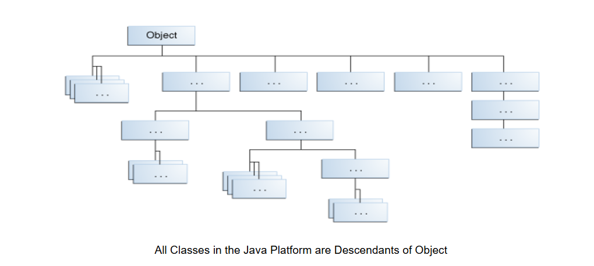
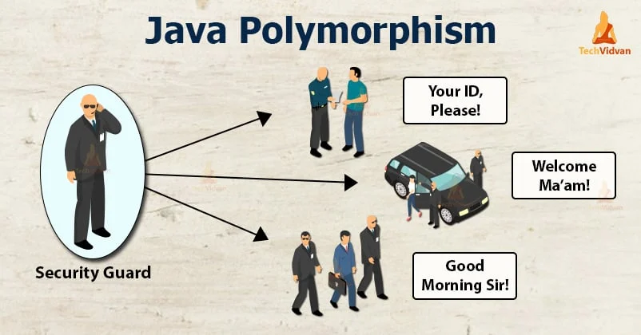

# Interfaces and Inheritance
## Interfaces
+ `Interfaces` là 1 bản hợp đồng chứa các quy tắc mà các `class` triển khai nó phải tuân theo
+ `Interfaces` sẽ khai báo `constants`, `method signatures`, `default methods`, `static methods`, và `nested types`
+ Chỉ `default methods` và `static methods` được triển khai `Method bodies` .
+ `Interfaces` không thể được khởi tạo chúng chỉ có thể được triển khai (`implements`) bởi các `classes` hoặc được mở rộng (`extend`) bởi các `interfaces` khác.
+ ví dụ khai báo `Interfaces`
    ```java
    public interface OperateCar {
 
   // constant declarations, if any
 
   // method signatures
   
   // Một enum với các giá trị RIGHT, LEFT
   int turn(Direction direction,
            double radius,
            double startSpeed,
            double endSpeed);
   int changeLanes(Direction direction,
                   double startSpeed,
                   double endSpeed);
   int signalTurn(Direction direction,
                  boolean signalOn);
   int getRadarFront(double distanceToCar,
                     double speedOfCar);
   int getRadarRear(double distanceToCar,
                    double speedOfCar);
         ......
   // thêm các method signatures khác
    }
 
    ```
+ Lưu ý rằng các `method signatures` không có dấu ngoặc nhọn và kết thúc bằng dấu chấm phẩy.
#### Interfaces as APIs
+ `interface` là công cụ để có thể tương tác giữa các phần mềm mà không tiết lộ các triển khai bên trong
 
### Defining an Interface
+ 1 `interface` được khai báo bao gồm các thành phần
  + `modifiers`: `public`, `pakage-private`
  + `keyword` `interface`: khai báo định danh 1 `interface`
  + tên `interface`
  + `keyword` `extends`: Một `interface` có thể mở rộng các `interface` khác, giống như một `class` có thể kế thừa hoặc mở rộng một `class` khác.
  + danh sách các `interface` cha: danh sách các `interface` mà `interface` hiện tại mở rộng, được phân tách bằng dấu phẩy.
 
    ```java
   public interface GroupedInterface extends Interface1, Interface2, Interface3 {
 
    // constant declarations
   
    // cơ số của logarit tự nhiên
    double E = 2.718282;
 
    // method signatures
    void doSomething(int i, double x);
    int doSomethingElse(String s);
    }
    ```
#### Phần Thân của Interface
+ Phần thân của một `interface` có thể chứa:
  + `abstract methods`: `method` ko chứa triển khai, không có dấu ngoặc nhọn
  + `default methods`: `method` được đánh dấu `default` và có thể có triển khai
  + `static methods`: `method` được đánh dấu `static`, thuộc về `interface`
  + `constants variable`: `variable` không đổi giá trị sau khi được gán giá trị
+ tất cả `abstract`, `default`, và `static methods` trong một `interface` đều mặc định là `public`
+ tất cả `constant` được định nghĩa trong `interface` đều mặc định là `public`, `static`, và `final`
 
### Implementing an Interface
+ Để khai báo một `class` triển khai một `interface`, sử dụng mệnh đề `implements` trong khai báo `class`
+ Một `class` có thể triển khai nhiều `interface`
+ Thông thường `implements` sẽ nằm sau `extends`
    ```java
   public interface Relatable {
       
    // `this` (`object` gọi `isLargerThan`)
    // và `other` phải là các instance
    // của cùng một `class`, trả về 1, 0, -1
    // nếu `this` lớn hơn,
    // bằng, hoặc nhỏ hơn `other`
    public int isLargerThan(Relatable other);
    }
 
    ```
#### Implementing the Relatable Interface
    ```java
    public class RectanglePlus
 
    implements Relatable {
    public int width = 0;
    public int height = 0;
    public Point origin;
 
    // bốn constructor
    public RectanglePlus() {
        origin = new Point(0, 0);
    }
    public RectanglePlus(Point p) {
        origin = p;
    }
    public RectanglePlus(int w, int h) {
        origin = new Point(0, 0);
        width = w;
        height = h;
    }
    public RectanglePlus(Point p, int w, int h) {
        origin = p;
        width = w;
        height = h;
    }
 
    // một method để di chuyển hình chữ nhật
    public void move(int x, int y) {
        origin.x = x;
        origin.y = y;
    }
 
    // một method để tính diện tích
    public int getArea() {
        return width * height;
    }
   
    // một method cần thiết để triển khai
    // `Interface` `Relatable`
    public int isLargerThan(Relatable other) {
        RectanglePlus otherRect
            = (RectanglePlus) other;
        if (this.getArea() < otherRect.getArea())
            return -1;
        else if (this.getArea() > otherRect.getArea())
            return 1;
        else
            return 0;              
    }
    }
 
    ```
+ Lưu ý: `Method isLargerThan`, được định nghĩa trong `Interface Relatable`, nhận một `object` thuộc kiểu `Relatable`. Dòng `code` `RectanglePlus otherRect=(RectanglePlus) other; `  chuyển kiểu (`cast`) `other` sang một `instance` của `RectanglePlus`. Việc chuyển kiểu này báo cho trình biên dịch biết `object` thực sự là gì. Nếu gọi trực tiếp `getArea` trên `other` (`other.getArea()`), `code` sẽ không thể biên dịch được vì trình biên dịch không hiểu rằng `other` thực sự là một `instance` của `RectanglePlus`.
 
### Using an Interface as a Type
+ Khi khai báo `interface` có thể được dùng như 1 kiểu dữ liệu tham chiếu. Biến tham chiếu được khai báo bằng `interface` phải được gán với tham chiếu của
`class` `implement` `interface` đó.
+ Khi 1 `class` `implement` 1 `interface` nó vừa có thể là kiểu dữ liệu của chính nó (hoặc `class` cha), vừa có thể là kiểu dữ liệu của `interface`,
`multiple inheritance`
   ```java
   public Object findLargest(Object object1, Object object2) {
   Relatable obj1 = (Relatable)object1;
   Relatable obj2 = (Relatable)object2;
   if ((obj1).isLargerThan(obj2) > 0)
      return object1;
   else
      return object2;
    }
 
    public Object findSmallest(Object object1, Object object2) {
   Relatable obj1 = (Relatable)object1;
   Relatable obj2 = (Relatable)object2;
   if ((obj1).isLargerThan(obj2) < 0)
      return object1;
   else
      return object2;
    }
 
    public boolean isEqual(Object object1, Object object2) {
   Relatable obj1 = (Relatable)object1;
   Relatable obj2 = (Relatable)object2;
   if ((obj1).isLargerThan(obj2) == 0)
      return true;
   else
      return false;
    }
   ```
 
### Evolving Interfaces
+ Khi tạo ra 1 `interface` hãy cố dự đoán tất cả các `method` mà `interface` cần được khai báo ngay từ đầu
+ Khi 1 `interface` đã được triển khai ở nhiều `class`, việc thêm 1 `method` mới vào `interface` sẽ trở lên khó khăn do các `class` hiện tại có thể chưa có cách để `implement method` mới này. Lúc này chúng ta có thể triển khai `method` mới theo 2 hướng chính
  + Tạo ra 1 `interface` mới kế thừa `interface` hiện tại để thêm `method` mới, lúc này các `class` đã `implement interface` cũ có thể chọn triển khai `method` mới 1 cách chủ động hơn
   ```java
    public interface DoItPlus extends DoIt {
 
       boolean didItWork(int i, double x, String s);
    }
 
   ```
   + Sử dụng 1 `default method` (cung cấp 1 triển khai tạm thời cho `method` mới)
   ```java
    public interface DoIt {
 
   void doSomething(int i, double x);
   int doSomethingElse(String s);
   default boolean didItWork(int i, double x, String s) {
       // Method body
   }
    }
   ```
### Default Methods
+ `Default methods` cho phép thêm chức năng mới vào các `interface` của thư viện và đảm bảo `binary compatibility` với code được viết cho các phiên bản cũ của những `interface` đó.
+  Khai báo một `method` là `default method` trong một `interface` bằng từ khóa `default` ở đầu `method signature`.
   ```java
    package defaultmethods;
 
    import java.time.*;
 
    public interface TimeClient {
    void setTime(int hour, int minute, int second);
    void setDate(int day, int month, int year);
    void setDateAndTime(int day, int month, int year,
                               int hour, int minute, int second);
    LocalDateTime getLocalDateTime();
   
    static ZoneId getZoneId (String zoneString) {
        try {
            return ZoneId.of(zoneString);
        } catch (DateTimeException e) {
            System.err.println("Invalid time zone: " + zoneString +
                "; using default time zone instead.");
            return ZoneId.systemDefault();
        }
    }
       
    default ZonedDateTime getZonedDateTime(String zoneString) {
        return ZonedDateTime.of(getLocalDateTime(), getZoneId(zoneString));
    }
    }
   ```
#### Mở rộng Interface chứa Default Method
+ Khi mở rộng một `interface` có chứa `default method`, có thể thực hiện những điều sau:
    + không khai báo `default method`, cho phép `interface` mở rộng kế thừa `default method`.
    ```java
    public interface AnotherTimeClient extends TimeClient { }
    ```
    + Khai báo lại `default method`, điều này biến `default method` thành `abstract`.
    ```java
        public interface AbstractZoneTimeClient extends TimeClient {
        public ZonedDateTime getZonedDateTime(String zoneString);
        }  
    ```
    + Định nghĩa lại `default method`, điều này ghi đè `default method`.
    ```java
    public interface HandleInvalidTimeZoneClient extends TimeClient {
    default public ZonedDateTime getZonedDateTime(String zoneString) {
        try {
            return ZonedDateTime.of(getLocalDateTime(), ZoneId.of(zoneString));
        } catch (DateTimeException e) {
            System.err.println("Invalid zone ID: " + zoneString +
                "; using the default time zone instead.");
            return ZonedDateTime.of(getLocalDateTime(), ZoneId.systemDefault());
        }
    }
    }
 
    ```
### Static Method
+ Ngoài `default method`, có thể khai báo `static method` trong các `interface`. (Một `static method` là một `method` được liên kết với `class` hoặc `interface` mà nó được khai báo thay vì với bất kỳ `object` nào. Mọi `instance` của `class` chia sẻ các `static method` của nó.)
    ```java
    public interface TimeClient {
    // ...
    static public ZoneId getZoneId(String zoneString) {
        try {
            return ZoneId.of(zoneString);
        } catch (DateTimeException e) {
            System.err.println("Invalid time zone: " + zoneString +
                "; using default time zone instead.");
            return ZoneId.systemDefault();
        }
    }
 
    default public ZonedDateTime getZonedDateTime(String zoneString) {
        return ZonedDateTime.of(getLocalDateTime(), getZoneId(zoneString));
    }    
    }
    ```
### Summary of Interfaces
+ Một khai báo `interface` có thể chứa `method signatures`, `default methods`, `static methods` và các định nghĩa hằng số. Các `method` duy nhất có triển khai là `default` và `static methods`.
 
+ Một `class` thực thi một `interface` phải triển khai tất cả các `method` được khai báo trong `interface`.
 
+ Tên của một `interface` có thể được sử dụng ở bất kỳ nơi nào mà một kiểu (`type`) có thể được sử dụng.
 
## Inheritance
+ Trong Java Các `class` có thể được bắt nguồn từ các `class` khác, qua đó kế thừa các `fields` and `methods` từ các `class` đó:
  + Một `class` được bắt nguồn từ một `class` khác được gọi là `subclass` (còn gọi là `derived class`, `extended class`, hoặc `child class`).
  + `Class` mà `subclass` được bắt nguồn từ đó được gọi là `superclass` (còn gọi là `base class` hoặc `parent class`).
+ Ngoại trừ `Object` (không có `superclass`), mọi `class` đều có một và chỉ một `superclass` trực tiếp (`single inheritance`). Nếu không có `superclass` rõ ràng nào được khai báo, thì mỗi `class` mặc định là một `subclass` của `Object`.
+ Các `class` có thể được bắt nguồn từ các `class` khác, tiếp nối như vậy, và cuối cùng bắt nguồn từ `class` cao nhất, `Object`. Những `class` này được gọi là hậu duệ (`descendant`) của tất cả các `class` trong chuỗi kế thừa kéo dài về `Object`.
+ Một `subclass` kế thừa tất cả các thành viên (`fields`, `methods`, và `nested types`) từ `superclass`.
+ Lưu ý: Các `constructor` không được kế thừa, nhưng `constructor` của `superclass` có thể được gọi từ `subclass`.
 
#### The Java Platform Class Hierarchy

  <p align="center">
  
  </p>

+ `Class` `Object`, được định nghĩa trong `package` `java.lang`, định nghĩa và thực hiện các hành vi chung cho tất cả các `class`.
+ Trên nền tảng `Java`, nhiều `class` kế thừa trực tiếp từ `Object`, các `class` khác kế thừa từ các `class` đó, và cứ tiếp tục như vậy, tạo thành một hệ thống phân cấp `class`.
+ Tất cả các `class` trong nền tảng `Java` đều là hậu duệ của `Object`.
+ Ở đầu hệ thống phân cấp, `Object` là `class` tổng quát nhất. Các `class` gần cuối hệ thống phân cấp cung cấp hành vi và đặc điểm chuyên biệt hơn.
    ```java
    public class Bicycle {
       
    // the Bicycle class has three fields
    public int cadence;
    public int gear;
    public int speed;
       
    // the Bicycle class has one constructor
    public Bicycle(int startCadence, int startSpeed, int startGear) {
        gear = startGear;
        cadence = startCadence;
        speed = startSpeed;
    }
       
    // the Bicycle class has four methods
    public void setCadence(int newValue) {
        cadence = newValue;
    }
       
    public void setGear(int newValue) {
        gear = newValue;
    }
       
    public void applyBrake(int decrement) {
        speed -= decrement;
    }
       
    public void speedUp(int increment) {
        speed += increment;
    }
    }
    ```
    ```java
    public class MountainBike extends Bicycle {
       
    // the MountainBike subclass adds one field
    public int seatHeight;
 
    // the MountainBike subclass has one constructor
    public MountainBike(int startHeight,
                        int startCadence,
                        int startSpeed,
                        int startGear) {
        super(startCadence, startSpeed, startGear);
        seatHeight = startHeight;
    }  
       
    // the MountainBike subclass adds one method
    public void setHeight(int newValue) {
        seatHeight = newValue;
    }  
    }
    ```
#### What You Can Do in a Subclass
+ Kế thừa tất cả các thành viên `public` và `protected` của `superclass`, dù `subclass` nằm trong `package` nào
+ Nếu `subclass` nằm trong cùng `package` với `superclass`, nó cũng kế thừa các thành viên `package-private`.
+ Có thể sử dụng các thành viên được kế thừa như hiện tại, thay thế, ẩn, hoặc bổ sung các thành viên mới.
+ Lưu ý: `Subclass` không kế thừa các thành viên `private` của `superclass`. Tuy nhiên, nếu `superclass` có `method public` hoặc `protected` để truy cập các trường `private`, `subclass` có thể sử dụng chúng.
#### Casting Objects
+ Nếu một `object` là kiểu của `class` từ đó nó được khởi tạo, có thể ép kiểu giữa các loại `class` trong chuỗi kế thừa. Ví dụ:
    ```java
    Object obj = new MountainBike();
    MountainBike myBike = (MountainBike)obj;  // Explicit casting
    ```
+ sử dụng `instanceof` để tránh bị lỗi khi `object` không phải `type` cần cast
    ```java
    if (obj instanceof MountainBike) {
    MountainBike myBike = (MountainBike)obj;
    }  // Explicit casting
    ```
 
### Multiple Inheritance of State, Implementation, and Type
+ Khác biệt giữa `class` và `Interface`:
  + `Class` có thể có `fields`, nhưng `Interface` thì không.
  + Có thể khởi tạo `class` để tạo `object`, nhưng không thể làm điều này với `Interface`.
+ Kế thừa đa dạng về trạng thái (`Multiple inheritance of state`), Java không cho phép một `class` mở rộng nhiều `class` để tránh xung đột khi:
  + Các `fields` giống nhau được kế thừa từ nhiều `superclass`.
  + `Method` hoặc `constructor` từ các `superclass` khác nhau khởi tạo cùng một `field`.
+ Kế thừa đa dạng về triển khai (`Multiple inheritance of implementation`):
  + Gây ra xung đột tên hoặc mơ hồ khi nhiều `superclass` chứa các `methods` trùng tên.
  + Java hỗ trợ một phần qua `default methods` trong `Interface`.
  + Java có quy tắc xác định `default method` nào sẽ được sử dụng nếu trùng tên.
+ Kế thừa đa dạng về kiểu (`Multiple inheritance of type`):
  + Một `class` có thể triển khai nhiều `Interface`.
  + Một `object` có thể có nhiều kiểu: kiểu của `class` và kiểu của các `Interface` mà `class` đó triển khai.
  + Nếu một `variable` được khai báo theo kiểu `Interface`, nó có thể tham chiếu đến bất kỳ `object` nào thuộc `class` triển khai `Interface`.
+ Xử lý xung đột `default methods` hoặc `static methods`
  + Khi một `class` kế thừa nhiều `methods` từ các `Interface`, lập trình viên hoặc trình biên dịch phải quyết định dùng cái nào.
 
### Overriding and Hiding Methods
#### Instance Methods
+ Một `instance` `method` trong `subclass` nếu có cùng `method signature` và kiểu trả về (`return type`) giống như (cùng `type` hoặc là `subtype` ) một `instance` `method` trong `superclass` sẽ `override` `method` của `superclass`.
+ Ghi đè hay `override` là khả năng thay đổi triển khai của một `method` mà `subclass` kế thừa từ `superclass`
    ```java
    // Superclass
    public class Animal {
    public void makeSound() {
        System.out.println("Some generic animal sound");
    }
    }
    ```
    ```java
    // Subclass
    public class Dog extends Animal {
    @Override
    public void makeSound() {
        System.out.println("Woof Woof");
    }
    }
    ```
    ```java
    public class Main {
    public static void main(String[] args) {
        Animal myAnimal = new Animal(); // Tạo một object của superclass
        Animal myDog = new Dog(); // Tạo một object của subclass nhưng tham chiếu từ kiểu superclass

        myAnimal.makeSound(); // Gọi method từ superclass
        myDog.makeSound();    // Gọi method từ subclass (ghi đè)
    }
    }

    ```
    ```cmd
    Some generic animal sound
    Woof Woof
    ```
+ Khi `override` 1 `method`, nên sử dụng `anotation` `@Override` để đánh dấu, khi 1 `method` được đánh dấu `override`, trình biên dịch `compiler`
sẽ xác định được `method` hiện tại đang `override` `method` của `super class`
#### Static Methods
+ Nếu một `subclass` định nghĩa một `static method` có cùng `method signature` như một `static method` trong `superclass`, thì method trong `subclass` sẽ hide (ẩn) `method` trong `superclass`.
+ Sự khác biệt giữa `hiding` một `static method` và `overriding` một `instance method`:
  + `instance method`: Khi gọi `method` bị `override` qua `subclass` nó sẽ gọi đến `method` của `subclass`
  + `static method`: Khi gọi `method` bị `override` nó sẽ phụ thuộc vào tên của `class` gọi nó
    ```java
    public class Animal {
    public static void testClassMethod() {
        System.out.println("The static method in Animal");
    }
    public void testInstanceMethod() {
        System.out.println("The instance method in Animal");
    }
    }

    ```
    ```java
    public class Cat extends Animal {
    public static void testClassMethod() {
        System.out.println("The static method in Cat");
    }
    public void testInstanceMethod() {
        System.out.println("The instance method in Cat");
    }

    public static void main(String[] args) {
        Cat myCat = new Cat();
        Animal myAnimal = myCat;
        Animal.testClassMethod();
        myAnimal.testInstanceMethod();
    }
    }

    ```
    ```cmd
    The static method in Animal  
    The instance method in Cat
    ```

### Đa hình (Polymorphism)
  <p align="center">
  
  </p>

+ Đa hình là một trong những nguyên tắc quan trọng của lập trình hướng đối tượng (`Object-Oriented Programming - OOP`), 
cho phép các `object` có cùng `interface` hoặc kế thừa cùng một `class` có thể triển khai khác nhau dựa trên ngữ cảnh.
+ `JVM` sẽ gọi `method` phù hợp với `object` mà `reference variable` trỏ tới, không phải với kiểu (`type`) của `variable`.
    ```java
    // Lớp cha
    public class Animal {
    public void speak() {
        System.out.println("Animal is making a sound");
    }
    }

    // Lớp con Dog
    public class Dog extends Animal {
    @Override
    public void speak() {
        System.out.println("Dog says: Woof Woof");
    }
    }

    // Lớp con Cat
    public class Cat extends Animal {
    @Override
    public void speak() {
        System.out.println("Cat says: Meow Meow");
    }
    }

    public class TestPolymorphism {
    public static void main(String[] args) {
        Animal myAnimal; // Reference variable kiểu Animal

        myAnimal = new Dog(); // Tham chiếu tới đối tượng Dog
        myAnimal.speak(); // Gọi phương thức speak() của Dog

        myAnimal = new Cat(); // Tham chiếu tới đối tượng Cat
        myAnimal.speak(); // Gọi phương thức speak() của Cat
    }
    }

    ```
    ```cmd
    Dog says: Woof Woof
    Cat says: Meow Meow
    ```

+ Tính đa hình được thể hiện qua 2 loại đa hình chính
  + `Compile-time Polymorphism` (Đa hình lúc biên dịch):
    + Thể hiện thông qua `method overloading`.
    + `Compiler` sẽ quyết định `method` nào được gọi tại thời điểm biên dịch.
  + `Runtime Polymorphism` (Đa hình lúc chạy):
    + Thể hiện thông qua `method overriding`.
    + `Java` quyết định `method` nào được gọi tại `runtime`, dựa trên `object` mà `reference variable` trỏ tới.

+ Lợi ích của đa hình
    + Tăng tính linh hoạt và khả năng mở rộng: Cho phép sử dụng một `interface` chung nhưng triển khai khác nhau.
    + Giảm sự phụ thuộc giữa các thành phần: Dễ dàng thay đổi hoặc mở rộng hệ thống mà không ảnh hưởng đến phần code hiện tại.
    + Tối ưu hóa mã nguồn: Có thể sử dụng chung `reference variable` thay vì viết các `method` xử lý riêng biệt cho từng `class`.

### Hiding Fields 
+ Trong Java, `hiding fields` xảy ra khi một `field` trong `subclass` có cùng tên với một `field` trong `superclass`, bất kể kiểu dữ liệu (`data type`) của chúng có giống nhau hay không.
+ Để truy cập `field` trong `superclass`, phải sử dụng từ khóa `super`.
+ Không khuyến khích việc `hiding fields` do sẽ làm `code` khó bảo trì
    ```java
    // Lớp cha
    public class SuperClass {
    public String field = "Field in SuperClass";
    }

    // Lớp con
    public class SubClass extends SuperClass {
    public String field = "Field in SubClass";

    public void printFields() {
        // Truy cập field trong subclass
        System.out.println("SubClass field: " + field);

        // Truy cập field trong superclass
        System.out.println("SuperClass field: " + super.field);
    }
    }

    // Kiểm tra
    public class TestHidingFields {
    public static void main(String[] args) {
        SubClass obj = new SubClass();
        obj.printFields();
    }
    }

    ```
    ```cmd
    SubClass field: Field in SubClass
    SuperClass field: Field in SuperClass
    ```
+ **Lưu ý**: `Hiding fields` khác với `method overriding`
    + `Hiding fields`: Sự lựa chọn `field` để sử dụng dựa trên kiểu của `reference variable` (lúc biên dịch - `compile-time`).
    + `Method overriding`: Sự lựa chọn `method` để gọi dựa trên kiểu của `object` thực sự (lúc chạy - `runtime`).
    ```java
    // Lớp cha
    public class SuperClass {
    public String field = "Field in SuperClass";
    }

    // Lớp con
    public class SubClass extends SuperClass {
    public String field = "Field in SubClass";

    public void printFields() {
        // Truy cập field trong subclass
        System.out.println("SubClass field: " + field);

        // Truy cập field trong superclass
        System.out.println("SuperClass field: " + super.field);
    }
    }

    // Kiểm tra
    public class TestHiding {
    public static void main(String[] args) {
        SuperClass obj = new SubClass();
        System.out.println(obj.field); // Kết quả: Field in SuperClass
    }
    }
    ```
    ```cmd
    SubClass field: Field in SubClass
    SuperClass field: Field in SuperClass
    ```
### Using the Keyword super
#### Accessing Superclass Members
+ Nếu một `method` hoặc `field` trong `subclass` ghi đè (`overrides`) `method` của `superclass`, có thể gọi `method` bị ghi đè bằng cách sử dụng từ khóa `super`.
    ```java
    // Superclass
    public class Superclass {
    public void printMethod() {
        System.out.println("Printed in Superclass.");
    }
    }

    // Subclass
    public class Subclass extends Superclass {
    // Ghi đè (override) printMethod trong Superclass
    @Override
    public void printMethod() {
        // Gọi phương thức của superclass
        super.printMethod(); 
        System.out.println("Printed in Subclass");
    }

    public static void main(String[] args) {
        Subclass s = new Subclass();
        s.printMethod();
    }
    }
    ```
    ```cmd
    Printed in Superclass.
    Printed in Subclass
    ```    
#### Subclass Constructors
+ Từ khóa `super` cũng được sử dụng để gọi `constructor` của `superclass`.
+ Lời gọi đến `constructor` của `superclass` phải nằm ở dòng đầu tiên trong `constructor` của `subclass`.
    ```java
    // Superclass: Bicycle
    public class Bicycle {
    private int cadence;
    private int speed;
    private int gear;

    public Bicycle(int startCadence, int startSpeed, int startGear) {
        this.cadence = startCadence;
        this.speed = startSpeed;
        this.gear = startGear;
    }
    }

    // Subclass: MountainBike
    public class MountainBike extends Bicycle {
    private int seatHeight;

    public MountainBike(int startHeight, 
                        int startCadence,
                        int startSpeed,
                        int startGear) {
        // Gọi constructor của superclass
        super(startCadence, startSpeed, startGear); 
        this.seatHeight = startHeight; // Thêm logic khởi tạo riêng
    }
    }

    ```
    ```cmd
    Printed in Superclass.
    Printed in Subclass
    ```
+ Cú pháp gọi `constructor` của `superclass`:
    + `super();` dùng để Gọi `constructor` không tham số (`no-argument constructor`) của `superclass`.
    + `super(parameter list);` Gọi `constructor` có tham số của `superclass`, với danh sách tham số phù hợp.
+ **Lưu ý:** 
    + Nếu không gọi `super()` một cách rõ ràng:
        + `Compiler` sẽ tự động thêm lệnh gọi đến `constructor` không tham số của `superclass`.
        + Nếu `superclass` không có `constructor` không tham số, chương trình sẽ báo lỗi biên dịch.
    + `Constructor chaining`:
        + Khi `constructor` của `subclass` gọi `constructor` của `superclas`s, quá trình này sẽ tiếp tục theo "chuỗi" ngược lên đến `Object`.
        + Đây được gọi là `constructor chaining`.
        ```java 
        public class Grandparent {
        public Grandparent() {
        System.out.println("Constructor of Grandparent");
            }
        }

        public class Parent extends Grandparent {
        public Parent() {
        super(); // Gọi constructor của Grandparent
        System.out.println("Constructor of Parent");
        }
        }

        public class Child extends Parent {
        public Child() {
        super(); // Gọi constructor của Parent
        System.out.println("Constructor of Child");
        }

        public static void main(String[] args) {
        Child obj = new Child();
        }   
        }
        ```
        ```cmd
        Constructor of Grandparent
        Constructor of Parent
        Constructor of Child
        ```
### Object as a Superclass
+ `Class` `Object`, nằm trong `package` `java.lang`, đứng ở đỉnh của cây phân cấp các `class`. Mọi `class` đều là hậu duệ, trực tiếp hoặc gián tiếp, của `class` `Object`.
+ Toàn bộ các `Class` trong `java` đều kế thừa các `method` của `Object`, các `method` này bao gồm
    + `protected Object clone() throws CloneNotSupportedException`: Tạo và trả về một bản sao của `object` này.
    + `public boolean equals(Object obj)`: Xác định xem một `object` khác có "bằng" với `object` hiện tại hay không.
    + `protected void finalize() throws Throwable`: Được gọi bởi bộ thu gom rác (`garbage collector`) trên `object` khi không còn bất kỳ tham chiếu nào trỏ đến `object` đó.
    + `public final Class getClass()`: trả về `runtime class` của 1 `object` 
    + `public int hashCode()`: trả về giá trị `hashcode` của 1 `object`
    + `public String toString()`: trả về biểu diễn chuỗi (`String`) của `object`.
+ Các `method` `notify`, `notifyAll`, và `wait` trong `Object` đóng vai trò trong việc đồng bộ hóa hoạt động của các `thread` chạy độc lập trong một chương trình
    + `public final void notify()`
    + `public final void notifyAll()`
    + `public final void wait()`
    + `public final void wait(long timeout)`
    + `public final void wait(long timeout, int nanos)`
### Writing Final Classes and Methods
### Abstract Methods and Classes
### Summary of Inheritance