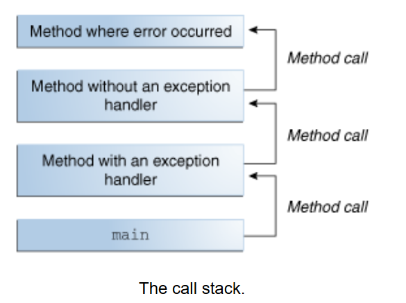
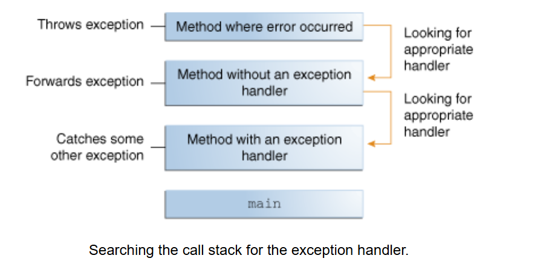
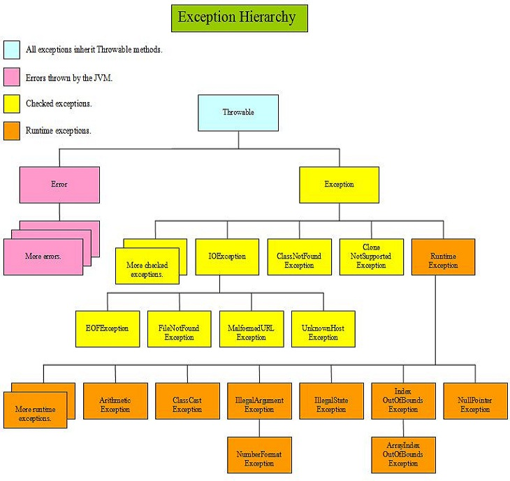
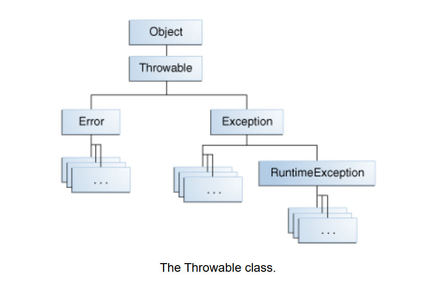

# Exceptions
## What Is an Exception?
+ `Exception` là một sự kiện xảy ra trong quá trình thực thi chương trình, làm gián đoạn luồng bình thường của các câu lệnh (`statement`) trong chương trình.
 
### Luồng xử lý lỗi của `java interpreter`?
+ Khi xảy ra lỗi trong một `method`, `method` này sẽ tạo một `object` và giao nó cho hệ thống `runtime` (`JVM`). `Object` này, gọi là `exception object`, chứa thông tin về lỗi, bao gồm loại lỗi và trạng thái của chương trình tại thời điểm xảy ra lỗi. Việc tạo một `exception object` và chuyển nó cho `JVM` được gọi là `throwing` (ném ra) một `exception`.
 
+ Sau khi `JVM` nhận được một `exception` nó sẽ cố gắng tìm 1 `try catch block` gần nhất chứa `method` `throwing` (ném ra) `exception`  để xử lý lỗi, tạo ra 1 `callstack` bao gồm các `method`
gọi đến `method` xảy ra lỗi
    <p align="center">
  
    </p>
 
+ `JVM` sẽ tìm kiếm trong `call stack` một `method` chứa một khối code có thể xử lý lỗi. Khối code này được gọi là `exception handler`. Việc tìm kiếm bắt đầu từ `method` nơi lỗi xảy ra và tiếp tục theo thứ tự ngược lại của các lần gọi `method`. Khi tìm thấy một trình xử lý phù hợp, `JVM` sẽ chuyển `exception` đến trình xử lý đó. Một `exception handler` được coi là phù hợp nếu loại của `exception object` được ném ra khớp với loại mà `exception handle` có thể xử lý.
 
    <p align="center">
  
    </p>
 
+ Nếu `JVM` không tìm được `exception handler` phù hợp nó sẽ `terminate` kết thúc chương trình đang chạy.
   
    ```java
    public class CallStackExample {
 
    public static void main(String[] args) {
        try {
            methodA();
        } catch (ArithmeticException e) {
            System.out.println("Caught exception in main: " + e.getMessage());
        }
    }
 
    public static void methodA() {
        methodB();
    }
 
    public static void methodB() {
        methodC();
    }
 
    public static void methodC() {
        throw new ArithmeticException("Exception from methodC.");
    }
    }
 
    ```
 
## The Catch or Specify Requirement
+ Code hợp lệ trong ngôn ngữ lập trình Java phải tuân thủ Yêu cầu `Catch or Specify`. Điều này có nghĩa là `code` có thể ném ra một số `exception` nhất định phải được bao bọc bởi một trong các cách sau:
    + Một câu lệnh `try` để bắt `exception`. Câu lệnh try phải cung cấp một trình xử lý cho `exception`, như được mô tả trong phần `Catching and Handling Exceptions`.
    + Một `method` khai báo rằng nó có thể ném ra `exception`. `Method` này phải cung cấp một câu lệnh `throws` liệt kê các `exception`, như được mô tả trong phần `Specifying the Exceptions Thrown by a Method`.
+ Code không tuân thủ Yêu cầu `Catch or Specify` sẽ không biên dịch được.
+ Không phải tất cả `exception` đều phải tuân thủ Yêu cầu `Catch or Specify`.
 
### The Three Kinds of Exceptions
<p align="center">
  
</p>
 
+ có 3 loại `exception` chính bao gồm:
    + `Error`: Đây là những `exception` xuất phát từ bên ngoài ứng dụng, mà ứng dụng thường không thể dự đoán hoặc khắc phục được.
    + `Runtime Exception`: Đây là những điều kiện `exception` xuất phát từ bên trong ứng dụng mà ứng dụng thường không thể dự đoán hoặc khắc phục được. Thông thường, những điều kiện này chỉ ra lỗi lập trình, chẳng hạn như lỗi logic hoặc sử dụng sai API
    + `Checked Exception`: Đây là những điều kiện `exception` mà một ứng dụng được viết tốt cần phải dự đoán và khắc phục. `Checked exception` phải tuân thủ Yêu cầu `Catch or Specify`. Tất cả `exception` là `checked exception`, trừ những `exception` thuộc `Error`, `RuntimeException`, và các `class` con của chúng.
 
+ `Error` và `Runtime Exception` được gọi chung là `unchecked exception`.
+ Bỏ qua `Catch or Specify`: Một số lập trình viên coi `Catch or Specify` là một thiếu sót nghiêm trọng trong cơ chế `exception` và cố tình bỏ qua bằng cách sử dụng `unchecked exception` thay cho `checked exception`.Tuy nhiên, nhìn chung, cách làm này không được khuyến khích. Phần `Unchecked Exceptions — The Controversy` sẽ đề cập khi nào việc sử dụng `unchecked exception` là phù hợp.
 
## Catching and Handling Exceptions?
+ Phần này mô tả
    + Cách sử dụng ba thành phần của trình xử lý `exception` — `try`, `catch`, và `finally blocks` — để viết một trình xử lý `exception`
    + Câu lệnh `try-with-resources` đặc biệt phù hợp cho các tình huống sử dụng các tài nguyên thuộc loại `Closeable`, chẳng hạn như `streams`.
 
### The try Block
+ Bước đầu tiên trong việc xây dựng trình xử lý `exception` là đặt code có khả năng ném ra `exception` vào trong một` try block`. Về cơ bản, một `try block` sẽ trông như sau:
    ```java
    try {
    code
    }
    catch and finally blocks . . .
    ```
+ Phần được dán nhãn code trong ví dụ chứa một hoặc nhiều dòng code hợp lệ có thể ném ra `exception`
+ Cách hoạt động của khối `try`:
    + Nếu có `exception` xảy ra bên trong `try block`, `exception` đó sẽ được xử lý bởi `exception handler` liên kết với `try block` này.
    + Để liên kết `exception handler` với một `try block`, cần đặt một `catch block` ngay sau `try block`.
### The catch Blocks
+ Để xử lý những lỗi xảy ra trong `try block` sử dụng những `catch Blocks` đặt ngay sau `try block`. Không được phép có bất kỳ dòng code nào nằm giữa phần cuối của `try block` và phần đầu của `catch block` đầu tiên.
    ```java
    try {
    // Code có thể ném `exception`
    } catch (ExceptionType name) {
    // Code xử lý `exception`
    } catch (ExceptionType name) {
    // Code xử lý `exception` khác
    }
    ```
    + Mỗi `catch block` là một `exception handler` để xử lý loại `exception` được chỉ định trong đối số của nó.
    + `ExceptionType` là kiểu `exception` mà `handler` có thể xử lý, phải là tên của một `class` kế thừa từ `Throwable`.
    + `name` là biến tham chiếu đến `object` `exception` mà `handler` có thể sử dụng.
 
+ Cách hoạt động:
    + `catch block` chứa code được thực thi khi `exception handler` được gọi.
    + Hệ thống `runtime` gọi `exception handler` đầu tiên trong `call stack` có kiểu `exception` (`ExceptionType`) phù hợp với loại `exception` được ném ra.
    + Nếu `object` `exception` có thể gán hợp lệ cho tham số của `exception handler`, thì hệ thống sẽ coi đó là một "`match`".
    ```java
    try {
    // Code có thể ném `exception`
    } catch (IndexOutOfBoundsException e) {
    System.err.println("IndexOutOfBoundsException: " + e.getMessage());
    } catch (IOException e) {
    System.err.println("Caught IOException: " + e.getMessage());
    }
 
    ```
+ `exception handlers` có thể làm những việc sau
    + Thực hiện phục hồi lỗi (`error recovery`).
    + Yêu cầu người dùng đưa ra quyết định.
    + Hoặc chuyển tiếp lỗi lên cấp cao hơn bằng `chained exceptions` (được giải thích trong phần `Chained Exceptions`).
#### Catching More Than One Type of Exception with One Exception Handler
+ Từ Java SE 7, một `catch block` có thể xử lý nhiều loại `exception`, giúp giảm trùng lặp code và tránh việc bắt các `exception` quá rộng.
    ```java
    catch (IOException | SQLException ex) {
    logger.log(ex);
    throw ex;
    }
    ```
    + Các loại `exception` được xử lý bởi một catch block được phân tách bằng ký tự |.
    + Lưu ý: Nếu một `catch block` xử lý nhiều loại `exception`, tham số catch (ví dụ: ex) sẽ được xem như final. Nên không thể gán giá trị mới cho tham số đó trong `catch block`.
### The finally Block
+ `finally Block` luôn được thực thi khi `try block` kết thúc. Điều này đảm bảo rằng các câu lệnh trong `finally block` sẽ được thực hiện ngay cả khi xảy ra `exception` không mong muốn. Ngoài xử lý `exception`, `finally` còn được sử dụng để đảm bảo `code cleanup` (dọn dẹp tài nguyên) không bị bỏ qua do các câu lệnh như `return`, `continue`, hoặc `break`.
    + **Lưu ý**: `finally block` có thể không được thực thi nếu `JVM` thoát trong khi `try` hoặc `catch` `code` đang được thực thi.
    ```java
        finally {
    if (out != null) {
        System.out.println("Closing PrintWriter");
        out.close();
    } else {
        System.out.println("PrintWriter not open");
    }
    if (f != null) {
        System.out.println("Closing FileWriter");
        f.close();
    }  
    }
 
    ```
+ Sử dụng `try-with-resources` thay vì `finally` để đóng tài nguyên: Java giới thiệu try-with-resources trong phiên bản Java SE 7, giúp tự động giải phóng tài nguyên hệ thống khi không còn cần thiết, chẳng hạn như đóng tệp hoặc stream.
 
    ```java
    public void writeList() throws IOException {
    try (FileWriter f = new FileWriter("OutFile.txt");
         PrintWriter out = new PrintWriter(f)) {
        for (int i = 0; i < SIZE; i++) {
            out.println("Value at: " + i + " = " + list.get(i));
        }
    }
    }
    ```
    + Ưu điểm của `try-with-resources`
        + Tự động giải phóng tài nguyên khi thoát khỏi `try block` (kể cả khi có `exception`).
        + Code ngắn gọn và dễ đọc hơn.
        + Giảm nguy cơ lỗi do quên đóng tài nguyên.
 
### The try-with-resources Statement
+ Câu lệnh `try-with-resources` là một `try statement` dùng để khai báo một hoặc nhiều `resources`. Một `resource` là một `object` cần phải được đóng lại sau khi chương trình sử dụng xong. `Try-with-resources` `statement` đảm bảo rằng mỗi `resource` được đóng lại ở cuối câu lệnh. Bất kỳ `object` nào triển khai giao diện `java.lang.AutoCloseable`, bao gồm tất cả các `object` triển khai `java.io.Closeable`, đều có thể được sử dụng như một `resource`.
    ```java
    static String readFirstLineFromFile(String path) throws IOException {
    try (FileReader fr = new FileReader(path);
         BufferedReader br = new BufferedReader(fr)) {
        return br.readLine();
    }
    }
 
    ```
    + Trong ví dụ này, các `resource` được khai báo trong `try-with-resources statement` là `FileReader` và `BufferedReader`. Các câu lệnh khai báo `resource` xuất hiện trong dấu ngoặc tròn ngay sau từ khóa try. Các `class FileReader` và `BufferedReader`, trong Java SE 7 và các phiên bản sau, triển khai `interface` `java.lang.AutoCloseable`. Vì các `instance` của `FileReader` và `BufferedReader` được khai báo trong một `try-with-resources statement`, chúng sẽ được đóng lại bất kể `try statement` kết thúc bình thường hay đột ngột (do `method` `BufferedReader.readLine` ném một `exception` `IOException`).
    + Trước Java SE 7, có thể sử dụng `finally block` để đảm bảo rằng một `resource` được đóng lại bất kể `try statement` kết thúc bình thường hay bất thường. Ví dụ sau đây sử dụng `finally block` thay vì `try-with-resources statement`:
        ```java
        static String readFirstLineFromFileWithFinallyBlock(String path) throws IOException {
        FileReader fr = new FileReader(path);
        BufferedReader br = new BufferedReader(fr);
        try {
        return br.readLine();
         } finally {
        br.close();
        fr.close();
         }
            }
         ```
 
    + Tuy nhiên, ví dụ này có thể xảy ra `resource leak`. Một chương trình không nên chỉ dựa vào `garbage collector` (GC) để giải phóng bộ nhớ của một `resource` khi sử dụng xong. Chương trình cần phải giải phóng `resource` trở lại hệ điều hành, thường bằng cách gọi `method close` của `resource`. Tuy nhiên, nếu chương trình không làm điều này trước khi `GC` thu hồi `resource`, thì thông tin cần để giải phóng `resource` sẽ bị mất. `Resource`, theo quan điểm của hệ điều hành, vẫn được coi là đang sử dụng, dẫn đến hiện tượng `leak`.
 
### Specifying the Exceptions Thrown by a Method
+ Để chỉ ra rằng `method` có thể ném hai loại `exception`, thêm một `throws clause` vào khai báo của `method`. `Throws clause` bao gồm từ khóa `throws` theo sau là danh sách các `exception`, phân tách bởi dấu phẩy. `Clause` này được đặt sau tên và danh sách tham số của `method`, trước dấu ngoặc nhọn { định nghĩa phạm vi của `method`.
    ```java
    public void writeList() throws IOException, IndexOutOfBoundsException {}
    ```
 
### How to Throw Exceptions
+ Trước khi có thể bắt một `exception`, một đoạn `code` nào đó phải ném `exception` đó. Bất kỳ đoạn `code` nào cũng có thể ném một `exception`: `code` của bạn, `code` từ một `package` được viết bởi người khác, chẳng hạn như các `package` đi kèm với nền tảng Java, hoặc môi trường chạy Java (`Java runtime environment`). Dù ai ném `exception`, nó luôn được ném bằng `throw statement`.
+ `Java` cung cấp nhiều `class` `exception` (`exception classes`) để giúp phân biệt các loại `exception` có thể xảy ra trong quá trình thực thi `program`. Tất cả các `class` này đều là `class` con của `class` `Throwable`, và tất cả cho phép chương trình phân biệt các loại `exception` khác nhau.
+ Có thể tạo các `class` `exception` của riêng mình để đại diện cho các vấn đề có thể xảy ra trong các `class` mà `dev` viết. Thực tế, nếu bạn là người phát triển package, bạn có thể cần phải tạo một bộ `exception` riêng để giúp người dùng phân biệt một lỗi có thể xảy ra trong `package` của bạn với các lỗi xảy ra trong nền tảng `Java` hoặc các `package` khác.
+ Ngoài ra, bạn cũng có thể tạo `chained exceptions`. Để biết thêm thông tin, tham khảo phần Chained Exceptions.
 
#### The throw Statement
+ Tất cả các `method` sử dụng câu lệnh `throw` để ném một `exception`. Câu lệnh `throw` yêu cầu một đối số duy nhất: một `object` có thể ném (`throwable object`). Các `objec`t có thể ném là các thể hiện của bất kỳ `class` con nào của `class` `Throwable`
 
    ```java
    public Object pop() {
    Object obj;
 
    if (size == 0) {
        throw new EmptyStackException();
    }
 
    obj = objectAt(size - 1);
    setObjectAt(size - 1, null);
    size--;
    return obj;
    }
 
    ```
##### Throwable Class and Its Subclasses
+ Các `object` kế thừa từ `class` `Throwable` bao gồm các `class` con trực tiếp (các `object` kế thừa trực tiếp từ `class` `Throwable`) và các `class` con gián tiếp (các `object` kế thừa từ `class` con hoặc cháu của `class` `Throwable`). Hình dưới đây minh họa cấu trúc phân cấp của `class` `Throwable` và các `class` con quan trọng nhất của nó.
 
+ Cấu trúc phân cấp của `class` `Throwable` và các `class` con quan trọng.
    <p align="center">
  
    </p>
 
###### `class` `Error`
+ Khi có sự cố liên kết động hoặc lỗi hệ thống nghiêm trọng khác xảy ra trong `Java Virtual Machine`, `Error` sẽ được ném ra. Các chương trình đơn giản thường không bắt hoặc ném các `Error`.
 
###### `class` `Exception`
+ Hầu hết các chương trình ném và bắt các `object` kế thừa từ `class` `Exception`. Một `Exception` chỉ ra rằng có một vấn đề xảy ra, nhưng không phải là một lỗi nghiêm trọng của hệ thống. Phần lớn các chương trình bạn viết sẽ ném và bắt các `Exception` thay vì `Error`.
 
+ `Java platform` định nghĩa nhiều `class` con của `Exception`. Các `class` con này chỉ ra các loại `exception` khác nhau có thể xảy ra. Ví dụ, `IllegalAccessException` báo hiệu rằng một `method` cụ thể không thể được tìm thấy, và `NegativeArraySizeException` cho biết chương trình đã cố gắng tạo một mảng với kích thước âm.
 
+ Một `class` con của `Exception`, `RuntimeException`, được dành riêng cho các `exception` chỉ ra việc sử dụng sai API. Một ví dụ về `runtime exception` là `NullPointerException`, xảy ra khi một `method` cố gắng truy cập một thành viên của `object` thông qua một tham chiếu `null`. Phần `Unchecked Exceptions — The Controversy` giải thích lý do tại sao hầu hết các ứng dụng không nên ném các `runtime exceptions` hoặc tạo `class` con từ `RuntimeException`.
 
##### Chained Exceptions
+ Một ứng dụng thường phản ứng với một `exception` bằng cách ném một `exception` khác. Thực tế, `exception` đầu tiên gây ra `exception` thứ hai. Việc biết được khi nào một `exception` gây ra một `exception` khác có thể rất hữu ích. `Chained Exceptions` giúp lập trình viên thực hiện điều này.
+ Dưới đây là các `method` và `constructor` trong `Throwable` hỗ trợ `chained exceptions`.
    ```java
    Throwable getCause()
    Throwable initCause(Throwable)
    Throwable(String, Throwable)
    Throwable(Throwable)
    ```
    + Tham số `Throwable` trong `initCause` và các `constructor` `Throwable` là `exception` đã gây ra `exception` hiện tại. `getCause` trả về `exception` đã gây ra `exception` hiện tại, và `initCause` thiết lập nguyên nhân của `exception` hiện tại.
    ```java
    try {
    // Expressions, Statements, and Blocks
    } catch (IOException e) {
    throw new SampleException("Other IOException", e);
    }
 
    ```    
######  Accessing Stack Trace Information
+ Bây giờ giả sử bộ xử lý `exception` cấp cao hơn muốn xuất thông tin `stack trace` theo định dạng của riêng nó.
 
+ Định nghĩa: Một `stack trace` cung cấp thông tin về lịch sử thực thi của `current thread` và liệt kê các tên của `class` và `method` đã được gọi tại thời điểm xảy ra `exception`. Một `stack trace` là công cụ gỡ lỗi hữu ích mà thường sử dụng khi một `exception` đã được ném.
    ```java
    catch (Exception cause) {
    StackTraceElement elements[] = cause.getStackTrace();
    for (int i = 0, n = elements.length; i < n; i++) {      
        System.err.println(elements[i].getFileName()
            + ":" + elements[i].getLineNumber()
            + ">> "
            + elements[i].getMethodName() + "()");
        }
    }
 
    ```
 
###### Logging API
+ Đoạn mã dưới đây ghi lại nơi một `exception` xảy ra trong `catch block`. Tuy nhiên, thay vì phân tích thủ công `stack trace` và gửi đầu ra tới `System.err()`, nó gửi đầu ra vào một tệp tin bằng cách sử dụng công cụ ghi log trong `java.util.logging package`.
    ```java
    try {
    Handler handler = new FileHandler("OutFile.log");
    Logger.getLogger("").addHandler(handler);
   
    } catch (IOException e) {
    Logger logger = Logger.getLogger("package.name");
    StackTraceElement elements[] = e.getStackTrace();
    for (int i = 0, n = elements.length; i < n; i++) {
        logger.log(Level.WARNING, elements[i].getMethodName());
    }
    }
    ```
 
##### Creating Exception Classes
+ Khi phải chọn loại `exception` để ném, có thể sử dụng một `exception` đã được viết bởi người khác — `Java platform` cung cấp rất nhiều `class` `exception` có thể sử dụng — hoặc có thể viết một `exception` của riêng mình. Bạn nên viết các `class` `exception` của riêng mình nếu bạn trả lời có với bất kỳ câu hỏi nào sau đây; nếu không, bạn có thể sử dụng `exception` của người khác.
    + Bạn có cần một loại `exception` mà những `exception` có sẵn trong `Java platform` không đại diện được không?
    + Liệu việc người dùng có thể phân biệt được các `exception` của bạn với các `exception` do các `class` viết bởi các nhà cung cấp khác gây ra có hữu ích không?
    + Code của bạn có ném nhiều `exception` có liên quan không?
    + Nếu bạn sử dụng `exception` của người khác, người dùng có thể truy cập những `exception` đó không? Một câu hỏi tương tự là, liệu gói phần mềm của bạn có nên độc lập và tự xử lý các `exception` này ?
 
###### Choosing a Superclass
+ Hầu hết các `applications` mà bạn viết sẽ ném các `object` là `Exceptions`. `Errors` thường được sử dụng cho các lỗi nghiêm trọng, lỗi hệ thống, chẳng hạn như những lỗi ngăn cản `JVM` chạy.
+ **Lưu ý**: Để code dễ đọc, một thói quen tốt là thêm từ "`Exception`" vào tên của tất cả các `class` kế thừa (trực tiếp hoặc gián tiếp) từ `Exception class`.
 
##### Unchecked Exceptions — The Controversy
+ Không lợi dụng `unchecked exception` để không phải `handle` lỗi
+ Các `Exception` được ném bởi một `method` là một phần của `method` đó, mục đích là để cho những người gọi `method` phải biết các `exception` mà nó có thể ném để quyết định cách xử lý.
 
+ `RuntimeException` đại diện cho các lỗi lập trình (như chia cho không, `null reference`, chỉ mục sai), và không thể kỳ vọng `client` sẽ xử lý chúng. Việc thêm các `exception` này vào mỗi khai báo `method` sẽ làm giảm độ rõ ràng của chương trình.
 
+ Quy tắc: Nếu `client` có thể hồi phục từ một `exception`, đó là `exception` kiểm tra (`checked exception`). Nếu không thể hồi phục, đó là `exception` không kiểm tra (`unchecked exception`).
+ `unchecked exception` là lỗi mà người dùng, người gọi `method` không thể xử lý, `handle` (`NullPointerException`, `ArrayIndexOutOfBoundsException`,`ArithmeticException`... )
+ `checked exception` là lỗi mà người dùng, người gọi `method` có thể xử lý (`IOException`, `SQLException`, `FileNotFoundException`)
 
##### Advantages of Exceptions
 
###### Separating Error-Handling Code from "Regular" Code
   
+  `Exceptions` giúp tách mã xử lý lỗi ra khỏi luồng logic chính, làm cho chương trình rõ ràng và dễ bảo trì hơn.
+  Thay vì mã lỗi lộn xộn (spaghetti code), `Exceptions` có thể xử lý lỗi một cách riêng biệt bằng các khối `try-catch`.
    ``` java
        errorCodeType readFile {
        initialize errorCode = 0;
   
        open the file;
        if (theFileIsOpen) {
        determine the length of the file;
        if (gotTheFileLength) {
            allocate that much memory;
            if (gotEnoughMemory) {
                read the file into memory;
                if (readFailed) {
                    errorCode = -1;
                }
            } else {
                errorCode = -2;
            }
        } else {
            errorCode = -3;
        }
        close the file;
        if (theFileDidntClose && errorCode == 0) {
            errorCode = -4;
        } else {
            errorCode = errorCode and -4;
        }
        } else {
        errorCode = -5;
        }
        return errorCode;
        }
    ```
   
    ```java
        readFile {
        try {
        open the file;
        determine its size;
        allocate that much memory;
        read the file into memory;
        close the file;
        } catch (fileOpenFailed) {
        doSomething;
        } catch (sizeDeterminationFailed) {
        doSomething;
        } catch (memoryAllocationFailed) {
        doSomething;
        } catch (readFailed) {
        doSomething;
        } catch (fileCloseFailed) {
        doSomething;
        }
        }
    ```
 
###### Propagating Errors Up the Call Stack
+ `Exception` cho phép lỗi tự động được truyền ngược qua các `method` gọi mà không cần truyền thủ công qua các mã lỗi.
+  Chỉ các `method` thức quan tâm đến lỗi mới cần xử lý chúng, giảm sự phức tạp ở các `method` trung gian.
    ```java
        method1 {
    errorCodeType error;
    error = call method2;
    if (error)
        doErrorProcessing;
    else
        proceed;
    }
 
    errorCodeType method2 {
    errorCodeType error;
    error = call method3;
    if (error)
        return error;
    else
        proceed;
    }
 
    errorCodeType method3 {
    errorCodeType error;
    error = call readFile;
    if (error)
        return error;
    else
        proceed;
    }
 
    ```
   
    ```java
    method1 {
    try {
        call method2;
    } catch (exception e) {
        doErrorProcessing;
    }
    }
 
    method2 throws exception {
    call method3;
    }
 
    method3 throws exception {
    call readFile;
    }
 
    ```
###### Grouping and Differentiating Error Types
+ các `Exception` được nhóm tự nhiên nhờ hệ phân cấp `class`.
+ có thể bắt lỗi tổng quát (`IOException`) hoặc lỗi cụ thể (`FileNotFoundException`) tùy theo nhu cầu.
+ việc bắt lỗi cụ thể giúp chương trình xử lý chính xác và tránh những lỗi không mong muốn.
    ```java
    catch (IOException e) {
    // Output goes to System.err.
    e.printStackTrace();
    // Send trace to stdout.
    e.printStackTrace(System.out);
    }
    // A (too) general exception handler
    catch (Exception e) {
   
        }
 
    ```
   
 