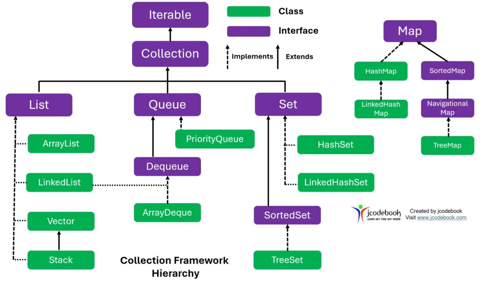
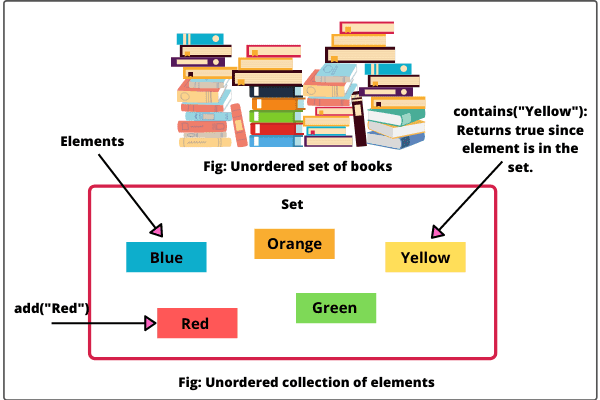
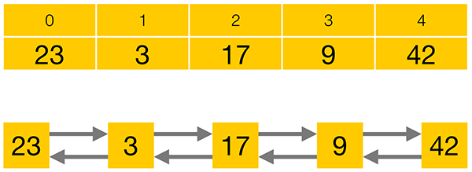
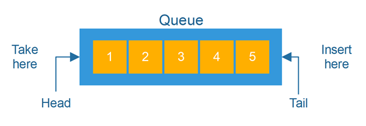

# Collections
 
## Introduction to Collections
+ `Collection` là một object nhóm nhiều phần tử thành một đơn vị duy nhất. `Collections` được dùng để lưu trữ, truy xuất, thao tác và giao tiếp dữ liệu tổng hợp.
### What Is a Collections Framework?
+ https://topdev.vn/blog/framework-la-gi-su-khac-biet-giua-framework-va-library/
+ `Library` (thư viện) trong lập trình là một tập hợp các hàm, phương thức hoặc đoạn mã được xây dựng sẵn, nhằm thực hiện các nhiệm vụ cụ thể và có thể được tái sử dụng trong nhiều ứng dụng khác nhau.
+ `Framework` là các đoạn code đã được viết sẵn, cấu thành nên một bộ khung và các thư viện lập trình được đóng gói. Chúng cung cấp các tính năng có sẵn như mô hình, API và các yếu tố khác để tối giản cho việc phát triển các ứng dụng web phong phú, năng động. Các `framework` giống như là chúng ta có khung nhà được làm sẵn nền móng cơ bản, lập trình viên chỉ cần vào xây dựng và nội thất theo ý mình.
 
+ `Collections Framework` là một kiến trúc thống nhất để biểu diễn và thao tác với `collections`. Tất cả các `collections frameworks` đều bao gồm:
    + `Interfaces`: Đây là các kiểu dữ liệu trừu tượng đại diện cho `collections`. `Interfaces` cho phép thao tác với `collections` một cách độc lập với chi tiết triển khai của chúng. Trong các ngôn ngữ hướng đối tượng, `interfaces `thường tạo thành một hệ thống phân cấp.
    + `Implementations`: Đây là các triển khai cụ thể của `collection interfaces`. Về cơ bản, chúng là các cấu trúc dữ liệu có thể tái sử dụng.
    + `Algorithms`: Đây là các `methods` thực hiện các tính toán hữu ích, như tìm kiếm và sắp xếp, trên các `objects` triển khai `collection interfaces`. Các `algorithms` có tính chất đa hình (`polymorphic`): nghĩa là cùng một `method` có thể được triển khai theo nhiều cách khác nhau khi implement chung một
     `collection interfaces`.
 
### Benefits of the Java Collections Framework
+ Giảm `effort code`: Cung cấp các cấu trúc dữ liệu và `algorithms` hữu ích, giúp nhà phát triển tập trung vào các phần quan trọng của phần mềm mà không cần lo lắng về các chi tiết kỹ thuật phức tạp.
+ Tăng tốc độ và chất lượng phần mềm:
    + Cung cấp các triển khai hiệu năng cao, chất lượng cao cho cấu trúc dữ liệu và algorithms.
    + Các triển khai khác nhau của mỗi `interface` có thể thay thế lẫn nhau, giúp dễ dàng điều chỉnh chương trình bằng cách đổi `collection implementations`.
+ Dễ dàng sử dụng và tái sử dụng
 
## Interfaces
  <p align="center">
  
  </p>

+ Các `core` `collection interfaces` bao gồm các loại `collections` khác nhau, Các `interfaces` này cho phép thao tác với các `collections` một cách độc lập với các triển khai của chúng
+ `Core collection interfaces` là nền tảng của `Java Collections Framework`,
+ `Core collection interfaces` tạo thành 1 hệ thống phân cấp bắt đầu với 2  `interface` chính là `Collection` và `Map`
    + `Collection`: gốc của hệ thống phân cấp `collections`. Một `Collection` đại diện cho một nhóm `objects`, những `object` này được gọi là các phần tử của `Collection`
        + `Set`: một `collection` không thể chứa các phần tử trùng lặp
            + `SortedSet`: một `Set` duy trì các phần tử của nó theo thứ tự tăng dần
        + `List`: một `indexed collection` (đôi khi được gọi là một dãy). `Lists` có thể chứa các phần tử trùng lặp. Một `List` có quyền kiểm soát chính xác vị trí trong danh sách mà mỗi phần tử được chèn vào và có thể truy cập các phần tử bằng chỉ số (vị trí - `index`)  của chúng.
        + `Queue`: một `collection` được sử dụng để giữ nhiều `elements` trước khi xử lý. Bên cạnh các thao tác cơ bản của `Collection`, một `Queue` cung cấp thêm các thao tác chèn, trích xuất và kiểm tra. `Queues` thường, nhưng không nhất thiết, sắp xếp các phần tử theo kiểu `FIFO (first-in, first-out)`. Các ngoại lệ bao gồm `priority queues`, sắp xếp các phần tử theo một `comparator` được cung cấp hoặc thứ tự tự nhiên của các phần tử.
        + `Deque`: một `collection` được sử dụng để giữ nhiều `elements` trước khi xử lý. Bên cạnh các thao tác cơ bản của `Collection`, một `Deque` cung cấp thêm các thao tác chèn, trích xuất và kiểm tra ở cả hai đầu.
    + `Map`: một `object` ánh xạ các `key`s tới các `values`. Một `Map` không thể chứa các `keys` trùng lặp; mỗi `key` có thể ánh xạ tối đa một `value`.
        + `SortedMap`: một `Map` duy trì các ánh xạ của nó theo thứ tự `key` tăng dần.
        
### The Collection Interface
+ Một `Collection` đại diện cho một nhóm các `object`. `Interface Collection` được sử dụng để truyền các `Collection object` với mức tổng quát tối đa
+ `Collection` có thể khởi tạo chuyển đổi với tất cả các `sub class` và `interface` của nó
    ```java
    Collection<String> collections = new ArrayList<String>(c);
    collections = new ArrayList<>(c);
    collections = new LinkedList<>();
    ```
+ `Interface Collection` chứa các `method`
    + thực hiện các thao tác cơ bản:
        + int size(): trả về số lượng phần tử đang chứa
        + boolean isEmpty(): `collection` hiện tại có rỗng hay không
        + boolean contains(Object element): `collection` có chứa phần tử này (Object element) không
        + boolean add(E element): thêm mới phần tử `E element` vào `collection`
        + boolean remove(Object element): loại bỏ phần tử `E element` khỏi `collection`
        + Iterator<E> iterator(): tạo 1 `Iterator`
 
    + `method` hoạt động trên toàn bộ `Collection`:
        + boolean containsAll(Collection<?> c): kiểm tra `collection` hiện tại có chứa `collection` c không
        + boolean addAll(Collection<? extends E> c): thêm phần toàn bộ phần tử từ `collection` khác vào `collection` hiện tại
        + boolean removeAll(Collection<?> c): loại bỏ toàn bộ các phần tử có trong `collection` c ở `collection` hiện tại
        + boolean retainAll(Collection<?> c): loại bỏ toàn bộ các phần tử không có trong `collection` c ở `collection` hiện tại
        + void clear(): xóa toàn bộ phần tử trong `collection` hiện tại
        + Object[] toArray(): lấy ra 1 mảng từ `collection` hiện tại
   
    + lấy ra các `stream` từ `collection` hiện tại:
        + Stream<E> stream()
        + Stream<E> parallelStream()
 
+ Như vậy `Collection` cung cấp nhiều chức năng hỗ trợ để làm việc trên 1 nhóm các `Object` bao gồm:
    + Xác định số lượng phần tử trong `Collection` (`size`, `isEmpty`).
    + Kiểm tra xem một object cụ thể có nằm trong `Collection` không (`contains`).
    + Thêm và xóa một phần tử khỏi `Collection` (`add`, `remove`).
    + Cung cấp một `Iterator` để duyệt qua `Collection` (`iterator`).
 
##### Traversing Collections
+ Có 3 cách duyệt qua 1 `Collection`:
    + `Aggregate Operations`: tạo 1 `stream` và thực hiện các `aggregate operations` trên `stream` đó. Thường được dùng với `lamda`
    ```java
        myShapesCollection.stream()
        .filter(e -> e.getColor() == Color.RED)
        .forEach(e -> System.out.println(e.getName()));
 
        myShapesCollection.parallelStream()
        .filter(e -> e.getColor() == Color.RED)
        .forEach(e -> System.out.println(e.getName()));
 
    ```
    + `for-each Construct`: duyệt qua `Collection` hoặc `array` một cách ngắn gọn bằng vòng lặp `for`
    ```java
        for (Object o : collection)
            System.out.println(o);
    ```
    + `Iterators`: duyệt qua một `Collection` và xóa các phần tử một cách chọn lọc nếu cần
    ```java
        static void filter(Collection<?> c) {
        for (Iterator<?> it = c.iterator(); it.hasNext(); )
            if (!cond(it.next()))
            it.remove();
            }
    ```
#### The Set Interface
  <p align="center">
  
  </p>

+ `Set` là một `Collection` không cho phép chứa các phần tử trùng lặp. Nó mô phỏng khái niệm tập hợp trong toán học. `Interface Set` chỉ chứa các `method signatures` kế thừa từ `Collection` và bổ sung thêm ràng buộc rằng các phần tử trùng lặp sẽ không được thêm vào.
+ Hai `Set instances` được coi là bằng nhau nếu chúng chứa các phần tử giống nhau.
+ Java cung cấp ba triển khai Set phổ biến: `HashSet`, `TreeSet`, và `LinkedHashSet`.
    + `HashSet` lưu trữ các phần tử của nó trong một bảng băm (`hash table`) và là triển khai có hiệu suất tốt nhất; tuy nhiên, nó không đảm bảo thứ tự thêm vào.
    + `TreeSet` lưu trữ các phần tử trong một cấu trúc dữ liệu `red-black tree`, `treeSet` đảm bảo thứ tự thêm vào; nhưng chậm hơn đáng kể so với `HashSet`.
    + `LinkedHashSet` được triển khai như một `hash table` có `LinkedList` chạy xuyên qua, sắp xếp các phần tử dựa trên thứ tự chèn (`insertion-order`). `LinkedHashSet` giúp tránh được thứ tự lộn xộn không xác định của `HashSet` với chi phí chỉ cao hơn một chút.
+ Tạo 1 `Set` từ 1 `collection` đã có sẵn (`Set` được tạo sẽ ko chứa phần tử trùng lặp)
    ```java
    Collection<Type> noDups1 = new HashSet<Type>(c);
 
    Collection<Type> noDups2 =   c.stream()
    .collect(Collectors.toSet());
 
    Set<String> set = people.stream()
                        .map(Person::getName)
                        .collect(Collectors.toCollection(TreeSet::new));
 
    Collection<Type> noDups = new LinkedHashSet<Type>(c);
    ```
 
##### Set Interface Basic Operations
+ `size`: Trả về số lượng phần tử trong `Set`.
+ `isEmpty`: Kiểm tra xem `Set` có rỗng không.
+ `add`: Thêm phần tử vào `Set` nếu nó chưa tồn tại và trả về giá trị `boolean`.
+ `remove`: Loại bỏ phần tử khỏi `Set` nếu nó tồn tại và trả về giá trị `boolean`.
+ `iterator`: Trả về một `Iterator` để duyệt qua `Set`.
 
##### Set Interface Bulk Operations
+ `s1.containsAll(s2)`: kiểm tra s2 có phải là tập con của s1 không.
+ `s1.addAll(s2)`: Hợp nhất s1 với s2 (union).
+ `s1.retainAll(s2)`: Lấy giao của s1 và s2 (intersection).
+ `s1.removeAll(s2)`: Lấy hiệu giữa s1 và s2 (difference).
 
#### The List Interface
  <p align="center">
  
  </p>

+ `List` là một `Interface` mở rộng từ `Collection` (đôi khi gọi là `sequence`). Các `List` có thể chứa các phần tử trùng lặp.
+ Ngoài các thao tác kế thừa từ `Collection`, `List` cung cấp các thao tác đặc biệt sau:
    + Truy cập vị trí (`Positional access`): Thao tác với các phần tử dựa trên vị trí của chúng trong danh sách. Bao gồm các `method signatures` như get, set, `add`, `addAll`, và `remove`.
    + Tìm kiếm (Search): Tìm kiếm một `object` cụ thể trong danh sách và trả về vị trí của chúng trong danh sách. Các `method signatures` liên quan gồm `indexOf` và `lastIndexOf`.
    + Lặp (Iteration): Tạo `Iterator` để lặp qua danh sách.
    + Xem phạm vi (Range-view): `Method` `subList` lấy ra 1 `list` con từ `list` hiện tại.
+ Java cung cấp hai `class` triển khai `List` phổ biến:
    + `ArrayList`: thường hoạt động tốt hơn về hiệu suất
    + `LinkedList`: hoạt động tốt hơn trong một số trường hợp cụ thể

##### Collection Operations
+ `List` chứa các `method` kế thừa từ `collection interface`
 
##### Positional Access and Search Operations
+ Các thao tác truy cập và tìm kiếm cơ bản:
    + Truy cập vị trí: `get`, `set`, `add`, `remove` (trả về giá trị cũ được thay thế hoặc xóa).
    + Tìm kiếm: indexOf, lastIndexOf.
 
##### Iterators
+ `Iterator` thông thường trả về các phần tử theo thứ tự chính xác.
+ `ListIterator` cung cấp nhiều tính năng hơn:
    + Lặp tiến/lùi: `hasNext`, `next`, `hasPrevious`, `previous`.
    + Thêm, xóa, thay đổi phần tử khi lặp: `remove`, `set`, `add`.
    ```java
    for (ListIterator<Type> it = list.listIterator(list.size()); it.hasPrevious(); ) {
    Type t = it.previous();
    }
    ```
##### Range-View Operation
+ `Method subList(fromIndex, toIndex)` trả về một `List` con từ `List` chính, gồm các phần tử từ `fromIndex` (bao gồm) đến `toIndex` (không bao gồm). Thay đổi trong `List` con sẽ phản ánh trong `List` chính
    ```java
    list.subList(fromIndex, toIndex).clear();
    ```
##### List Algorithms
+ Các thuật toán trong `Collections` class dành riêng cho `List` gồm:
    + `sort` — Sắp xếp bằng merge sort.
    + `shuffle` — Trộn ngẫu nhiên.
    + `reverse` — Đảo ngược thứ tự.
    + `rotate` — Xoay `List` theo khoảng cách chỉ định.
    + `swap` — Đổi chỗ phần tử tại vị trí chỉ định.
    + `replaceAll` — Thay thế tất cả các giá trị cụ thể.
    + `fill` — Ghi đè toàn bộ phần tử bằng giá trị chỉ định.
    + `copy` — Sao chép từ `source List` sang `destination List`.
    + `binarySearch` — Tìm kiếm nhị phân trong `List` đã `sort`.
    + `indexOfSubList`, `lastIndexOfSubList` — Tìm vị trí của danh sách con đầu tiên/cuối cùng.
   
#### The Queue Interface
  <p align="center">
  
  </p>

+ Một `Queue` là một tập hợp dùng để lưu giữ các phần tử trước khi xử lý theo trình tự. Ngoài các thao tác cơ bản của `Collection`, `queues` cung cấp thêm các thao tác chèn, xóa, và kiểm tra.
    
    ```java
    public interface Queue<E> extends Collection<E> {
        E element();
        boolean offer(E e);
        E peek();
        E poll();
        E remove();
    }
    ```
+ `method` của `Queue` có hai dạng:
    + Một dạng sẽ ném ra `Exception` nếu thao tác thất bại.
    + Dạng còn lại trả về một giá trị đặc biệt (hoặc `null` hoặc `false`, tùy thuộc vào thao tác).
    
| Loại thao tác   | Ném ngoại lệ     | Trả về giá trị đặc biệt |
|------------------|------------------|--------------------------|
| Insert (Chèn)    | `add(e)`        | `offer(e)`              |
| Remove (Xóa)     | `remove()`      | `poll()`                |
| Examine (Kiểm tra)| `element()`    | `peek()`                |

+ `Queues` thường sắp xếp các phần tử theo kiểu `FIFO` (`first-in-first-out` - vào trước ra trước). Trong một `FIFO queue`, tất cả các phần tử mới đều được chèn vào cuối `queue` (`tail`)

#### The Deque Interface
 
### The Map Interface

### Object Ordering

### The SortedSet Interface

### The SortedMap Interface
 
## Aggregate Operations

### Reduction

### Parallelism
 
## Implementations
## Algorithms
## Custom Collection Implementations
## Interoperability