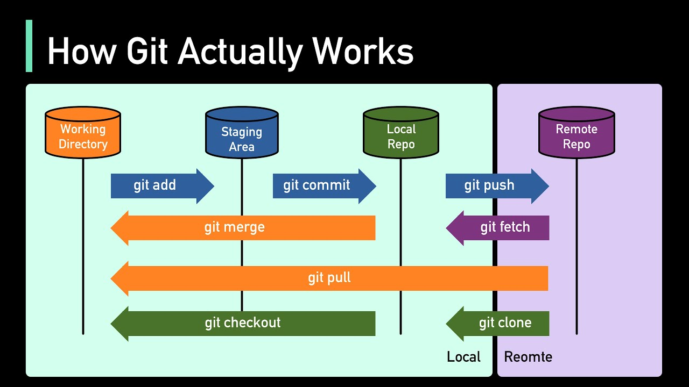
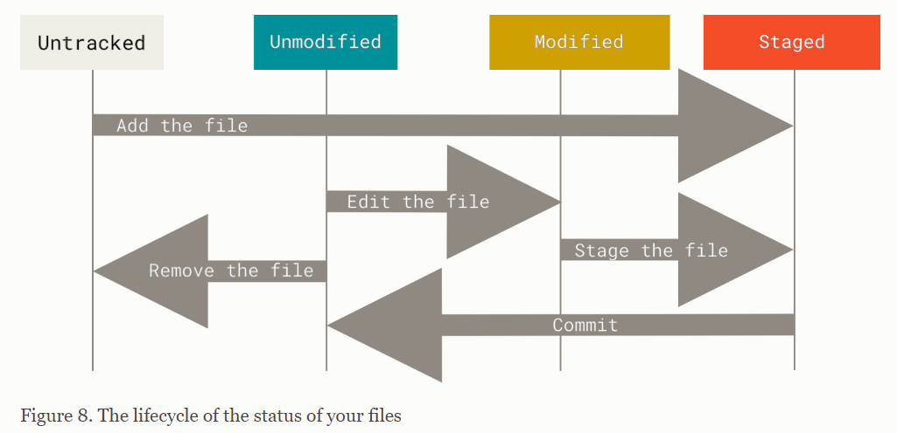
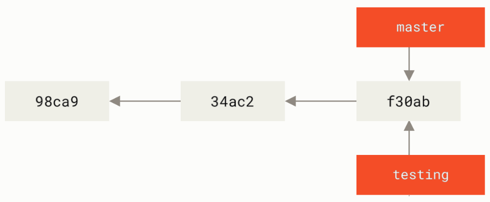
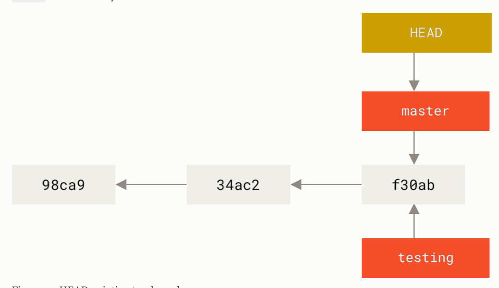
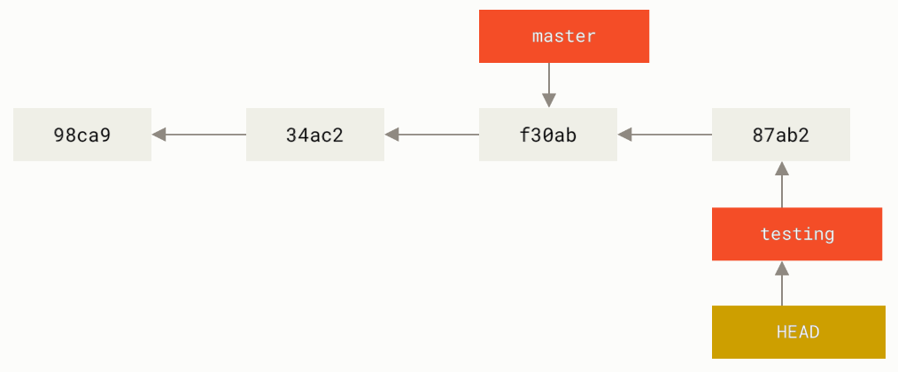
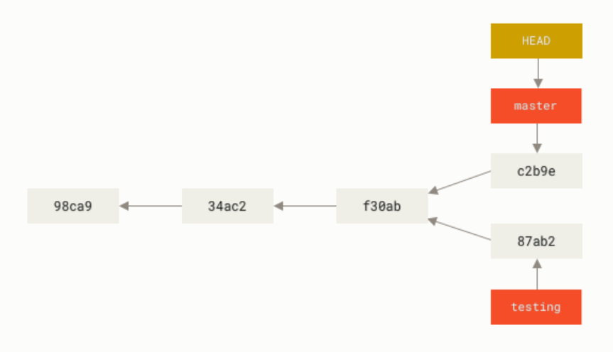
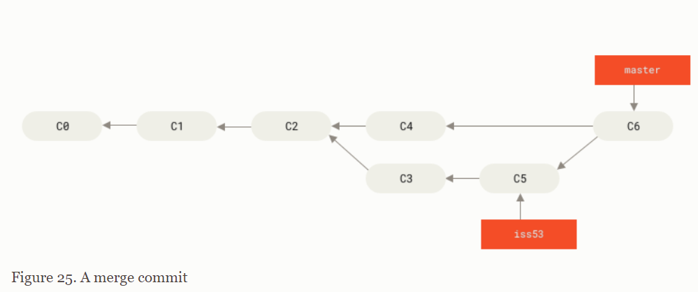

# GIT
## Khái niệm:
### `Distributed Version Control System - DVCS`
+ Là một loại hệ thống quản lý phiên bản, trong đó toàn bộ mã nguồn (`source code`) cùng với lịch sử thay đổi đầy đủ được sao chép và lưu trữ trên máy của mỗi nhà phát triển
### `Git`
+ Là một `DVCS` được sử dụng để theo dõi sự thay đổi của `source code` trong quá trình phát triển phần mềm. Nó cho phép nhiều lập trình viên cùng làm việc trên một dự án, theo dõi sự thay đổi của tệp tin và quản lý các phiên bản khác nhau của mã nguồn.
### Các thành phần chính của `Git`:

### `Working Directory`:
+  là nơi chứa `source code` và tất cả các files của dự án mà lập trình viên đang làm việc.
+ cách để create 1 `Working Directory`:
 - clone từ 1 remote repository về máy local `git clone <repository-url>`
 - khởi tạo (`initialize`) 1 repository tại máy local `git init`

+ File ở trong `Working Directory` sẽ có 1 trong 3 trạng thái:
  + `Untracked`: Các file mới chưa được `Git` theo dõi
  + `Modified`: Các file có thay đổi mới nhưng chưa được `Git` theo dõi những thay đổi mới này
  + `Tracked`: Các file đã được `Git` quản lý và theo dõi các thay đổi mới  

 

### `Staging Area (index)`
+ là 1 vùng nhớ tạm thời nơi chứa những thay đổi đã được ghi nhận nhưng chưa chính thức được xác nhận (`commit`)
 
### `Repository`
+ là nơi chứa toàn bộ lịch sử thay đổi của `source code`. Mỗi một thay đổi sẽ được `commit` và lưu vào repo dưới dạng 1 `snapshot`.
+ có 2 loại `Repository`:
 + `Local Repository`: là `Repository` tại máy `local`, có thể làm việc và lưu trữ lịch sử mà ko cần kết nối mạng
 + `Remote Repository`: Kho lưu trữ trên máy chủ (`server`) từ xa, như GitHub, GitLab, hoặc Bitbucket.

### `Commit`
+ `Commit` hay `snapshot` là 1 bản ghi lưu trữ nội dung của `source code` tại 1 thời điểm nhất định

### `Branches`
+ là một con trỏ, trỏ đến 1 `commit` cụ thể, giúp cho lập trình viên dễ dàng làm việc song song và độc lập trên nhiều phiên bản `commit` của dự án
+ cách thức hoạt đông của việc phân nhánh trong `Git`
  + mỗi nhánh sẽ là 1 con trỏ, trỏ đến 1 `commit`, mỗi `commit` sẽ trỏ về `commit` trước đó của nó 

  

  + việc kiểm soát đang ở `branch` nào sẽ được quản lý bởi 1 con trỏ đặc biệt gọi là `HEAD` 

  

  

  + khi `commit` vào 1 `branch` , git sẽ thực hiện tạo 1 `commit` mới và thực hiện thay đổi `pointer` của  `branch` và `HEAD` sang `commit` mới tạo

  

  + có thể di chuyển giữa các `branch` khác nhau để tạo nhiều `commit` khác nhau nối dài `branch` đó

  

  + có thể merge 2 branch để kết hợp toàn bộ thay đổi trên 2 branch thành 1 `commit` 

  

### Git Flow và các command hay dùng:
+ Khởi tại Repo mới: `git init`

+ Config thông tin user: 
  + `git config --global user.name "Tên của bạn"` 
  + `git config --global user.email "email@example.com"`

+ Clone remote repo: `git clone <url-repository>`

+ Quản lý `file status` và `commit`:
  + Kiểm tra trạng thái các tệp: `git status`
  + Thêm file vào `Staging Area`: `git add <tên-file>`||`git add .`
  + Tạo `commit`: `git commit -m "Thông điệp commit"`

+ Quản lý `branch`:
  + tạo `branch` mới: `git branch <tên-branch>`
  + chuyển sanh `branch` khác: `git checkout <tên-branch>`
  + tạo và chuyển sang `branch` khác: `git checkout -b <tên-branch>`
  + xóa `branch`: `git branch -d <tên-branch>`

+ Quản lý `remote reposirory`:
  + Liên kết remote repository: `git remote add origin <url-repository>`
  + Push thay đổi của `branch` lên `remote reposirory`: `git push origin <tên-branch>`
  + Pull thay đổi của 1 `remote branch` về `branch` hiện tại: `git pull origin <tên-branch>`
 
+ Reset, revert, và restore:
  + Hủy các thay đổi chưa được staged: `git restore <tên-file>`
  + Xóa file khỏi `staging area`: `git reset <tên-file>`
  + Xóa tất cả thay đổi (chưa `commit`): `git reset --hard`
  + Khôi phục một `commit` trước đó: `git revert <commit-id>`

+ Xem lịch sử và log:
  + Xem lịch sử commit: `git log`
  + Kiểm tra chi tiết thay đổi của một file: `git diff <tên-file>`

+ Tag:
  + Tạo tag để đánh dấu phiên bản: `git tag <tên-tag>`
  + Push tag lên remote: `git push origin <tên-tag>`

+ `Stash` (lưu tạm thời thay đổi):
  + Lưu tạm thời các thay đổi chưa `commit`: `git stash`
  + Xem danh sách `stash`: `git stash list`
  + Khôi phục `stash`:`git stash apply`

+ `Fetch` kiểm tra thay đổi từ `remote repo`: `git fetch`
### Tài liệu tham khảo: 
+ https://git-scm.com/book/en/v2/Git-Branching-Branches-in-a-Nutshell